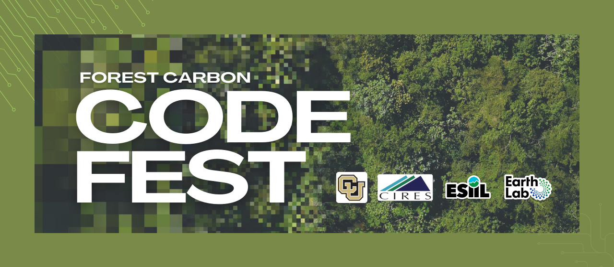

# Big Data for Environmental Resilience and Adaptation 
May 14th-16th, 2024
University of Colorado Boulder

ESIIL's 2024 Innovation Summit will offer an opportunity to use big data to understand resilience across genes, species, ecosystems and societies, advance ecological forecasting with solutions in mind, and inform adaptive management and natural climate solutions. The Summit will support attendees to advance data-informed courses of action for resilience and adaptation in the face of our changing environment. It will be an in-person ‘unconference’, enabling participants to dynamically work on themes that most inspire them, with inclusive physical and intellectual spaces for working together. Over two and a half days participants will work in teams to explore research questions using open science approaches, including: data infrastructure, artificial intelligence (AI) and novel analytics, and cloud computing. Participants will be encouraged to work across and respect different perspectives, with the aim of co-developing resilience solutions. ESIIL will provide participants with opportunities to learn more about cultural intelligence, ethical and open science practices, and leadership in the rapidly evolving field of environmental data science. Overall, the Summit will capitalize on the combination of open data and analytics opportunities to develop innovative or impactful approaches that improve environmental resilience and adaptation.

### Why Big Data for Environmental Resilience and Adaptation?
Humans have vastly altered ecosystems, leading to habitat and biodiversity loss, climate change, and altered nutrient and water cycles. At the same time, we are in an unprecedented moment where vast amounts of data are being produced about our planet faster than we can generate insights in a responsible way. We urgently need solutions that foster equitable use of our planet’s resources and better distribute the burden of adaptation.

### The goals of the 2024 ESIIL Innovation Summit are to: 
Explore big data for environmental resilience and adaptation by identifying data synthesis opportunities and utilizing ESIIL cloud-compute capabilities. 
Promote best practices in ethical, open science, by supporting accessibility and usability of environmental data by all stakeholders. Champion ethical and equitable practices in environmental science, honoring data sovereignty and encouraging the responsible use of AI. 
Support diverse and inclusive teams by establishing collaborations around data-inspired themes across different disciplines, sectors, career stages, and backgrounds.
Encourage the co-production of environmental knowledge with communities that are experiencing significant environmental challenges.

## [Event living agenda is linked here](https://docs.google.com/document/d/1UPiDjg_5f5lV7603QF9W7XTl1GWIMb4dk6EYPIh6nlU/edit?usp=sharing)

## Venue Information
The ESIIL Innovation Summit will be held at the University of Colorado Boulder East Campus SEEC Building (4001 Discovery Dr, Boulder, CO 80303). Directions to the SEEC Building [here](https://https://seec.colorado.edu/getting-here/directions).

(Building Maps to follow)

## Hotels 
**[Fairfield Inn and Suites Boulder](https://https://www.marriott.com/en-us/hotels/vboff-fairfield-inn-and-suites-boulder/overview/?gclid=CjwKCAiArfauBhApEiwAeoB7qMAiU5fx2MLcvIu6_IzEGkfX_GXVtOJQkOGWaU63o8dVHRqDfwUKChoCQhUQAvD_BwE&gclsrc=aw.ds&cid=PAI_GLB0004YXD_GLE000BIM5_GLF000OETA)**
**ESIIL Event Rate:** $152
**Location:** 5397 South Boulder Rd., Boulder, CO (2.3 miles from venue)
**Contact:** Ari Rubin, ari.rubin@marriott.com
Complimentary breakfast buffet, free internet, free parking, and use of fitness center. 
**Attendees can access this rate at:** https://www.marriott.com/event-reservations/reservation-link.mi?id=1709058275827&key=GRP&app=resvlink

CU Boulder has set negotiated rates with hotels all around Boulder and the surrounding area, which should provide some different options depending on your budget. Of these hotels, the **Marriott Boulder**, **Residence Inn Boulder Canyon Boulevard**, **Hilton Garden Inn**, and **Embassy Suites** by Hilton Boulder are the closest to CU Boulder’s East Campus. The Hotel Boulderado and the St. Julien Hotel and Spa are further from East Campus, but are within walking distance of Boulder’s Pearl Street Mall–a lively, walking-only street with many shops and restaurants.

When booking with one of these hotels ([instructions on the site](https://https://www.cu.edu/psc/travel/preferred-hotel-program-local/preferred-hotel-program-local-ucb)), note that you need to mention “The University of Colorado special rate” and that you will be staying for a university-sponsored event. You should be able to get these rates up until the day before the event, but we recommend booking sooner than later to ensure that there is space at your preferred location.

## Transportation

### Air Transportation
If you are flying in for the event you will want to fly into the Denver International Airport (DIA). Note that the airport is quite large and you will need to take an airport train to the main terminal.

### Ground Transportation
#### Ride Share
A Lyft or Uber or airport taxi are the most expensive option but also the most direct way to get from the airport to Boulder (often $70 or higher one way).

#### Public transportation to/from airport
Transit from the Denver airport to Boulder is quite easy via the **AB1 Boulder/Denver** airport bus. This bus runs at least once an hour during the day, with more frequent trips at popular times. To locate the bus, follow signs in the Denver airport baggage claim area to ‘Train to city,’ which will lead you down an escalator. At the base of the escalator, instead of continuing straight towards the visible train station, turn left and you should see a bus terminal with an RTD ticket machine. Tickets for the AB1 can be purchased for $10. Find the gate for the AB1 / Downtown Boulder line.

#### Airport Shuttle Services
If you would prefer to book a shuttle to/from DIA (Denver International Airport) & Boulder, there are three options:
* Green Ride Boulder: www.greenrideboulder.com 303-997-0238
* SuperShuttle: www.supershuttle.com 800-258-3826
* Eight Black Shuttle: https://eightblackairportshuttle.com 720-223-5474

#### Car Rentals
There are a number of rental car agencies located at the Denver International Airport:
* Advantage: www.advantage.com
* Alamo: www.alamo.com
* Avis: www.avis.com
* Budget: www.budget.com
* Dollar: www.dollar.com
* Enterprise: www.enterprise.com
* Hertz: www.hertz.com
* National: www.nationalcar.com
* Payless: www.paylesscarrental.com

#### Additional car rental options include:
* eGo CarShare
* Zipcar

### Transportation around the Boulder area
Boulder has a number of public transportation options for traversing Boulder and the surrounding area.
#### Bus lines
[Information about Boulder’s local bus network can be found here](https://http://www.bouldercolorado.gov/goboulder/bus). Note that the Skip, Bound, and Hop lines pass campus regularly.
If you need to travel to Denver for any reason, the [Flatiron Flyer](https://https://www.rtd-denver.com/services/flatiron-flyer) bus connects Denver to Boulder. Currently the FF1 is the best option, and connects Denver’s Union Station to the Downtown Boulder Station (with numerous stops in-between).

#### Biking & Walking
Boulder has an extensive system of city walking/biking paths; [maps can be found here](https://https://bouldercolorado.gov/goboulder/walk). [Boulder B-Cycle](https://http://www.boulder.bcycle.com/) is a community non-profit bike sharing system with daily and month passes available.

# Event Documents

- [Event overview & official rules](https://docs.google.com/document/d/1el21bK1y2s7QlPMZGwckOaqwhWzW6Tt6CILTUBfjlCc/edit?usp=drive_link)
- [Project evaluation criteria](https://docs.google.com/document/d/1nMNbWuwLj-zqCxvk9fpxxHOeb1OQ48ah8thdLAHxakU/edit)
- [Code of conduct](https://docs.google.com/document/d/1BpqHKCaa_NZYQXPk2BHyPG3p9tjvWMJNsixn93mtAMU/edit?usp=drive_link)
- [Intellectual property participant agreement](https://docs.google.com/document/d/1jKXWrVzuhKWbRPtcRelxcSD9svh9rvTQUmadDV1Dy1I/edit?usp=drive_link)
- [Guidelines for intellectual contributions and credit](https://drive.google.com/file/d/1WcjV412EzCxohNtjFtca-o2Gpf36ISAX/view?usp=sharing)

*This event is hosted by ESIIL and funded by the National Science Foundation (via award # DBI-2153040), and subject to the NSF’s terms and conditions.

