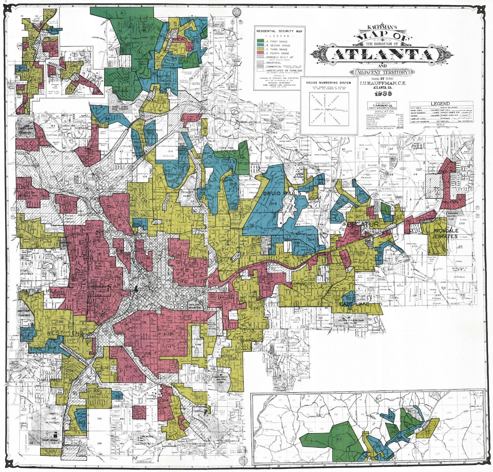

# Exploring the Impact of Historical Redlining on Urban Greenspace: A Collaborative Examination of Maps, Justice, and Resilience

## Introduction

This group exploration delves into the long-term impacts of historical redlining on urban greenspace, emphasizing the powerful role of maps in shaping environmental and social landscapes. By drawing on the research by Nardone et al. (2021), you will collaboratively investigate how discriminatory practices encoded in maps have led to persistent disparities in urban settings. This exploration aims to uncover the resilience of communities in adapting to these entrenched injustices and to foster a deeper understanding of how mapping can serve both as a tool of exclusion and as a means for promoting social equity.

)

## Understanding Redlining as a Systemic Disturbance

Redlining originated in the 1930s as a discriminatory practice where the Home Owners' Loan Corporation (HOLC) systematically denied mortgages or offered unfavorable terms based on racial and ethnic compositions. This methodical exclusion, executed through maps that color-coded "risky" investment areas in red, marked minority-populated areas, denying them crucial investment and development opportunities and initiating a profound and lasting disturbance in the urban fabric.

Maps serve as powerful tools beyond navigation; they communicate and enforce control. By defining neighborhood boundaries through redlining, HOLC maps not only mirrored societal biases but also perpetuated and embedded them into the urban landscape. This manipulation of geographic data set a trajectory that limited economic growth, dictated the allocation of services, and influenced the development or deterioration of community infrastructure.

**Figure 1:** 1938 Map of Atlanta uses colors as grades for neighborhoods. The red swaths identify each area with large African-American populations that were deemed “less safe.”

**Explore the Story Map:** Click on the image above to explore the interactive story map about [subject of the story map].

## Resilience and Adaptation in Urban Environments

The legacy of redlining presents both a challenge and an opportunity for resilience and adaptation. Economically and socially, redlining entrenched cycles of poverty and racial segregation, creating a resilient wealth gap that has been difficult to dismantle. Environmentally, the neighborhoods targeted by redlining continue to face significant challenges—they generally feature less greenspace, suffer from higher pollution levels, and are more vulnerable to the impacts of climate change. These factors compound the health and wellness challenges faced by residents.

Despite these adversities, urban communities have continually demonstrated remarkable resilience. Adaptation strategies, such as community-led green initiatives, urban agriculture, and grassroots activism, have emerged as responses to these systemic disturbances. By enhancing green infrastructure and advocating for equitable environmental policies, these communities strive to increase their resilience against both historical inequities and environmental challenges.

**Video Title:** Exploring the Impacts of Historical Redlining on Urban Development  
**Description:** Click on the image above to watch a video that delves into the consequences of historical redlining and its ongoing impact on urban environments. This educational piece offers insights into how such discriminatory practices have shaped cities and what can be learned from them.

The following group exercise will not only uncover the impact of redlining on urban greenspace but also highlight the adaptive strategies developed in response to this enduring disturbance. Through mapping and analysis, we aim to illustrate the powerful role that geographic data can play in understanding and fostering urban resilience and social equity.

### References

- Nardone, A., Rudolph, K. E., Morello-Frosch, R., & Casey, J. A. (2021). Redlines and Greenspace: The Relationship between Historical Redlining and 2010 Greenspace across the United States. *Environmental Health Perspectives*, 129(1), 017006. DOI:10.1289/EHP7495.
- Hoffman, J. S., Shandas, V., & Pendleton, N. (2020). The Effects of Historical Housing Policies on Resident Exposure to Intra-Urban Heat: A Study of 108 US Urban Areas. *Climate*, 8(1), 12. DOI:10.3390/cli8010012.

## Goals of this group activity

The primary objectives of this tutorial are:
  1. To practice coding in CyVerse.
  2. To analyze the relationship between HOLC grades and the presence of urban greenspace.
  3. To understand how historic policies continue to affect the spatial distribution of environmental amenities.

## Part 1: Accessing and Visualizing Historic Redlining Data

We will begin by accessing HOLC maps from the Mapping Inequality project and overlaying this data with modern geographic datasets to visualize the historical impact on contemporary urban landscapes.

### Data Acquisition
- Download HOLC map shapefiles from the University of Richmond’s Mapping Inequality Project.
- Utilize satellite imagery and other geospatial data to map current greenspace using the normalized difference vegetation index (NDVI).

### Analysis Methodology
- Replicate the approach used by Nardone et al. to calculate NDVI values for each HOLC neighborhood, assessing greenspace as a health-promoting resource.
- Employ statistical methods such as propensity score matching to control for confounding variables and estimate the true impact of HOLC grades on urban greenspace.

## Part 2: Integrating Environmental Data

### Data Processing
- Use satellite data from 2010 to analyze greenspace using NDVI, an index that measures the quantity of vegetation in an area.
- Apply methods to adjust for potential confounders as described in the study, ensuring that comparisons of greenspace across HOLC grades are valid and not biased by historical or socio-demographic factors.

## Part 3: Comparative Analysis and Visualization

### Statistical Analysis
- Conduct a detailed statistical analysis to compare greenspace across different HOLC grades, using techniques like Targeted Maximum Likelihood Estimation (TMLE) to assess the association between historical redlining and current greenspace levels.
- Visualize the disparities in greenspace distribution using GIS tools, highlighting how redlining has shaped urban ecological landscapes.

## Conclusion

This tutorial provides tools and methodologies to explore the lingering effects of historic redlining on urban greenspace, offering insights into the intersection of urban planning, environmental justice, and public health.

### References

- Nardone, A., Rudolph, K. E., Morello-Frosch, R., & Casey, J. A. (2021). Redlines and Greenspace: The Relationship between Historical Redlining and 2010 Greenspace across the United States. *Environmental Health Perspectives*, 129(1), 017006. DOI:10.1289/EHP7495. [Available online](https://www.ncbi.nlm.nih.gov/pmc/articles/PMC7839347/pdf/ehp7495.pdf)
