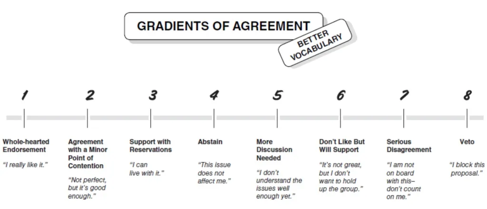

# TEAM ACTIVITY 2: Innovate as a Team

Welcome back! We hope today is a productive day getting to know your team and coding.

## Day 2 summary: 
Please complete the warm-up with your team, briefly review today’s objectives, and carefully read the Day 2 and Day 3 report out items to guide your efforts.  

## Objectives for Day 2
1. Work together to decide on the data sets you will use. Reminder: Use a decision-making technique discussed during Day 1. Kaner’s Gradient of Agreement is below for reference.
2. Practice joining your datasets together. 
3. Discuss and try creating interesting graphics.
4. Report back on your results at the end of the day. Today’s report back is short and focused on your team process. The Day 3 report back is more detailed. 

## Morning Warm-up
Please share the following informaton with your team. (No need to write down your responses this time)
- Name
- Pronouns
- Reflecting on Day 1, what is something that surprised you?

## Decision-Making
Use the gradient of agreement (Kaner 20214) to make decisions as a team.
**Instead of the suggested gradient, we used a TEK-consistent process which includes consensus, making sure all voices are heard, respect for Elders, the importance of ceremony and prayer, elevating youth, thinking generationally, being a good relative, including all age groups, especially children, generosity, and the importance of language and culture projection.**

## Day 2 Report Back
Day 2 report-back questions are about the team *process*. We are interested in your team’s unique experience. Below are some prompts you might consider. You don't need to address all of them - choose which ones you want to present. Please limit your reflection to 2-3 mins.  

1. **What worked well for your team? Bouncing ideas back and forth, active listening, constructive arguments and feedback.**
3. **What’s one thing you would change? We immediately put the tables in a circle to decolonize the workspace.**
4. **Did your group ever have an “ah-ha” moment? Yes, several. First, we changed (decolonized) the group question. Then we came to the realization that of what our focus and output should be. We also came to some new conceptualizations and realized the importance of having Tribal Leadership in the conversation.  What led up to that moment? The above mentioned processes that worked well.**
5. **Did your group experience the groan zone?  What is one tip you want to share with future groups at the Summit about getting through the groan zone? Yes. We had to remember that disagreements are OK. We worked through things by listening to different perspectives and letting everyone speak, especially if the deeply passionate parts.**

**************************************************************

### Looking Ahead: Day 3 Report Back
*These are the prompts for the final Report Back **tomorrow (Day 3)** - start thinking about these questions as you work today. Each group will share their Day 3 GitHub page on the screen and give a 4 minute presentation.*

- **Project Title:**
- **Research Question:**
- **One interesting graphic/finding:**
- **What are you thinking about doing next with your team? Long-term, short-term?**
- **What’s missing: what resources, people, data sets, etc. does your team need?**
      
### Reminder
There is the opportunity for groups to continue working on their projects as an ESIIL Working Group. If you love your team and want to continue working together, considering submitting a Working Group Application this fall. See the ESIIL website for more information: <https://esiil.org/working-groups>.
     

