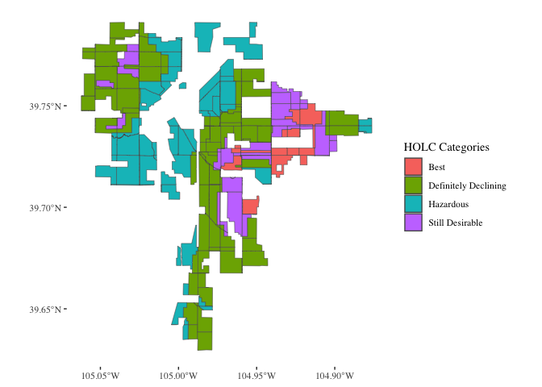
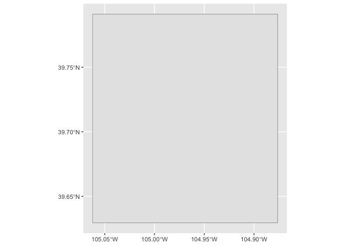
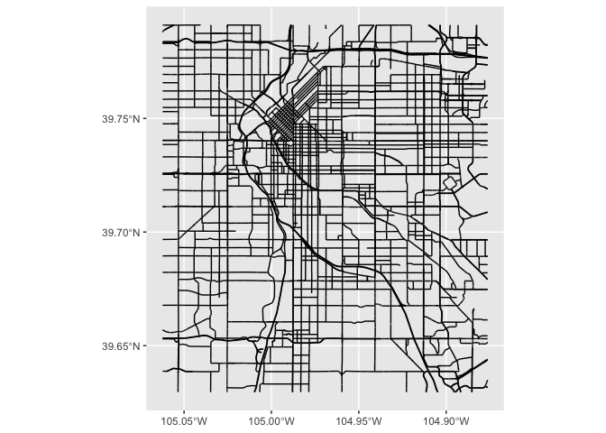
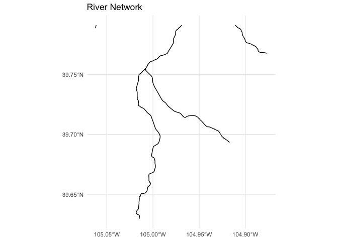
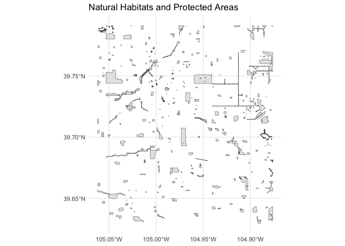
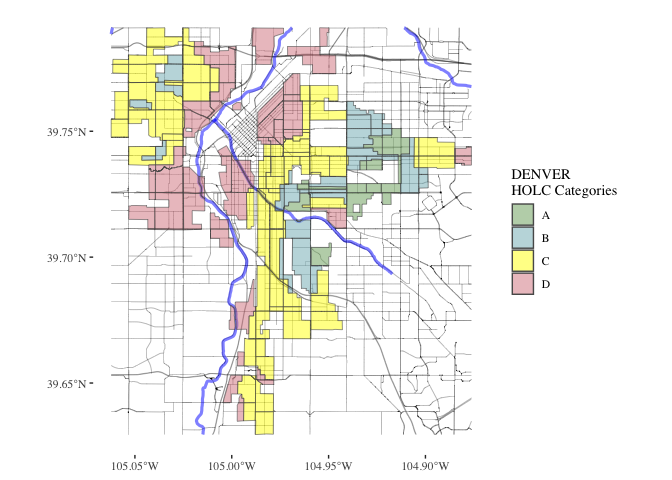
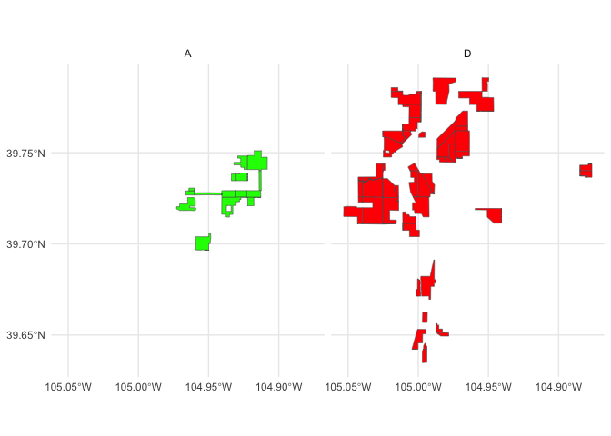

redlining
================

``` r
# Install and load necessary libraries]
library(knitr)
library(sf)
```

    Linking to GEOS 3.11.0, GDAL 3.5.3, PROJ 9.1.0; sf_use_s2() is TRUE

``` r
library(dplyr)
```


    Attaching package: 'dplyr'

    The following objects are masked from 'package:stats':

        filter, lag

    The following objects are masked from 'package:base':

        intersect, setdiff, setequal, union

``` r
#https://dsl.richmond.edu/panorama/redlining/static/mappinginequality.json

# Download historic redlining data for Philadelphia
url <- "https://raw.githubusercontent.com/americanpanorama/mapping-inequality-census-crosswalk/main/MIv3Areas_2010TractCrosswalk.geojson"
philly_geojson <- read_sf(url)
philly_geojson
```

    Simple feature collection with 51866 features and 15 fields
    Geometry type: MULTIPOLYGON
    Dimension:     XY
    Bounding box:  xmin: -122.7675 ymin: 25.70537 xmax: -69.60044 ymax: 48.2473
    Geodetic CRS:  WGS 84
    # A tibble: 51,866 × 16
       area_id city      state city_survey cat   grade label res   com   ind   fill 
         <int> <chr>     <chr> <lgl>       <chr> <chr> <chr> <lgl> <lgl> <lgl> <chr>
     1     244 Birmingh… AL    TRUE        Best  A     A1    TRUE  FALSE FALSE #76a…
     2     244 Birmingh… AL    TRUE        Best  A     A1    TRUE  FALSE FALSE #76a…
     3     244 Birmingh… AL    TRUE        Best  A     A1    TRUE  FALSE FALSE #76a…
     4     244 Birmingh… AL    TRUE        Best  A     A1    TRUE  FALSE FALSE #76a…
     5     244 Birmingh… AL    TRUE        Best  A     A1    TRUE  FALSE FALSE #76a…
     6     193 Birmingh… AL    TRUE        Best  A     A2    TRUE  FALSE FALSE #76a…
     7     193 Birmingh… AL    TRUE        Best  A     A2    TRUE  FALSE FALSE #76a…
     8     193 Birmingh… AL    TRUE        Best  A     A2    TRUE  FALSE FALSE #76a…
     9     193 Birmingh… AL    TRUE        Best  A     A2    TRUE  FALSE FALSE #76a…
    10     193 Birmingh… AL    TRUE        Best  A     A2    TRUE  FALSE FALSE #76a…
    # ℹ 51,856 more rows
    # ℹ 5 more variables: GEOID10 <chr>, GISJOIN <chr>, calc_area <dbl>,
    #   pct_tract <dbl>, geometry <MULTIPOLYGON [°]>

``` r
# Count the number of areas per HOLC grade
colorado_redline <- philly_geojson |>
  filter(city=="Denver" & grade != "") 


colorado_redline$grade
```

      [1] "A" "A" "A" "A" "A" "A" "A" "A" "A" "A" "A" "A" "A" "A" "A" "A" "A" "A"
     [19] "A" "A" "B" "B" "B" "B" "B" "B" "B" "B" "B" "B" "B" "B" "B" "B" "B" "B"
     [37] "B" "B" "B" "B" "B" "B" "B" "B" "B" "B" "B" "B" "B" "B" "B" "B" "B" "B"
     [55] "B" "B" "B" "B" "B" "B" "B" "B" "B" "B" "B" "B" "B" "B" "B" "B" "B" "B"
     [73] "B" "B" "B" "C" "C" "C" "C" "C" "C" "C" "C" "C" "C" "C" "C" "C" "C" "C"
     [91] "C" "C" "C" "C" "C" "C" "C" "C" "C" "C" "C" "C" "C" "C" "C" "C" "C" "C"
    [109] "C" "C" "C" "C" "C" "C" "C" "C" "C" "C" "C" "C" "C" "C" "C" "C" "C" "C"
    [127] "C" "C" "C" "C" "C" "C" "C" "C" "C" "C" "C" "C" "C" "C" "C" "C" "C" "C"
    [145] "C" "C" "C" "C" "C" "C" "C" "C" "C" "C" "C" "C" "C" "C" "C" "C" "C" "C"
    [163] "C" "C" "C" "C" "C" "C" "C" "C" "C" "C" "C" "C" "C" "C" "C" "C" "C" "C"
    [181] "C" "C" "C" "C" "C" "C" "C" "C" "C" "C" "C" "C" "C" "C" "C" "C" "C" "C"
    [199] "C" "C" "C" "C" "C" "C" "C" "D" "D" "D" "D" "D" "D" "D" "D" "D" "D" "D"
    [217] "D" "D" "D" "D" "D" "D" "D" "D" "D" "D" "D" "D" "D" "D" "D" "D" "D" "D"
    [235] "D" "D" "D" "D" "D" "D" "D" "D" "D" "D" "D" "D" "D" "D" "D" "D" "D" "D"
    [253] "D" "D" "D" "D" "D" "D" "D" "D" "D" "D" "D" "D" "D" "D" "D" "D" "D" "D"
    [271] "D" "D" "D" "D" "D" "D" "D" "D" "D"

``` r
library(ggplot2)
```

    Warning: package 'ggplot2' was built under R version 4.3.2

``` r
library(ggthemes)
```

    Warning: package 'ggthemes' was built under R version 4.3.2

``` r
ggplot(data=colorado_redline, aes(fill=cat)) +
  geom_sf() +
  theme_tufte()  + 
  labs(fill='HOLC Categories')
```



``` r
colorado_redline |>
  st_bbox() -> bbox_here

library(osmdata)
```

    Data (c) OpenStreetMap contributors, ODbL 1.0. https://www.openstreetmap.org/copyright

``` r
aoi <- getbb("United States", format_out="sf_polygon")

conus <- aoi$multipolygon |>
  st_crop(bbox_here)


ggplot(data=conus) +
  geom_sf()
```



``` r
library(osmextract)
```

    Data (c) OpenStreetMap contributors, ODbL 1.0. https://www.openstreetmap.org/copyright.
    Check the package website, https://docs.ropensci.org/osmextract/, for more details.

``` r
# Assuming colorado_redline is an sf object and bbox_here has been created with st_bbox()
colorado_redline |>
  st_bbox() |>
  st_as_sfc() -> bbox_here

# Use the bbox to get data with oe_get(), specifying the desired layer and a custom SQL query for highways
highway_network <- oe_get(
  place = bbox_here,
  layer = "lines",
  query = "SELECT * FROM lines WHERE highway IN ('motorway', 'trunk', 'primary', 'secondary', 'tertiary')",
  quiet = TRUE
)


# Crop the data to the bounding box
cropped_highway_network <- st_crop(highway_network, bbox_here)
```

    Warning: attribute variables are assumed to be spatially constant throughout
    all geometries

``` r
ggplot(data=cropped_highway_network) +
  geom_sf()
```



``` r
library(osmextract)
library(sf)
library(ggplot2)

# Assuming colorado_redline is an sf object and bbox_here has been created with st_bbox()
colorado_redline |>
  st_bbox() |>
  st_as_sfc() -> bbox_here

# Use the bbox to get data with oe_get(), specifying the desired layer and a custom SQL query for rivers
river_network <- oe_get(
  place = bbox_here,
  layer = "lines",
  query = "SELECT * FROM lines WHERE waterway IN ('river')",
  quiet = TRUE
)

# Crop the data to the bounding box
cropped_river_network <- st_crop(river_network, bbox_here)
```

    Warning: attribute variables are assumed to be spatially constant throughout
    all geometries

``` r
# Plotting the cropped river network
ggplot(data = cropped_river_network) +
  geom_sf() +
  ggtitle("River Network") +
  theme_minimal()
```



``` r
library(osmextract)
library(sf)
library(ggplot2)

# Assuming colorado_redline is an sf object and bbox_here has been created with st_bbox()
colorado_redline |>
  st_bbox() |>
  st_as_sfc() -> bbox_here

# Use the bbox to get data with oe_get(), specifying the desired layer and a custom SQL query for environmental monitoring stations
monitoring_stations <- oe_get(
  place = bbox_here,
  layer = "points",  # Assuming monitoring stations are best represented as points
  query = "SELECT * FROM points WHERE man_made = 'monitoring_station'",
  quiet = TRUE
)

# Crop the data to the bounding box
cropped_monitoring_stations <- st_crop(monitoring_stations, bbox_here)
```

    Warning: attribute variables are assumed to be spatially constant throughout
    all geometries

``` r
# Plotting the cropped environmental monitoring stations
ggplot(data = cropped_monitoring_stations) +
  geom_sf() +
  ggtitle("Environmental Monitoring Stations") +
  theme_minimal()
```


``` r
library(osmextract)
library(sf)
library(ggplot2)

# Assuming colorado_redline is an sf object and bbox_here has been created with st_bbox()
colorado_redline |>
  st_bbox() |>
  st_as_sfc() -> bbox_here

# Use the bbox to get data with oe_get(), specifying custom SQL queries for natural habitats
natural_habitats <- oe_get(
  place = bbox_here,
  layer = "multipolygons",  # Assuming natural features may be represented as areas
  query = "SELECT * FROM multipolygons WHERE (
             boundary = 'protected_area' OR
             natural IN ('tree', 'wood') OR
             landuse = 'forest' OR
             leisure = 'park'
           )",
  quiet = TRUE
)
```

    Warning in CPL_gdalvectortranslate(source, destination, options, oo, doo, :
    GDAL Message 1: Non closed ring detected. To avoid accepting it, set the
    OGR_GEOMETRY_ACCEPT_UNCLOSED_RING configuration option to NO

    Warning in CPL_gdalvectortranslate(source, destination, options, oo, doo, :
    GDAL Message 1: Non closed ring detected. To avoid accepting it, set the
    OGR_GEOMETRY_ACCEPT_UNCLOSED_RING configuration option to NO

    Warning in CPL_gdalvectortranslate(source, destination, options, oo, doo, :
    GDAL Message 1: Non closed ring detected. To avoid accepting it, set the
    OGR_GEOMETRY_ACCEPT_UNCLOSED_RING configuration option to NO

    Warning in CPL_gdalvectortranslate(source, destination, options, oo, doo, :
    GDAL Message 1: Non closed ring detected. To avoid accepting it, set the
    OGR_GEOMETRY_ACCEPT_UNCLOSED_RING configuration option to NO

``` r
# Validate and possibly repair geometries before cropping
natural_habitats <- st_make_valid(natural_habitats)  # or lwgeom::st_make_valid(natural_habitats)

# Crop the data
cropped_natural_habitats <- st_crop(natural_habitats, bbox_here)
```

    Warning: attribute variables are assumed to be spatially constant throughout
    all geometries

``` r
# Plotting the cropped natural habitats
ggplot(data = cropped_natural_habitats) +
  geom_sf() +
  ggtitle("Natural Habitats and Protected Areas") +
  theme_minimal()
```



``` r
unique(colorado_redline$fill)
```

    [1] "#76a865" "#7cb5bd" "#ffff00" "#d9838d"

``` r
colors <- c( "#76a865","#7cb5bd", "#ffff00", "#d9838d")


ggplot() +
  
  geom_sf(data=cropped_highway_network, lwd=0.1) +
  geom_sf(data = cropped_river_network, col="blue", alpha=0.5, lwd=1.1) +
  geom_sf(data=colorado_redline, aes(fill=grade), alpha=0.5) +
  #geom_sf(data=cropped_natural_habitats,color="black", fill="black", alpha=1)+
  theme_tufte()  + 
  scale_fill_manual(values = colors) +
  labs(fill='DENVER \nHOLC Categories')
```



``` r
# Filter for only A and D grade polygons
sf_data_filtered <- colorado_redline %>% 
  filter(grade %in% c('A', 'D')) %>%
  # Add a dummy column for facetting, ensuring there's only one A and one D polygon
  group_by(grade) %>%
  #slice(2) %>%
  ungroup()

# Create the plot with two panels
ggplot(data = sf_data_filtered) +
  geom_sf(aes(fill = grade)) +
  facet_wrap(~ grade) + # Free scales allow for different zoom levels
  scale_fill_manual(values = c("A" = "green", "D" = "red")) +
  theme_minimal() +
  labs(fill = 'HOLC Grade') +
  theme(legend.position = "none")  # Hide the legend if not needed
```



``` r
library(ggplot2)
library(sf)
library(dplyr)

# Assuming colorado_redline is your sf object with a 'grade' column
# Filter for grades A, B, C, and D
sf_data_filtered <- colorado_redline %>% 
  filter(grade %in% c('A', 'B', 'C', 'D'))

# Define a color for each grade
grade_colors <- c("A" = "#76a865", "B" = "#7cb5bd", "C" = "#ffff00", "D" = "#d9838d")

grade_colors <- c("A" = "black", "B" = "black", "C" = "black", "D" = "black")

# Create the plot with panels for each grade
ggplot(data = sf_data_filtered) +
  geom_sf(data=cropped_highway_network,alpha=0.1, lwd=0.1) +
  geom_sf(data = cropped_river_network, col="blue", alpha=0.1, lwd=1.1) +
  geom_sf(aes(fill = grade)) +
  facet_wrap(~ grade, nrow = 1) +  # Free scales for different zoom levels if needed
  scale_fill_manual(values = grade_colors) +
  theme_minimal() +
  labs(fill = 'HOLC Grade') +
  theme_tufte()+
  theme(legend.position = "none",  # Optionally hide the legend
        axis.text = element_blank(),     # Remove axis text
        axis.title = element_blank(),    # Remove axis titles
        axis.ticks = element_blank(),    # Remove axis ticks
        panel.grid.major = element_blank(),  # Remove major grid lines
        panel.grid.minor = element_blank())  
```


``` r
library(terra)
```

    Warning: package 'terra' was built under R version 4.3.2

    terra 1.7.71


    Attaching package: 'terra'

    The following object is masked from 'package:knitr':

        spin

``` r
library(ggplot2)
library(sf)
library(dplyr)

# Assuming 'cropped_natural_habitats' is your sf object with polygons
# Make sure it is in a projected coordinate system appropriate for area calculations

# Create a raster with the desired resolution using terra
r <- rast(ext(cropped_natural_habitats))  # Replace res with desired resolution
dim(r) <- c(150, 150, 1)

# Rasterize: count the number of polygons in each cell using terra
r_count <- terra::rasterize(cropped_natural_habitats, r, field=1, fun = 'count')

# Convert the raster to a dataframe for ggplot
df_raster <- as.data.frame(r_count, xy = TRUE, na.rm = TRUE)
colnames(df_raster) <- c("x", "y", "count")

# Plot using ggplot
ggplot(df_raster, aes(x = x, y = y, fill = count)) +
  geom_tile() +  # Use geom_tile to visualize the raster grid
  scale_fill_viridis_c() +  # Use a continuous color scale
  coord_fixed(ratio = 1) +  # Keep aspect ratio fixed
  labs(fill = "Polygon count") +
  theme_minimal()
```


``` r
# Load the sf library
library(sf)
library(dplyr)  # for data manipulation

# Example data loading (assumes colorado_redline and cropped_natural_habitats are already loaded)
layer1 <- colorado_redline
layer2 <- cropped_natural_habitats

# Make geometries valid
layer1 <- st_make_valid(layer1)
layer2 <- st_make_valid(layer2)

# Optionally, simplify geometries to remove duplicate vertices
layer1 <- st_simplify(layer1, preserveTopology = TRUE)

# Prepare a list to store results
results <- list()

# Loop through each grade and perform operations
for (grade in c("A", "B", "C", "D")) {
  # Filter layer1 for current grade
  layer1_grade <- layer1[layer1$grade == grade, ]

  # Buffer the geometries of the current grade
  buffered_layer1_grade <- st_buffer(layer1_grade, dist = 100)

  # Intersect with the second layer
  intersections <- st_intersects(layer2, buffered_layer1_grade, sparse = FALSE)
  selected_polygons <- layer2[rowSums(intersections) > 0, ]

  # Add a new column to store the grade information
  selected_polygons$grade <- grade

  # Store the result
  results[[grade]] <- selected_polygons
}

# Combine all selected polygons from different grades into one sf object
final_selected_polygons <- do.call(rbind, results)
```

``` r
library(ggplot2)

grade_colors <- c("A" = "#76a865", "B" = "#7cb5bd", "C" = "#ffff00", "D" = "#d9838d")
# Assuming 'final_selected_polygons' is your final sf object
# Plot using ggplot2
ggplot(data = final_selected_polygons) +
  geom_sf(aes(fill = grade), color = "black", size = 0.2) +
  scale_fill_manual(values = grade_colors) +
  labs(title = "Selected Polygons by Grade",
       fill = "Grade") +
  theme_minimal() +
  coord_sf()  # Use coord_sf to use the proper aspect ratio
```


``` r
grade_colors_2 <- c("A" = "black", "B" = "black", "C" = "black", "D" = "black")

# Create the plot with panels for each grade
ggplot(data = sf_data_filtered) +
  geom_sf(data=cropped_highway_network,alpha=0.1, lwd=0.1) +
  geom_sf(data = cropped_river_network, col="blue", alpha=0.1, lwd=1.1) +
  geom_sf(aes(fill = grade)) +
  facet_wrap(~ grade, nrow = 1) +  # Free scales for different zoom levels if needed
  scale_fill_manual(values = grade_colors_2) +
  theme_minimal() +
  labs(fill = 'HOLC Grade') +
  theme_tufte()+
  theme(legend.position = "none",  # Optionally hide the legend
        axis.text = element_blank(),     # Remove axis text
        axis.title = element_blank(),    # Remove axis titles
        axis.ticks = element_blank(),    # Remove axis ticks
        panel.grid.major = element_blank(),  # Remove major grid lines
        panel.grid.minor = element_blank())+
geom_sf(data = final_selected_polygons, aes(fill = grade), color = "limegreen",fill = "limegreen", size = 0.2) 
```


