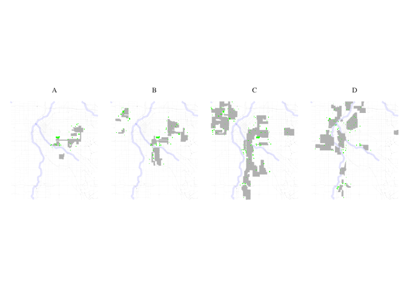
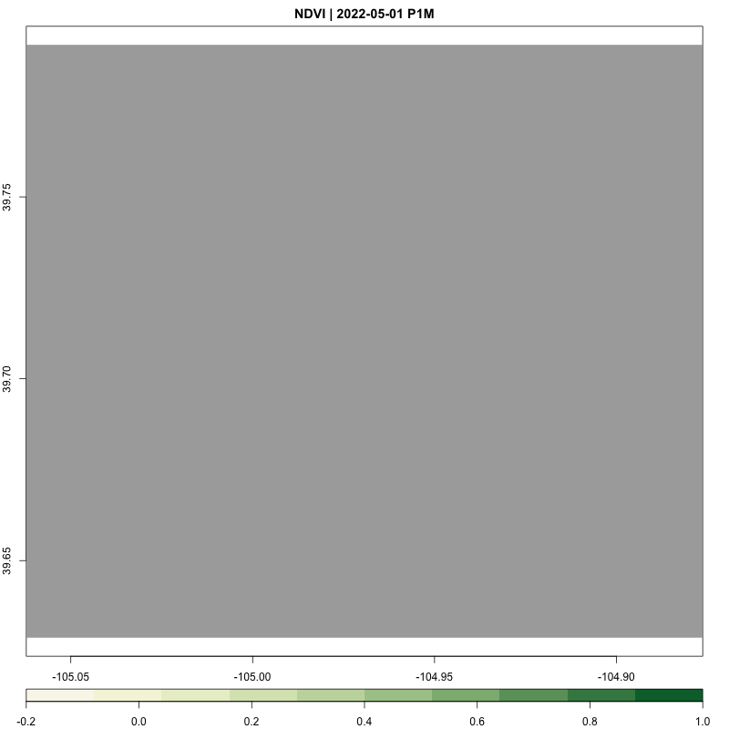

Redlining
================

<style>
img {
    width: 100%;
}

details summary {
  color: black;
  background-color: white;
}

details[open] summary {
  color: black; 
}
</style>
<details>
<summary>
R libraries we use in this analysis
</summary>

``` r
if (!requireNamespace("tidytext", quietly = TRUE)) {
  install.packages("tidytext")
}
library(tidytext)
## Warning: package 'tidytext' was built under R version 4.3.2
library(sf)
## Warning: package 'sf' was built under R version 4.3.2
## Linking to GEOS 3.11.0, GDAL 3.5.3, PROJ 9.1.0; sf_use_s2() is TRUE
library(ggplot2)
## Warning: package 'ggplot2' was built under R version 4.3.2
library(ggthemes)
## Warning: package 'ggthemes' was built under R version 4.3.2
library(dplyr)
## 
## Attaching package: 'dplyr'
## The following objects are masked from 'package:stats':
## 
##     filter, lag
## The following objects are masked from 'package:base':
## 
##     intersect, setdiff, setequal, union
library(rstac)
## Warning: package 'rstac' was built under R version 4.3.2
library(gdalcubes)
## Warning: package 'gdalcubes' was built under R version 4.3.2
library(gdalUtils)
## Please note that rgdal will be retired during October 2023,
## plan transition to sf/stars/terra functions using GDAL and PROJ
## at your earliest convenience.
## See https://r-spatial.org/r/2023/05/15/evolution4.html and https://github.com/r-spatial/evolution
## rgdal: version: 1.6-7, (SVN revision 1203)
## Geospatial Data Abstraction Library extensions to R successfully loaded
## Loaded GDAL runtime: GDAL 3.5.3, released 2022/10/21
## Path to GDAL shared files: /Library/Frameworks/R.framework/Versions/4.3-x86_64/Resources/library/rgdal/gdal
##  GDAL does not use iconv for recoding strings.
## GDAL binary built with GEOS: TRUE 
## Loaded PROJ runtime: Rel. 9.1.0, September 1st, 2022, [PJ_VERSION: 910]
## Path to PROJ shared files: /Library/Frameworks/R.framework/Versions/4.3-x86_64/Resources/library/gdalcubes/proj
## PROJ CDN enabled: FALSE
## Linking to sp version:1.6-1
## To mute warnings of possible GDAL/OSR exportToProj4() degradation,
## use options("rgdal_show_exportToProj4_warnings"="none") before loading sp or rgdal.
## 
## Attaching package: 'gdalUtils'
## The following object is masked from 'package:sf':
## 
##     gdal_rasterize
library(gdalcubes)
library(colorspace)
library(terra)
## Warning: package 'terra' was built under R version 4.3.2
## terra 1.7.71
## 
## Attaching package: 'terra'
## The following object is masked from 'package:colorspace':
## 
##     RGB
## The following objects are masked from 'package:gdalcubes':
## 
##     animate, crop, size
library(tidyterra)
## 
## Attaching package: 'tidyterra'
## The following object is masked from 'package:stats':
## 
##     filter
library(basemapR)
library(tidytext)
library(ggwordcloud)
library(osmextract)
## Data (c) OpenStreetMap contributors, ODbL 1.0. https://www.openstreetmap.org/copyright.
## Check the package website, https://docs.ropensci.org/osmextract/, for more details.
library(sf)
library(ggplot2)
library(ggthemes)
library(glue)
## 
## Attaching package: 'glue'
## The following object is masked from 'package:terra':
## 
##     trim

library(purrr)
```

</details>
<details>
<summary>
FUNCTION: List cities where HOLC data are available
</summary>

``` r
# Function to get a list of unique cities and states from the redlining data
get_city_state_list_from_redlining_data <- function() {
  # URL to the GeoJSON data
  url <- "https://raw.githubusercontent.com/americanpanorama/mapping-inequality-census-crosswalk/main/MIv3Areas_2010TractCrosswalk.geojson"
  
  # Read the GeoJSON file into an sf object
  redlining_data <- tryCatch({
    read_sf(url)
  }, error = function(e) {
    stop("Error reading GeoJSON data: ", e$message)
  })

  # Check for the existence of 'city' and 'state' columns
  if (!all(c("city", "state") %in% names(redlining_data))) {
    stop("The required columns 'city' and/or 'state' do not exist in the data.")
  }

  # Extract a unique list of city and state pairs without the geometries
  city_state_df <- redlining_data %>%
    select(city, state) %>%
    st_set_geometry(NULL) %>%  # Drop the geometry to avoid issues with invalid shapes
    distinct(city, state) %>%
    arrange(state, city )  # Arrange the list alphabetically by state, then by city

  # Return the dataframe of unique city-state pairs
  return(city_state_df)
}
```

</details>
<details open>
<summary>
Stream list of available HOLC cities
</summary>

``` r
#Retrieve the list of cities and states
city_state_list <- get_city_state_list_from_redlining_data()

knitr::kable(city_state_list, format = "markdown")
```

| city                             | state |
|:---------------------------------|:------|
| Birmingham                       | AL    |
| Mobile                           | AL    |
| Montgomery                       | AL    |
| Arkadelphia                      | AR    |
| Batesville                       | AR    |
| Camden                           | AR    |
| Conway                           | AR    |
| El Dorado                        | AR    |
| Fort Smith                       | AR    |
| Little Rock                      | AR    |
| Russellville                     | AR    |
| Texarkana                        | AR    |
| Phoenix                          | AZ    |
| Fresno                           | CA    |
| Los Angeles                      | CA    |
| Oakland                          | CA    |
| Sacramento                       | CA    |
| San Diego                        | CA    |
| San Francisco                    | CA    |
| San Jose                         | CA    |
| Stockton                         | CA    |
| Boulder                          | CO    |
| Colorado Springs                 | CO    |
| Denver                           | CO    |
| Fort Collins                     | CO    |
| Fort Morgan                      | CO    |
| Grand Junction                   | CO    |
| Greeley                          | CO    |
| Longmont                         | CO    |
| Pueblo                           | CO    |
| Bridgeport and Fairfield         | CT    |
| Hartford                         | CT    |
| New Britain                      | CT    |
| New Haven                        | CT    |
| Stamford, Darien, and New Canaan | CT    |
| Waterbury                        | CT    |
| Crestview                        | FL    |
| Daytona Beach                    | FL    |
| DeFuniak Springs                 | FL    |
| DeLand                           | FL    |
| Jacksonville                     | FL    |
| Miami                            | FL    |
| New Smyrna                       | FL    |
| Orlando                          | FL    |
| Pensacola                        | FL    |
| St. Petersburg                   | FL    |
| Tampa                            | FL    |
| Atlanta                          | GA    |
| Augusta                          | GA    |
| Columbus                         | GA    |
| Macon                            | GA    |
| Savannah                         | GA    |
| Boone                            | IA    |
| Cedar Rapids                     | IA    |
| Council Bluffs                   | IA    |
| Davenport                        | IA    |
| Des Moines                       | IA    |
| Dubuque                          | IA    |
| Sioux City                       | IA    |
| Waterloo                         | IA    |
| Aurora                           | IL    |
| Chicago                          | IL    |
| Decatur                          | IL    |
| East St. Louis                   | IL    |
| Joliet                           | IL    |
| Peoria                           | IL    |
| Rockford                         | IL    |
| Springfield                      | IL    |
| Evansville                       | IN    |
| Fort Wayne                       | IN    |
| Indianapolis                     | IN    |
| Lake Co. Gary                    | IN    |
| Muncie                           | IN    |
| South Bend                       | IN    |
| Terre Haute                      | IN    |
| Atchison                         | KS    |
| Junction City                    | KS    |
| Topeka                           | KS    |
| Wichita                          | KS    |
| Covington                        | KY    |
| Lexington                        | KY    |
| Louisville                       | KY    |
| New Orleans                      | LA    |
| Shreveport                       | LA    |
| Arlington                        | MA    |
| Belmont                          | MA    |
| Boston                           | MA    |
| Braintree                        | MA    |
| Brockton                         | MA    |
| Brookline                        | MA    |
| Cambridge                        | MA    |
| Chelsea                          | MA    |
| Dedham                           | MA    |
| Everett                          | MA    |
| Fall River                       | MA    |
| Fitchburg                        | MA    |
| Haverhill                        | MA    |
| Holyoke Chicopee                 | MA    |
| Lawrence                         | MA    |
| Lexington                        | MA    |
| Lowell                           | MA    |
| Lynn                             | MA    |
| Malden                           | MA    |
| Medford                          | MA    |
| Melrose                          | MA    |
| Milton                           | MA    |
| Needham                          | MA    |
| New Bedford                      | MA    |
| Newton                           | MA    |
| Pittsfield                       | MA    |
| Quincy                           | MA    |
| Revere                           | MA    |
| Salem                            | MA    |
| Saugus                           | MA    |
| Somerville                       | MA    |
| Springfield                      | MA    |
| Waltham                          | MA    |
| Watertown                        | MA    |
| Winchester                       | MA    |
| Winthrop                         | MA    |
| Worcester                        | MA    |
| Baltimore                        | MD    |
| Augusta                          | ME    |
| Boothbay                         | ME    |
| Portland                         | ME    |
| Sanford                          | ME    |
| Waterville                       | ME    |
| Battle Creek                     | MI    |
| Bay City                         | MI    |
| Detroit                          | MI    |
| Flint                            | MI    |
| Grand Rapids                     | MI    |
| Jackson                          | MI    |
| Kalamazoo                        | MI    |
| Lansing                          | MI    |
| Muskegon                         | MI    |
| Pontiac                          | MI    |
| Saginaw                          | MI    |
| Austin                           | MN    |
| Duluth                           | MN    |
| Mankato                          | MN    |
| Minneapolis                      | MN    |
| Rochester                        | MN    |
| St. Cloud                        | MN    |
| St. Paul                         | MN    |
| Staples                          | MN    |
| Cape Girardeau                   | MO    |
| Carthage                         | MO    |
| Greater Kansas City              | MO    |
| Joplin                           | MO    |
| Springfield                      | MO    |
| St. Joseph                       | MO    |
| St. Louis                        | MO    |
| Jackson                          | MS    |
| Asheville                        | NC    |
| Charlotte                        | NC    |
| Durham                           | NC    |
| Elizabeth City                   | NC    |
| Fayetteville                     | NC    |
| Goldsboro                        | NC    |
| Greensboro                       | NC    |
| Hendersonville                   | NC    |
| High Point                       | NC    |
| New Bern                         | NC    |
| Rocky Mount                      | NC    |
| Statesville                      | NC    |
| Winston-Salem                    | NC    |
| Fargo                            | ND    |
| Grand Forks                      | ND    |
| Minot                            | ND    |
| Williston                        | ND    |
| Lincoln                          | NE    |
| Omaha                            | NE    |
| Manchester                       | NH    |
| Atlantic City                    | NJ    |
| Bergen Co.                       | NJ    |
| Camden                           | NJ    |
| Essex Co.                        | NJ    |
| Hudson Co.                       | NJ    |
| Monmouth                         | NJ    |
| Passaic County                   | NJ    |
| Perth Amboy                      | NJ    |
| Trenton                          | NJ    |
| Union Co.                        | NJ    |
| Albany                           | NY    |
| Binghamton-Johnson City          | NY    |
| Bronx                            | NY    |
| Brooklyn                         | NY    |
| Buffalo                          | NY    |
| Elmira                           | NY    |
| Jamestown                        | NY    |
| Lower Westchester Co.            | NY    |
| Manhattan                        | NY    |
| Niagara Falls                    | NY    |
| Poughkeepsie                     | NY    |
| Queens                           | NY    |
| Rochester                        | NY    |
| Schenectady                      | NY    |
| Staten Island                    | NY    |
| Syracuse                         | NY    |
| Troy                             | NY    |
| Utica                            | NY    |
| Akron                            | OH    |
| Canton                           | OH    |
| Cleveland                        | OH    |
| Columbus                         | OH    |
| Dayton                           | OH    |
| Hamilton                         | OH    |
| Lima                             | OH    |
| Lorain                           | OH    |
| Portsmouth                       | OH    |
| Springfield                      | OH    |
| Toledo                           | OH    |
| Warren                           | OH    |
| Youngstown                       | OH    |
| Ada                              | OK    |
| Alva                             | OK    |
| Enid                             | OK    |
| Miami Ottawa County              | OK    |
| Muskogee                         | OK    |
| Norman                           | OK    |
| Oklahoma City                    | OK    |
| South McAlester                  | OK    |
| Tulsa                            | OK    |
| Portland                         | OR    |
| Allentown                        | PA    |
| Altoona                          | PA    |
| Bethlehem                        | PA    |
| Chester                          | PA    |
| Erie                             | PA    |
| Harrisburg                       | PA    |
| Johnstown                        | PA    |
| Lancaster                        | PA    |
| McKeesport                       | PA    |
| New Castle                       | PA    |
| Philadelphia                     | PA    |
| Pittsburgh                       | PA    |
| Wilkes-Barre                     | PA    |
| York                             | PA    |
| Pawtucket & Central Falls        | RI    |
| Providence                       | RI    |
| Woonsocket                       | RI    |
| Aiken                            | SC    |
| Charleston                       | SC    |
| Columbia                         | SC    |
| Greater Anderson                 | SC    |
| Greater Greenville               | SC    |
| Orangeburg                       | SC    |
| Rock Hill                        | SC    |
| Spartanburg                      | SC    |
| Sumter                           | SC    |
| Aberdeen                         | SD    |
| Huron                            | SD    |
| Milbank                          | SD    |
| Mitchell                         | SD    |
| Rapid City                       | SD    |
| Sioux Falls                      | SD    |
| Vermillion                       | SD    |
| Watertown                        | SD    |
| Chattanooga                      | TN    |
| Elizabethton                     | TN    |
| Erwin                            | TN    |
| Greenville                       | TN    |
| Johnson City                     | TN    |
| Knoxville                        | TN    |
| Memphis                          | TN    |
| Nashville                        | TN    |
| Amarillo                         | TX    |
| Austin                           | TX    |
| Beaumont                         | TX    |
| Dallas                           | TX    |
| El Paso                          | TX    |
| Fort Worth                       | TX    |
| Galveston                        | TX    |
| Houston                          | TX    |
| Port Arthur                      | TX    |
| San Antonio                      | TX    |
| Waco                             | TX    |
| Wichita Falls                    | TX    |
| Ogden                            | UT    |
| Salt Lake City                   | UT    |
| Bristol                          | VA    |
| Danville                         | VA    |
| Harrisonburg                     | VA    |
| Lynchburg                        | VA    |
| Newport News                     | VA    |
| Norfolk                          | VA    |
| Petersburg                       | VA    |
| Phoebus                          | VA    |
| Richmond                         | VA    |
| Roanoke                          | VA    |
| Staunton                         | VA    |
| Bennington                       | VT    |
| Brattleboro                      | VT    |
| Burlington                       | VT    |
| Montpelier                       | VT    |
| Newport City                     | VT    |
| Poultney                         | VT    |
| Rutland                          | VT    |
| Springfield                      | VT    |
| St. Albans                       | VT    |
| St. Johnsbury                    | VT    |
| Windsor                          | VT    |
| Seattle                          | WA    |
| Spokane                          | WA    |
| Tacoma                           | WA    |
| Kenosha                          | WI    |
| Madison                          | WI    |
| Milwaukee Co.                    | WI    |
| Oshkosh                          | WI    |
| Racine                           | WI    |
| Charleston                       | WV    |
| Huntington                       | WV    |
| Wheeling                         | WV    |

</details>
<details>
<summary>
FUNCTION: Stream HOLC data from a city
</summary>

``` r
# Function to load and filter redlining data by city
load_city_redlining_data <- function(city_name) {
  # URL to the GeoJSON data
  url <- "https://raw.githubusercontent.com/americanpanorama/mapping-inequality-census-crosswalk/main/MIv3Areas_2010TractCrosswalk.geojson"
  
  # Read the GeoJSON file into an sf object
  redlining_data <- read_sf(url)
  
  # Filter the data for the specified city and non-empty grades
  
  city_redline <- redlining_data %>%
    filter(city == city_name )
  
  # Return the filtered data
  return(city_redline)
}
```

</details>
<details open>
<summary>
Stream HOLC data for Denver, CO
</summary>

``` r
# Load redlining data for Denver
denver_redlining <- load_city_redlining_data("Denver")
knitr::kable(denver_redlining, format = "markdown")
```

| area_id | city   | state | city_survey | cat                  | grade | label      | res   | com   | ind   | fill     | GEOID10     | GISJOIN        |    calc_area | pct_tract | geometry                     |
|--------:|:-------|:------|:------------|:---------------------|:------|:-----------|:------|:------|:------|:---------|:------------|:---------------|-------------:|----------:|:-----------------------------|
|    6525 | Denver | CO    | TRUE        | Best                 | A     | A1         | TRUE  | FALSE | FALSE | \#76a865 | 08031004104 | G0800310004104 | 1.525535e+01 |   0.00001 | MULTIPOLYGON (((-104.9125 3… |
|    6525 | Denver | CO    | TRUE        | Best                 | A     | A1         | TRUE  | FALSE | FALSE | \#76a865 | 08031004201 | G0800310004201 | 3.987458e+05 |   0.20900 | MULTIPOLYGON (((-104.9246 3… |
|    6525 | Denver | CO    | TRUE        | Best                 | A     | A1         | TRUE  | FALSE | FALSE | \#76a865 | 08031004304 | G0800310004304 | 1.554195e+05 |   0.05927 | MULTIPOLYGON (((-104.9125 3… |
|    6525 | Denver | CO    | TRUE        | Best                 | A     | A1         | TRUE  | FALSE | FALSE | \#76a865 | 08031004202 | G0800310004202 | 1.117770e+06 |   0.57245 | MULTIPOLYGON (((-104.9125 3… |
|    6529 | Denver | CO    | TRUE        | Best                 | A     | A2         | TRUE  | FALSE | FALSE | \#76a865 | 08031004302 | G0800310004302 | 3.133415e+05 |   0.28381 | MULTIPOLYGON (((-104.928 39… |
|    6529 | Denver | CO    | TRUE        | Best                 | A     | A2         | TRUE  | FALSE | FALSE | \#76a865 | 08031004301 | G0800310004301 | 1.221218e+05 |   0.08622 | MULTIPOLYGON (((-104.9305 3… |
|    6529 | Denver | CO    | TRUE        | Best                 | A     | A2         | TRUE  | FALSE | FALSE | \#76a865 | 08031004304 | G0800310004304 | 3.459258e+03 |   0.00132 | MULTIPOLYGON (((-104.9222 3… |
|    6537 | Denver | CO    | TRUE        | Best                 | A     | A3         | TRUE  | FALSE | FALSE | \#76a865 | 08031004306 | G0800310004306 | 2.080832e+05 |   0.08135 | MULTIPOLYGON (((-104.9128 3… |
|    6537 | Denver | CO    | TRUE        | Best                 | A     | A3         | TRUE  | FALSE | FALSE | \#76a865 | 08031004302 | G0800310004302 | 2.630885e+05 |   0.23829 | MULTIPOLYGON (((-104.925 39… |
|    6537 | Denver | CO    | TRUE        | Best                 | A     | A3         | TRUE  | FALSE | FALSE | \#76a865 | 08031004303 | G0800310004303 | 8.176689e+05 |   0.32721 | MULTIPOLYGON (((-104.927 39… |
|    6537 | Denver | CO    | TRUE        | Best                 | A     | A3         | TRUE  | FALSE | FALSE | \#76a865 | 08031004301 | G0800310004301 | 3.428995e+05 |   0.24210 | MULTIPOLYGON (((-104.9406 3… |
|    6537 | Denver | CO    | TRUE        | Best                 | A     | A3         | TRUE  | FALSE | FALSE | \#76a865 | 08031004304 | G0800310004304 | 3.378176e+05 |   0.12883 | MULTIPOLYGON (((-104.914 39… |
|    6536 | Denver | CO    | TRUE        | Best                 | A     | A4         | TRUE  | FALSE | FALSE | \#76a865 | 08031003300 | G0800310003300 | 2.158058e+05 |   0.16814 | MULTIPOLYGON (((-104.9602 3… |
|    6536 | Denver | CO    | TRUE        | Best                 | A     | A4         | TRUE  | FALSE | FALSE | \#76a865 | 08031003203 | G0800310003203 | 1.313853e+05 |   0.07806 | MULTIPOLYGON (((-104.9618 3… |
|    6536 | Denver | CO    | TRUE        | Best                 | A     | A4         | TRUE  | FALSE | FALSE | \#76a865 | 08031004301 | G0800310004301 | 1.316081e+03 |   0.00093 | MULTIPOLYGON (((-104.9406 3… |
|    6536 | Denver | CO    | TRUE        | Best                 | A     | A4         | TRUE  | FALSE | FALSE | \#76a865 | 08031003202 | G0800310003202 | 5.373420e+04 |   0.10578 | MULTIPOLYGON (((-104.964 39… |
|    6540 | Denver | CO    | TRUE        | Best                 | A     | A5         | TRUE  | FALSE | FALSE | \#76a865 | 08031003203 | G0800310003203 | 5.587617e+05 |   0.33197 | MULTIPOLYGON (((-104.9594 3… |
|    6540 | Denver | CO    | TRUE        | Best                 | A     | A5         | TRUE  | FALSE | FALSE | \#76a865 | 08031003800 | G0800310003800 | 3.940475e+02 |   0.00018 | MULTIPOLYGON (((-104.9594 3… |
|    6550 | Denver | CO    | TRUE        | Best                 | A     | A6         | TRUE  | FALSE | FALSE | \#76a865 | 08031003901 | G0800310003901 | 7.005620e+05 |   0.23294 | MULTIPOLYGON (((-104.9535 3… |
|    6550 | Denver | CO    | TRUE        | Best                 | A     | A6         | TRUE  | FALSE | FALSE | \#76a865 | 08031003902 | G0800310003902 | 1.548718e+03 |   0.00071 | MULTIPOLYGON (((-104.9499 3… |
|    6526 | Denver | CO    | TRUE        | Still Desirable      | B     | B1         | TRUE  | FALSE | FALSE | \#7cb5bd | 08031004104 | G0800310004104 | 1.146274e+05 |   0.05838 | MULTIPOLYGON (((-104.9211 3… |
|    6526 | Denver | CO    | TRUE        | Still Desirable      | B     | B1         | TRUE  | FALSE | FALSE | \#7cb5bd | 08031004201 | G0800310004201 | 1.596168e+05 |   0.08366 | MULTIPOLYGON (((-104.9281 3… |
|    6526 | Denver | CO    | TRUE        | Still Desirable      | B     | B1         | TRUE  | FALSE | FALSE | \#7cb5bd | 08031004103 | G0800310004103 | 7.120352e+05 |   0.37335 | MULTIPOLYGON (((-104.9372 3… |
|    6526 | Denver | CO    | TRUE        | Still Desirable      | B     | B1         | TRUE  | FALSE | FALSE | \#7cb5bd | 08031003603 | G0800310003603 | 1.079270e+04 |   0.00546 | MULTIPOLYGON (((-104.9408 3… |
|    6526 | Denver | CO    | TRUE        | Still Desirable      | B     | B1         | TRUE  | FALSE | FALSE | \#7cb5bd | 08031004202 | G0800310004202 | 1.203857e+05 |   0.06165 | MULTIPOLYGON (((-104.9174 3… |
|    6562 | Denver | CO    | TRUE        | Still Desirable      | B     | B10        | TRUE  | FALSE | FALSE | \#7cb5bd | 08031000701 | G0800310000701 | 1.180970e+05 |   0.09855 | MULTIPOLYGON (((-105.0465 3… |
|    6562 | Denver | CO    | TRUE        | Still Desirable      | B     | B10        | TRUE  | FALSE | FALSE | \#7cb5bd | 08031000501 | G0800310000501 | 3.107774e+03 |   0.00153 | MULTIPOLYGON (((-105.0393 3… |
|    6562 | Denver | CO    | TRUE        | Still Desirable      | B     | B10        | TRUE  | FALSE | FALSE | \#7cb5bd | 08031000502 | G0800310000502 | 1.166653e+02 |   0.00007 | MULTIPOLYGON (((-105.0358 3… |
|    6562 | Denver | CO    | TRUE        | Still Desirable      | B     | B10        | TRUE  | FALSE | FALSE | \#7cb5bd | 08031000702 | G0800310000702 | 2.888221e+05 |   0.20513 | MULTIPOLYGON (((-105.0393 3… |
|    6564 | Denver | CO    | TRUE        | Still Desirable      | B     | B11        | TRUE  | FALSE | FALSE | \#7cb5bd | 08031000302 | G0800310000302 | 3.285026e+05 |   0.22749 | MULTIPOLYGON (((-105.0439 3… |
|    6567 | Denver | CO    | TRUE        | Still Desirable      | B     | B12        | TRUE  | FALSE | FALSE | \#7cb5bd | 08031000401 | G0800310000401 | 1.111853e+02 |   0.00011 | MULTIPOLYGON (((-105.0253 3… |
|    6567 | Denver | CO    | TRUE        | Still Desirable      | B     | B12        | TRUE  | FALSE | FALSE | \#7cb5bd | 08031000303 | G0800310000303 | 4.639658e+05 |   0.31702 | MULTIPOLYGON (((-105.0348 3… |
|    6567 | Denver | CO    | TRUE        | Still Desirable      | B     | B12        | TRUE  | FALSE | FALSE | \#7cb5bd | 08031000102 | G0800310000102 | 2.621576e+05 |   0.13690 | MULTIPOLYGON (((-105.0346 3… |
|    6567 | Denver | CO    | TRUE        | Still Desirable      | B     | B12        | TRUE  | FALSE | FALSE | \#7cb5bd | 08031000301 | G0800310000301 | 7.240805e+05 |   0.37571 | MULTIPOLYGON (((-105.0252 3… |
|    6567 | Denver | CO    | TRUE        | Still Desirable      | B     | B12        | TRUE  | FALSE | FALSE | \#7cb5bd | 08031000302 | G0800310000302 | 1.566999e+02 |   0.00011 | MULTIPOLYGON (((-105.0393 3… |
|    6527 | Denver | CO    | TRUE        | Still Desirable      | B     | B2         | TRUE  | FALSE | FALSE | \#7cb5bd | 08031004201 | G0800310004201 | 8.842388e+05 |   0.46346 | MULTIPOLYGON (((-104.9281 3… |
|    6527 | Denver | CO    | TRUE        | Still Desirable      | B     | B2         | TRUE  | FALSE | FALSE | \#7cb5bd | 08031004103 | G0800310004103 | 6.431714e+05 |   0.33724 | MULTIPOLYGON (((-104.9346 3… |
|    6527 | Denver | CO    | TRUE        | Still Desirable      | B     | B2         | TRUE  | FALSE | FALSE | \#7cb5bd | 08031003701 | G0800310003701 | 8.017105e+03 |   0.00403 | MULTIPOLYGON (((-104.9407 3… |
|    6527 | Denver | CO    | TRUE        | Still Desirable      | B     | B2         | TRUE  | FALSE | FALSE | \#7cb5bd | 08031003603 | G0800310003603 | 9.309432e+03 |   0.00471 | MULTIPOLYGON (((-104.9408 3… |
|    6528 | Denver | CO    | TRUE        | Still Desirable      | B     | B3         | TRUE  | FALSE | FALSE | \#7cb5bd | 08031003703 | G0800310003703 | 5.535660e+01 |   0.00008 | MULTIPOLYGON (((-104.9407 3… |
|    6528 | Denver | CO    | TRUE        | Still Desirable      | B     | B3         | TRUE  | FALSE | FALSE | \#7cb5bd | 08031004302 | G0800310004302 | 1.084869e+05 |   0.09826 | MULTIPOLYGON (((-104.925 39… |
|    6528 | Denver | CO    | TRUE        | Still Desirable      | B     | B3         | TRUE  | FALSE | FALSE | \#7cb5bd | 08031004301 | G0800310004301 | 3.903219e+05 |   0.27558 | MULTIPOLYGON (((-104.9399 3… |
|    6528 | Denver | CO    | TRUE        | Still Desirable      | B     | B3         | TRUE  | FALSE | FALSE | \#7cb5bd | 08031004201 | G0800310004201 | 4.651757e+05 |   0.24381 | MULTIPOLYGON (((-104.9375 3… |
|    6528 | Denver | CO    | TRUE        | Still Desirable      | B     | B3         | TRUE  | FALSE | FALSE | \#7cb5bd | 08031004304 | G0800310004304 | 1.320702e+05 |   0.05036 | MULTIPOLYGON (((-104.9141 3… |
|    6528 | Denver | CO    | TRUE        | Still Desirable      | B     | B3         | TRUE  | FALSE | FALSE | \#7cb5bd | 08031003701 | G0800310003701 | 3.385351e+03 |   0.00170 | MULTIPOLYGON (((-104.9408 3… |
|    6528 | Denver | CO    | TRUE        | Still Desirable      | B     | B3         | TRUE  | FALSE | FALSE | \#7cb5bd | 08031004202 | G0800310004202 | 4.735644e+04 |   0.02425 | MULTIPOLYGON (((-104.9203 3… |
|    6524 | Denver | CO    | TRUE        | Still Desirable      | B     | B4         | TRUE  | FALSE | FALSE | \#7cb5bd | 08031004405 | G0800310004405 | 2.518761e+05 |   0.04218 | MULTIPOLYGON (((-104.8986 3… |
|    6524 | Denver | CO    | TRUE        | Still Desirable      | B     | B4         | TRUE  | FALSE | FALSE | \#7cb5bd | 08031004306 | G0800310004306 | 2.714739e+04 |   0.01061 | MULTIPOLYGON (((-104.9128 3… |
|    6524 | Denver | CO    | TRUE        | Still Desirable      | B     | B4         | TRUE  | FALSE | FALSE | \#7cb5bd | 08031004404 | G0800310004404 | 1.222343e+05 |   0.09372 | MULTIPOLYGON (((-104.8987 3… |
|    6524 | Denver | CO    | TRUE        | Still Desirable      | B     | B4         | TRUE  | FALSE | FALSE | \#7cb5bd | 08031004304 | G0800310004304 | 1.160512e+06 |   0.44256 | MULTIPOLYGON (((-104.9059 3… |
|    6524 | Denver | CO    | TRUE        | Still Desirable      | B     | B4         | TRUE  | FALSE | FALSE | \#7cb5bd | 08031004202 | G0800310004202 | 2.049056e+05 |   0.10494 | MULTIPOLYGON (((-104.9126 3… |
|    6535 | Denver | CO    | TRUE        | Still Desirable      | B     | B5         | TRUE  | FALSE | FALSE | \#7cb5bd | 08031003300 | G0800310003300 | 8.075165e+05 |   0.62914 | MULTIPOLYGON (((-104.9546 3… |
|    6535 | Denver | CO    | TRUE        | Still Desirable      | B     | B5         | TRUE  | FALSE | FALSE | \#7cb5bd | 08031003203 | G0800310003203 | 5.974983e+04 |   0.03550 | MULTIPOLYGON (((-104.9608 3… |
|    6535 | Denver | CO    | TRUE        | Still Desirable      | B     | B5         | TRUE  | FALSE | FALSE | \#7cb5bd | 08031004303 | G0800310004303 | 6.695432e+01 |   0.00003 | MULTIPOLYGON (((-104.9406 3… |
|    6535 | Denver | CO    | TRUE        | Still Desirable      | B     | B5         | TRUE  | FALSE | FALSE | \#7cb5bd | 08031004301 | G0800310004301 | 4.288655e+03 |   0.00303 | MULTIPOLYGON (((-104.9406 3… |
|    6535 | Denver | CO    | TRUE        | Still Desirable      | B     | B5         | TRUE  | FALSE | FALSE | \#7cb5bd | 08031003800 | G0800310003800 | 1.637113e+04 |   0.00751 | MULTIPOLYGON (((-104.948 39… |
|    6535 | Denver | CO    | TRUE        | Still Desirable      | B     | B5         | TRUE  | FALSE | FALSE | \#7cb5bd | 08031003702 | G0800310003702 | 2.523205e+02 |   0.00036 | MULTIPOLYGON (((-104.9529 3… |
|    6541 | Denver | CO    | TRUE        | Still Desirable      | B     | B6         | TRUE  | FALSE | FALSE | \#7cb5bd | 08031003203 | G0800310003203 | 4.992697e+03 |   0.00297 | MULTIPOLYGON (((-104.9596 3… |
|    6541 | Denver | CO    | TRUE        | Still Desirable      | B     | B6         | TRUE  | FALSE | FALSE | \#7cb5bd | 08031004303 | G0800310004303 | 4.233896e+03 |   0.00169 | MULTIPOLYGON (((-104.9406 3… |
|    6541 | Denver | CO    | TRUE        | Still Desirable      | B     | B6         | TRUE  | FALSE | FALSE | \#7cb5bd | 08031003800 | G0800310003800 | 3.766785e+05 |   0.17287 | MULTIPOLYGON (((-104.948 39… |
|    6542 | Denver | CO    | TRUE        | Still Desirable      | B     | B7         | TRUE  | FALSE | FALSE | \#7cb5bd | 08031003201 | G0800310003201 | 8.769956e+04 |   0.10244 | MULTIPOLYGON (((-104.9706 3… |
|    6542 | Denver | CO    | TRUE        | Still Desirable      | B     | B7         | TRUE  | FALSE | FALSE | \#7cb5bd | 08031003203 | G0800310003203 | 5.545106e+05 |   0.32945 | MULTIPOLYGON (((-104.9689 3… |
|    6542 | Denver | CO    | TRUE        | Still Desirable      | B     | B7         | TRUE  | FALSE | FALSE | \#7cb5bd | 08031002801 | G0800310002801 | 2.528627e+05 |   0.33569 | MULTIPOLYGON (((-104.9777 3… |
|    6542 | Denver | CO    | TRUE        | Still Desirable      | B     | B7         | TRUE  | FALSE | FALSE | \#7cb5bd | 08031002702 | G0800310002702 | 3.391171e+04 |   0.05173 | MULTIPOLYGON (((-104.9752 3… |
|    6542 | Denver | CO    | TRUE        | Still Desirable      | B     | B7         | TRUE  | FALSE | FALSE | \#7cb5bd | 08031002803 | G0800310002803 | 2.740716e+04 |   0.04859 | MULTIPOLYGON (((-104.9777 3… |
|    6542 | Denver | CO    | TRUE        | Still Desirable      | B     | B7         | TRUE  | FALSE | FALSE | \#7cb5bd | 08031003401 | G0800310003401 | 3.984602e+01 |   0.00004 | MULTIPOLYGON (((-104.9732 3… |
|    6549 | Denver | CO    | TRUE        | Still Desirable      | B     | B8         | TRUE  | FALSE | FALSE | \#7cb5bd | 08031003203 | G0800310003203 | 1.119654e+04 |   0.00665 | MULTIPOLYGON (((-104.9636 3… |
|    6549 | Denver | CO    | TRUE        | Still Desirable      | B     | B8         | TRUE  | FALSE | FALSE | \#7cb5bd | 08031003901 | G0800310003901 | 2.424098e+04 |   0.00806 | MULTIPOLYGON (((-104.9592 3… |
|    6549 | Denver | CO    | TRUE        | Still Desirable      | B     | B8         | TRUE  | FALSE | FALSE | \#7cb5bd | 08031003902 | G0800310003902 | 4.069474e+05 |   0.18715 | MULTIPOLYGON (((-104.9534 3… |
|    6549 | Denver | CO    | TRUE        | Still Desirable      | B     | B8         | TRUE  | FALSE | FALSE | \#7cb5bd | 08031003401 | G0800310003401 | 8.803445e+05 |   0.78041 | MULTIPOLYGON (((-104.9593 3… |
|    6549 | Denver | CO    | TRUE        | Still Desirable      | B     | B8         | TRUE  | FALSE | FALSE | \#7cb5bd | 08031003402 | G0800310003402 | 1.547016e+06 |   0.55433 | MULTIPOLYGON (((-104.9594 3… |
|    6552 | Denver | CO    | TRUE        | Still Desirable      | B     | B9         | TRUE  | FALSE | FALSE | \#7cb5bd | 08031003003 | G0800310003003 | 5.239060e+04 |   0.04820 | MULTIPOLYGON (((-104.9685 3… |
|    6552 | Denver | CO    | TRUE        | Still Desirable      | B     | B9         | TRUE  | FALSE | FALSE | \#7cb5bd | 08031002902 | G0800310002902 | 2.998214e+05 |   0.23733 | MULTIPOLYGON (((-104.9754 3… |
|    6552 | Denver | CO    | TRUE        | Still Desirable      | B     | B9         | TRUE  | FALSE | FALSE | \#7cb5bd | 08031003401 | G0800310003401 | 2.110800e+01 |   0.00002 | MULTIPOLYGON (((-104.9733 3… |
|    6552 | Denver | CO    | TRUE        | Still Desirable      | B     | B9         | TRUE  | FALSE | FALSE | \#7cb5bd | 08031003402 | G0800310003402 | 1.519391e+05 |   0.05444 | MULTIPOLYGON (((-104.9734 3… |
|    6523 | Denver | CO    | TRUE        | Definitely Declining | C     | C1         | TRUE  | FALSE | FALSE | \#ffff00 | 08031004107 | G0800310004107 | 3.200060e+03 |   0.00038 | MULTIPOLYGON (((-104.8938 3… |
|    6523 | Denver | CO    | TRUE        | Definitely Declining | C     | C1         | TRUE  | FALSE | FALSE | \#ffff00 | 08031004403 | G0800310004403 | 1.140577e+06 |   0.77835 | MULTIPOLYGON (((-104.8939 3… |
|    6523 | Denver | CO    | TRUE        | Definitely Declining | C     | C1         | TRUE  | FALSE | FALSE | \#ffff00 | 08031004404 | G0800310004404 | 8.351579e+05 |   0.64035 | MULTIPOLYGON (((-104.8849 3… |
|    6523 | Denver | CO    | TRUE        | Definitely Declining | C     | C1         | TRUE  | FALSE | FALSE | \#ffff00 | 08031004304 | G0800310004304 | 1.045758e+05 |   0.03988 | MULTIPOLYGON (((-104.9059 3… |
|    6523 | Denver | CO    | TRUE        | Definitely Declining | C     | C1         | TRUE  | FALSE | FALSE | \#ffff00 | 08031004202 | G0800310004202 | 1.611375e+05 |   0.08252 | MULTIPOLYGON (((-104.9057 3… |
|    6545 | Denver | CO    | TRUE        | Definitely Declining | C     | C10        | TRUE  | FALSE | FALSE | \#ffff00 | 08031002901 | G0800310002901 | 7.438976e+05 |   0.74731 | MULTIPOLYGON (((-104.9829 3… |
|    6545 | Denver | CO    | TRUE        | Definitely Declining | C     | C10        | TRUE  | FALSE | FALSE | \#ffff00 | 08031002802 | G0800310002802 | 7.750470e+05 |   0.87399 | MULTIPOLYGON (((-104.9825 3… |
|    6545 | Denver | CO    | TRUE        | Definitely Declining | C     | C10        | TRUE  | FALSE | FALSE | \#ffff00 | 08031001800 | G0800310001800 | 4.774249e+04 |   0.04897 | MULTIPOLYGON (((-104.9924 3… |
|    6545 | Denver | CO    | TRUE        | Definitely Declining | C     | C10        | TRUE  | FALSE | FALSE | \#ffff00 | 08031001403 | G0800310001403 | 3.293036e+05 |   0.11226 | MULTIPOLYGON (((-104.9912 3… |
|    6545 | Denver | CO    | TRUE        | Definitely Declining | C     | C10        | TRUE  | FALSE | FALSE | \#ffff00 | 08005005700 | G0800050005700 | 8.115894e+03 |   0.00347 | MULTIPOLYGON (((-104.9912 3… |
|    6545 | Denver | CO    | TRUE        | Definitely Declining | C     | C10        | TRUE  | FALSE | FALSE | \#ffff00 | 08031002801 | G0800310002801 | 6.041350e+04 |   0.08020 | MULTIPOLYGON (((-104.9862 3… |
|    6545 | Denver | CO    | TRUE        | Definitely Declining | C     | C10        | TRUE  | FALSE | FALSE | \#ffff00 | 08031002902 | G0800310002902 | 1.918091e+04 |   0.01518 | MULTIPOLYGON (((-104.9803 3… |
|    6545 | Denver | CO    | TRUE        | Definitely Declining | C     | C10        | TRUE  | FALSE | FALSE | \#ffff00 | 08031002702 | G0800310002702 | 1.608645e+02 |   0.00025 | MULTIPOLYGON (((-104.9869 3… |
|    6545 | Denver | CO    | TRUE        | Definitely Declining | C     | C10        | TRUE  | FALSE | FALSE | \#ffff00 | 08031002803 | G0800310002803 | 5.384351e+03 |   0.00955 | MULTIPOLYGON (((-104.9803 3… |
|    6545 | Denver | CO    | TRUE        | Definitely Declining | C     | C10        | TRUE  | FALSE | FALSE | \#ffff00 | 08031003001 | G0800310003001 | 1.125221e+06 |   0.53049 | MULTIPOLYGON (((-104.9803 3… |
|    6545 | Denver | CO    | TRUE        | Definitely Declining | C     | C10        | TRUE  | FALSE | FALSE | \#ffff00 | 08005005800 | G0800050005800 | 1.349647e+04 |   0.01113 | MULTIPOLYGON (((-104.9805 3… |
|    6545 | Denver | CO    | TRUE        | Definitely Declining | C     | C10        | TRUE  | FALSE | FALSE | \#ffff00 | 08031003002 | G0800310003002 | 5.700073e+05 |   0.39159 | MULTIPOLYGON (((-104.9804 3… |
|    6545 | Denver | CO    | TRUE        | Definitely Declining | C     | C10        | TRUE  | FALSE | FALSE | \#ffff00 | 08031002100 | G0800310002100 | 4.991253e+05 |   0.12936 | MULTIPOLYGON (((-104.9886 3… |
|    6546 | Denver | CO    | TRUE        | Definitely Declining | C     | C11        | TRUE  | FALSE | FALSE | \#ffff00 | 08031002802 | G0800310002802 | 1.190036e+04 |   0.01342 | MULTIPOLYGON (((-104.9823 3… |
|    6546 | Denver | CO    | TRUE        | Definitely Declining | C     | C11        | TRUE  | FALSE | FALSE | \#ffff00 | 08031002801 | G0800310002801 | 3.433234e+05 |   0.45578 | MULTIPOLYGON (((-104.9826 3… |
|    6546 | Denver | CO    | TRUE        | Definitely Declining | C     | C11        | TRUE  | FALSE | FALSE | \#ffff00 | 08031002803 | G0800310002803 | 5.244039e+05 |   0.92963 | MULTIPOLYGON (((-104.9777 3… |
|    6546 | Denver | CO    | TRUE        | Definitely Declining | C     | C11        | TRUE  | FALSE | FALSE | \#ffff00 | 08031003401 | G0800310003401 | 4.384532e+04 |   0.03887 | MULTIPOLYGON (((-104.9732 3… |
|    6544 | Denver | CO    | TRUE        | Definitely Declining | C     | C12        | TRUE  | FALSE | FALSE | \#ffff00 | 08031003003 | G0800310003003 | 5.293768e+05 |   0.48702 | MULTIPOLYGON (((-104.9709 3… |
|    6544 | Denver | CO    | TRUE        | Definitely Declining | C     | C12        | TRUE  | FALSE | FALSE | \#ffff00 | 08031002902 | G0800310002902 | 9.442814e+05 |   0.74748 | MULTIPOLYGON (((-104.9803 3… |
|    6544 | Denver | CO    | TRUE        | Definitely Declining | C     | C12        | TRUE  | FALSE | FALSE | \#ffff00 | 08031002803 | G0800310002803 | 6.904414e+03 |   0.01224 | MULTIPOLYGON (((-104.9803 3… |
|    6544 | Denver | CO    | TRUE        | Definitely Declining | C     | C12        | TRUE  | FALSE | FALSE | \#ffff00 | 08031003401 | G0800310003401 | 4.127425e+04 |   0.03659 | MULTIPOLYGON (((-104.9722 3… |
|    6544 | Denver | CO    | TRUE        | Definitely Declining | C     | C12        | TRUE  | FALSE | FALSE | \#ffff00 | 08031003001 | G0800310003001 | 7.814923e+05 |   0.36844 | MULTIPOLYGON (((-104.9804 3… |
|    6544 | Denver | CO    | TRUE        | Definitely Declining | C     | C12        | TRUE  | FALSE | FALSE | \#ffff00 | 08031003402 | G0800310003402 | 4.683964e+04 |   0.01678 | MULTIPOLYGON (((-104.971 39… |
|    6547 | Denver | CO    | TRUE        | Definitely Declining | C     | C13        | TRUE  | FALSE | FALSE | \#ffff00 | 08031004002 | G0800310004002 | 3.707033e+01 |   0.00002 | MULTIPOLYGON (((-104.9591 3… |
|    6547 | Denver | CO    | TRUE        | Definitely Declining | C     | C13        | TRUE  | FALSE | FALSE | \#ffff00 | 08031003004 | G0800310003004 | 1.294079e+06 |   0.60383 | MULTIPOLYGON (((-104.964 39… |
|    6547 | Denver | CO    | TRUE        | Definitely Declining | C     | C13        | TRUE  | FALSE | FALSE | \#ffff00 | 08031003003 | G0800310003003 | 1.614482e+05 |   0.14853 | MULTIPOLYGON (((-104.964 39… |
|    6547 | Denver | CO    | TRUE        | Definitely Declining | C     | C13        | TRUE  | FALSE | FALSE | \#ffff00 | 08031004006 | G0800310004006 | 2.114849e+04 |   0.01083 | MULTIPOLYGON (((-104.9591 3… |
|    6547 | Denver | CO    | TRUE        | Definitely Declining | C     | C13        | TRUE  | FALSE | FALSE | \#ffff00 | 08031003001 | G0800310003001 | 1.161842e+05 |   0.05478 | MULTIPOLYGON (((-104.9804 3… |
|    6547 | Denver | CO    | TRUE        | Definitely Declining | C     | C13        | TRUE  | FALSE | FALSE | \#ffff00 | 08031003002 | G0800310003002 | 3.707104e+03 |   0.00255 | MULTIPOLYGON (((-104.9804 3… |
|    6551 | Denver | CO    | TRUE        | Definitely Declining | C     | C14        | TRUE  | FALSE | FALSE | \#ffff00 | 08031004005 | G0800310004005 | 6.429283e+05 |   0.60771 | MULTIPOLYGON (((-104.9501 3… |
|    6551 | Denver | CO    | TRUE        | Definitely Declining | C     | C14        | TRUE  | FALSE | FALSE | \#ffff00 | 08031003902 | G0800310003902 | 5.815736e+05 |   0.26746 | MULTIPOLYGON (((-104.9591 3… |
|    6551 | Denver | CO    | TRUE        | Definitely Declining | C     | C14        | TRUE  | FALSE | FALSE | \#ffff00 | 08031004006 | G0800310004006 | 1.039882e+06 |   0.53244 | MULTIPOLYGON (((-104.9465 3… |
|    6571 | Denver | CO    | TRUE        | Definitely Declining | C     | C15        | TRUE  | FALSE | FALSE | \#ffff00 | 08031001403 | G0800310001403 | 1.205433e+02 |   0.00004 | MULTIPOLYGON (((-104.9934 3… |
|    6571 | Denver | CO    | TRUE        | Definitely Declining | C     | C15        | TRUE  | FALSE | FALSE | \#ffff00 | 08005005951 | G0800050005951 | 6.727333e+05 |   0.46804 | MULTIPOLYGON (((-104.9871 3… |
|    6571 | Denver | CO    | TRUE        | Definitely Declining | C     | C15        | TRUE  | FALSE | FALSE | \#ffff00 | 08005006000 | G0800050006000 | 7.950208e+05 |   0.30375 | MULTIPOLYGON (((-104.9938 3… |
|    6571 | Denver | CO    | TRUE        | Definitely Declining | C     | C15        | TRUE  | FALSE | FALSE | \#ffff00 | 08005005700 | G0800050005700 | 6.223849e+05 |   0.26596 | MULTIPOLYGON (((-104.9877 3… |
|    6571 | Denver | CO    | TRUE        | Definitely Declining | C     | C15        | TRUE  | FALSE | FALSE | \#ffff00 | 08005006200 | G0800050006200 | 4.076085e+05 |   0.16157 | MULTIPOLYGON (((-104.9939 3… |
|    6571 | Denver | CO    | TRUE        | Definitely Declining | C     | C15        | TRUE  | FALSE | FALSE | \#ffff00 | 08005006100 | G0800050006100 | 7.616214e+05 |   0.67093 | MULTIPOLYGON (((-104.9865 3… |
|    6571 | Denver | CO    | TRUE        | Definitely Declining | C     | C15        | TRUE  | FALSE | FALSE | \#ffff00 | 08005005800 | G0800050005800 | 3.274414e+05 |   0.26994 | MULTIPOLYGON (((-104.9827 3… |
|    6571 | Denver | CO    | TRUE        | Definitely Declining | C     | C15        | TRUE  | FALSE | FALSE | \#ffff00 | 08005006300 | G0800050006300 | 7.800637e+05 |   0.60006 | MULTIPOLYGON (((-104.9786 3… |
|    6561 | Denver | CO    | TRUE        | Definitely Declining | C     | C16        | TRUE  | FALSE | FALSE | \#ffff00 | 08059011550 | G0800590011550 | 4.829041e+03 |   0.00123 | MULTIPOLYGON (((-105.0533 3… |
|    6561 | Denver | CO    | TRUE        | Definitely Declining | C     | C16        | TRUE  | FALSE | FALSE | \#ffff00 | 08031000701 | G0800310000701 | 8.535187e+05 |   0.71221 | MULTIPOLYGON (((-105.0464 3… |
|    6561 | Denver | CO    | TRUE        | Definitely Declining | C     | C16        | TRUE  | FALSE | FALSE | \#ffff00 | 08031000600 | G0800310000600 | 7.091201e+03 |   0.00558 | MULTIPOLYGON (((-105.0249 3… |
|    6561 | Denver | CO    | TRUE        | Definitely Declining | C     | C16        | TRUE  | FALSE | FALSE | \#ffff00 | 08031000501 | G0800310000501 | 4.040059e+02 |   0.00020 | MULTIPOLYGON (((-105.0393 3… |
|    6561 | Denver | CO    | TRUE        | Definitely Declining | C     | C16        | TRUE  | FALSE | FALSE | \#ffff00 | 08031000800 | G0800310000800 | 4.504646e+03 |   0.00272 | MULTIPOLYGON (((-105.025 39… |
|    6561 | Denver | CO    | TRUE        | Definitely Declining | C     | C16        | TRUE  | FALSE | FALSE | \#ffff00 | 08031000502 | G0800310000502 | 2.594263e+05 |   0.16276 | MULTIPOLYGON (((-105.0358 3… |
|    6561 | Denver | CO    | TRUE        | Definitely Declining | C     | C16        | TRUE  | FALSE | FALSE | \#ffff00 | 08059011401 | G0800590011401 | 4.874737e+03 |   0.00545 | MULTIPOLYGON (((-105.0533 3… |
|    6561 | Denver | CO    | TRUE        | Definitely Declining | C     | C16        | TRUE  | FALSE | FALSE | \#ffff00 | 08031000702 | G0800310000702 | 6.038766e+05 |   0.42889 | MULTIPOLYGON (((-105.0358 3… |
|    6563 | Denver | CO    | TRUE        | Definitely Declining | C     | C17        | TRUE  | FALSE | FALSE | \#ffff00 | 08059011300 | G0800590011300 | 6.035906e+05 |   0.46985 | MULTIPOLYGON (((-105.0534 3… |
|    6563 | Denver | CO    | TRUE        | Definitely Declining | C     | C17        | TRUE  | FALSE | FALSE | \#ffff00 | 08059010702 | G0800590010702 | 7.311911e+05 |   0.43094 | MULTIPOLYGON (((-105.0623 3… |
|    6563 | Denver | CO    | TRUE        | Definitely Declining | C     | C17        | TRUE  | FALSE | FALSE | \#ffff00 | 08059011401 | G0800590011401 | 8.361167e+03 |   0.00934 | MULTIPOLYGON (((-105.0534 3… |
|    6565 | Denver | CO    | TRUE        | Definitely Declining | C     | C18        | TRUE  | FALSE | FALSE | \#ffff00 | 08059010603 | G0800590010603 | 4.756110e+02 |   0.00024 | MULTIPOLYGON (((-105.0535 3… |
|    6565 | Denver | CO    | TRUE        | Definitely Declining | C     | C18        | TRUE  | FALSE | FALSE | \#ffff00 | 08059011300 | G0800590011300 | 3.483386e+03 |   0.00271 | MULTIPOLYGON (((-105.0534 3… |
|    6565 | Denver | CO    | TRUE        | Definitely Declining | C     | C18        | TRUE  | FALSE | FALSE | \#ffff00 | 08031000600 | G0800310000600 | 7.041200e+04 |   0.05536 | MULTIPOLYGON (((-105.0244 3… |
|    6565 | Denver | CO    | TRUE        | Definitely Declining | C     | C18        | TRUE  | FALSE | FALSE | \#ffff00 | 08031000303 | G0800310000303 | 8.901120e+05 |   0.60821 | MULTIPOLYGON (((-105.0299 3… |
|    6565 | Denver | CO    | TRUE        | Definitely Declining | C     | C18        | TRUE  | FALSE | FALSE | \#ffff00 | 08059010702 | G0800590010702 | 2.318085e+04 |   0.01366 | MULTIPOLYGON (((-105.0534 3… |
|    6565 | Denver | CO    | TRUE        | Definitely Declining | C     | C18        | TRUE  | FALSE | FALSE | \#ffff00 | 08031000402 | G0800310000402 | 1.502649e+03 |   0.00091 | MULTIPOLYGON (((-105.0244 3… |
|    6565 | Denver | CO    | TRUE        | Definitely Declining | C     | C18        | TRUE  | FALSE | FALSE | \#ffff00 | 08031000501 | G0800310000501 | 8.419323e+05 |   0.41467 | MULTIPOLYGON (((-105.0411 3… |
|    6565 | Denver | CO    | TRUE        | Definitely Declining | C     | C18        | TRUE  | FALSE | FALSE | \#ffff00 | 08031000502 | G0800310000502 | 1.331022e+06 |   0.83507 | MULTIPOLYGON (((-105.037 39… |
|    6565 | Denver | CO    | TRUE        | Definitely Declining | C     | C18        | TRUE  | FALSE | FALSE | \#ffff00 | 08031000301 | G0800310000301 | 1.320243e+03 |   0.00069 | MULTIPOLYGON (((-105.0393 3… |
|    6565 | Denver | CO    | TRUE        | Definitely Declining | C     | C18        | TRUE  | FALSE | FALSE | \#ffff00 | 08031000302 | G0800310000302 | 1.113119e+06 |   0.77083 | MULTIPOLYGON (((-105.0393 3… |
|    6569 | Denver | CO    | TRUE        | Definitely Declining | C     | C19        | TRUE  | FALSE | FALSE | \#ffff00 | 08001009751 | G0800010009751 | 1.190931e+02 |   0.00004 | MULTIPOLYGON (((-105.0254 3… |
|    6569 | Denver | CO    | TRUE        | Definitely Declining | C     | C19        | TRUE  | FALSE | FALSE | \#ffff00 | 08031000201 | G0800310000201 | 2.540848e+05 |   0.12162 | MULTIPOLYGON (((-105.0221 3… |
|    6569 | Denver | CO    | TRUE        | Definitely Declining | C     | C19        | TRUE  | FALSE | FALSE | \#ffff00 | 08031001102 | G0800310001102 | 1.598890e+05 |   0.12031 | MULTIPOLYGON (((-105.0066 3… |
|    6569 | Denver | CO    | TRUE        | Definitely Declining | C     | C19        | TRUE  | FALSE | FALSE | \#ffff00 | 08031001101 | G0800310001101 | 2.646887e+05 |   0.29446 | MULTIPOLYGON (((-105.0111 3… |
|    6569 | Denver | CO    | TRUE        | Definitely Declining | C     | C19        | TRUE  | FALSE | FALSE | \#ffff00 | 08031000401 | G0800310000401 | 9.740373e+05 |   0.99601 | MULTIPOLYGON (((-105.0253 3… |
|    6569 | Denver | CO    | TRUE        | Definitely Declining | C     | C19        | TRUE  | FALSE | FALSE | \#ffff00 | 08031000303 | G0800310000303 | 1.076945e+05 |   0.07359 | MULTIPOLYGON (((-105.0253 3… |
|    6569 | Denver | CO    | TRUE        | Definitely Declining | C     | C19        | TRUE  | FALSE | FALSE | \#ffff00 | 08031000202 | G0800310000202 | 5.850996e+05 |   0.33040 | MULTIPOLYGON (((-105.0194 3… |
|    6569 | Denver | CO    | TRUE        | Definitely Declining | C     | C19        | TRUE  | FALSE | FALSE | \#ffff00 | 08031000102 | G0800310000102 | 1.019888e+04 |   0.00533 | MULTIPOLYGON (((-105.0253 3… |
|    6569 | Denver | CO    | TRUE        | Definitely Declining | C     | C19        | TRUE  | FALSE | FALSE | \#ffff00 | 08031000402 | G0800310000402 | 9.763111e+05 |   0.58983 | MULTIPOLYGON (((-105.0113 3… |
|    6569 | Denver | CO    | TRUE        | Definitely Declining | C     | C19        | TRUE  | FALSE | FALSE | \#ffff00 | 08031000301 | G0800310000301 | 6.396239e+04 |   0.03319 | MULTIPOLYGON (((-105.0253 3… |
|    6569 | Denver | CO    | TRUE        | Definitely Declining | C     | C19        | TRUE  | FALSE | FALSE | \#ffff00 | 08031015400 | G0800310015400 | 1.118268e+04 |   0.00420 | MULTIPOLYGON (((-105.0254 3… |
|    6530 | Denver | CO    | TRUE        | Definitely Declining | C     | C2         | TRUE  | FALSE | FALSE | \#ffff00 | 08031003602 | G0800310003602 | 8.365138e+05 |   0.41715 | MULTIPOLYGON (((-104.95 39…. |
|    6530 | Denver | CO    | TRUE        | Definitely Declining | C     | C2         | TRUE  | FALSE | FALSE | \#ffff00 | 08031003601 | G0800310003601 | 3.463660e+00 |   0.00000 | MULTIPOLYGON (((-104.9597 3… |
|    6530 | Denver | CO    | TRUE        | Definitely Declining | C     | C2         | TRUE  | FALSE | FALSE | \#ffff00 | 08031003603 | G0800310003603 | 9.335566e+05 |   0.47218 | MULTIPOLYGON (((-104.9523 3… |
|    6570 | Denver | CO    | TRUE        | Definitely Declining | C     | C20        | TRUE  | FALSE | FALSE | \#ffff00 | 08059010603 | G0800590010603 | 2.846392e+05 |   0.14643 | MULTIPOLYGON (((-105.0535 3… |
|    6570 | Denver | CO    | TRUE        | Definitely Declining | C     | C20        | TRUE  | FALSE | FALSE | \#ffff00 | 08031000303 | G0800310000303 | 7.009164e+02 |   0.00048 | MULTIPOLYGON (((-105.038 39… |
|    6570 | Denver | CO    | TRUE        | Definitely Declining | C     | C20        | TRUE  | FALSE | FALSE | \#ffff00 | 08031000102 | G0800310000102 | 8.437243e+05 |   0.44058 | MULTIPOLYGON (((-105.044 39… |
|    6570 | Denver | CO    | TRUE        | Definitely Declining | C     | C20        | TRUE  | FALSE | FALSE | \#ffff00 | 08059010604 | G0800590010604 | 1.513217e+05 |   0.07448 | MULTIPOLYGON (((-105.0614 3… |
|    6570 | Denver | CO    | TRUE        | Definitely Declining | C     | C20        | TRUE  | FALSE | FALSE | \#ffff00 | 08031000301 | G0800310000301 | 9.823547e+05 |   0.50972 | MULTIPOLYGON (((-105.0526 3… |
|    6570 | Denver | CO    | TRUE        | Definitely Declining | C     | C20        | TRUE  | FALSE | FALSE | \#ffff00 | 08031000302 | G0800310000302 | 2.265508e+03 |   0.00157 | MULTIPOLYGON (((-105.0521 3… |
|    6570 | Denver | CO    | TRUE        | Definitely Declining | C     | C20        | TRUE  | FALSE | FALSE | \#ffff00 | 08031015400 | G0800310015400 | 9.539577e+05 |   0.35833 | MULTIPOLYGON (((-105.0439 3… |
|    6575 | Denver | CO    | TRUE        | Definitely Declining | C     | C3         | TRUE  | FALSE | FALSE | \#ffff00 | 08031003101 | G0800310003101 | 4.259479e+04 |   0.08357 | MULTIPOLYGON (((-104.9635 3… |
|    6575 | Denver | CO    | TRUE        | Definitely Declining | C     | C3         | TRUE  | FALSE | FALSE | \#ffff00 | 08031003602 | G0800310003602 | 4.396608e+03 |   0.00219 | MULTIPOLYGON (((-104.9596 3… |
|    6575 | Denver | CO    | TRUE        | Definitely Declining | C     | C3         | TRUE  | FALSE | FALSE | \#ffff00 | 08031003601 | G0800310003601 | 2.918162e+05 |   0.22002 | MULTIPOLYGON (((-104.9647 3… |
|    6575 | Denver | CO    | TRUE        | Definitely Declining | C     | C3         | TRUE  | FALSE | FALSE | \#ffff00 | 08031003701 | G0800310003701 | 1.397257e+03 |   0.00070 | MULTIPOLYGON (((-104.9596 3… |
|    6575 | Denver | CO    | TRUE        | Definitely Declining | C     | C3         | TRUE  | FALSE | FALSE | \#ffff00 | 08031003603 | G0800310003603 | 1.198686e+04 |   0.00606 | MULTIPOLYGON (((-104.9596 3… |
|    6575 | Denver | CO    | TRUE        | Definitely Declining | C     | C3         | TRUE  | FALSE | FALSE | \#ffff00 | 08031002300 | G0800310002300 | 3.999947e+05 |   0.27404 | MULTIPOLYGON (((-104.9635 3… |
|    6574 | Denver | CO    | TRUE        | Definitely Declining | C     | C4         | TRUE  | FALSE | FALSE | \#ffff00 | 08031003101 | G0800310003101 | 1.822137e+05 |   0.35749 | MULTIPOLYGON (((-104.9685 3… |
|    6574 | Denver | CO    | TRUE        | Definitely Declining | C     | C4         | TRUE  | FALSE | FALSE | \#ffff00 | 08031003102 | G0800310003102 | 6.483390e+05 |   0.75834 | MULTIPOLYGON (((-104.9685 3… |
|    6574 | Denver | CO    | TRUE        | Definitely Declining | C     | C4         | TRUE  | FALSE | FALSE | \#ffff00 | 08031002602 | G0800310002602 | 7.780198e+02 |   0.00198 | MULTIPOLYGON (((-104.9734 3… |
|    6574 | Denver | CO    | TRUE        | Definitely Declining | C     | C4         | TRUE  | FALSE | FALSE | \#ffff00 | 08031003701 | G0800310003701 | 7.771956e+03 |   0.00391 | MULTIPOLYGON (((-104.9596 3… |
|    6574 | Denver | CO    | TRUE        | Definitely Declining | C     | C4         | TRUE  | FALSE | FALSE | \#ffff00 | 08031002402 | G0800310002402 | 1.268200e+04 |   0.02934 | MULTIPOLYGON (((-104.9733 3… |
|    6534 | Denver | CO    | TRUE        | Definitely Declining | C     | C5         | TRUE  | FALSE | FALSE | \#ffff00 | 08031003703 | G0800310003703 | 6.763736e+05 |   0.99992 | MULTIPOLYGON (((-104.9407 3… |
|    6534 | Denver | CO    | TRUE        | Definitely Declining | C     | C5         | TRUE  | FALSE | FALSE | \#ffff00 | 08031003300 | G0800310003300 | 5.294336e+04 |   0.04125 | MULTIPOLYGON (((-104.9536 3… |
|    6534 | Denver | CO    | TRUE        | Definitely Declining | C     | C5         | TRUE  | FALSE | FALSE | \#ffff00 | 08031004301 | G0800310004301 | 2.819226e+04 |   0.01990 | MULTIPOLYGON (((-104.9406 3… |
|    6534 | Denver | CO    | TRUE        | Definitely Declining | C     | C5         | TRUE  | FALSE | FALSE | \#ffff00 | 08031004201 | G0800310004201 | 1.285271e+02 |   0.00007 | MULTIPOLYGON (((-104.9399 3… |
|    6534 | Denver | CO    | TRUE        | Definitely Declining | C     | C5         | TRUE  | FALSE | FALSE | \#ffff00 | 08031003701 | G0800310003701 | 6.770405e+05 |   0.34023 | MULTIPOLYGON (((-104.9597 3… |
|    6534 | Denver | CO    | TRUE        | Definitely Declining | C     | C5         | TRUE  | FALSE | FALSE | \#ffff00 | 08031003702 | G0800310003702 | 6.991740e+05 |   0.99005 | MULTIPOLYGON (((-104.9597 3… |
|    6533 | Denver | CO    | TRUE        | Definitely Declining | C     | C6         | TRUE  | FALSE | FALSE | \#ffff00 | 08031002703 | G0800310002703 | 3.029186e+02 |   0.00058 | MULTIPOLYGON (((-104.9763 3… |
|    6533 | Denver | CO    | TRUE        | Definitely Declining | C     | C6         | TRUE  | FALSE | FALSE | \#ffff00 | 08031003102 | G0800310003102 | 1.279763e+01 |   0.00001 | MULTIPOLYGON (((-104.9734 3… |
|    6533 | Denver | CO    | TRUE        | Definitely Declining | C     | C6         | TRUE  | FALSE | FALSE | \#ffff00 | 08031002602 | G0800310002602 | 2.839555e+05 |   0.72201 | MULTIPOLYGON (((-104.979 39… |
|    6533 | Denver | CO    | TRUE        | Definitely Declining | C     | C6         | TRUE  | FALSE | FALSE | \#ffff00 | 08031002402 | G0800310002402 | 5.730550e+03 |   0.01326 | MULTIPOLYGON (((-104.9734 3… |
|    6533 | Denver | CO    | TRUE        | Definitely Declining | C     | C6         | TRUE  | FALSE | FALSE | \#ffff00 | 08031002601 | G0800310002601 | 1.637370e+05 |   0.31495 | MULTIPOLYGON (((-104.9835 3… |
|    6573 | Denver | CO    | TRUE        | Definitely Declining | C     | C7         | TRUE  | FALSE | FALSE | \#ffff00 | 08031003300 | G0800310003300 | 8.522366e+02 |   0.00066 | MULTIPOLYGON (((-104.9596 3… |
|    6573 | Denver | CO    | TRUE        | Definitely Declining | C     | C7         | TRUE  | FALSE | FALSE | \#ffff00 | 08031003201 | G0800310003201 | 4.777004e+05 |   0.55800 | MULTIPOLYGON (((-104.9688 3… |
|    6573 | Denver | CO    | TRUE        | Definitely Declining | C     | C7         | TRUE  | FALSE | FALSE | \#ffff00 | 08031002701 | G0800310002701 | 3.940757e+04 |   0.06864 | MULTIPOLYGON (((-104.9824 3… |
|    6573 | Denver | CO    | TRUE        | Definitely Declining | C     | C7         | TRUE  | FALSE | FALSE | \#ffff00 | 08031003203 | G0800310003203 | 4.603431e+03 |   0.00274 | MULTIPOLYGON (((-104.9706 3… |
|    6573 | Denver | CO    | TRUE        | Definitely Declining | C     | C7         | TRUE  | FALSE | FALSE | \#ffff00 | 08031002703 | G0800310002703 | 5.181544e+05 |   0.99193 | MULTIPOLYGON (((-104.9763 3… |
|    6573 | Denver | CO    | TRUE        | Definitely Declining | C     | C7         | TRUE  | FALSE | FALSE | \#ffff00 | 08031003102 | G0800310003102 | 2.061121e+05 |   0.24108 | MULTIPOLYGON (((-104.9708 3… |
|    6573 | Denver | CO    | TRUE        | Definitely Declining | C     | C7         | TRUE  | FALSE | FALSE | \#ffff00 | 08031002801 | G0800310002801 | 9.317363e+04 |   0.12369 | MULTIPOLYGON (((-104.9751 3… |
|    6573 | Denver | CO    | TRUE        | Definitely Declining | C     | C7         | TRUE  | FALSE | FALSE | \#ffff00 | 08031002602 | G0800310002602 | 1.987636e+03 |   0.00505 | MULTIPOLYGON (((-104.9736 3… |
|    6573 | Denver | CO    | TRUE        | Definitely Declining | C     | C7         | TRUE  | FALSE | FALSE | \#ffff00 | 08031002702 | G0800310002702 | 3.907096e+05 |   0.59605 | MULTIPOLYGON (((-104.9824 3… |
|    6573 | Denver | CO    | TRUE        | Definitely Declining | C     | C7         | TRUE  | FALSE | FALSE | \#ffff00 | 08031003701 | G0800310003701 | 1.178973e+03 |   0.00059 | MULTIPOLYGON (((-104.9597 3… |
|    6573 | Denver | CO    | TRUE        | Definitely Declining | C     | C7         | TRUE  | FALSE | FALSE | \#ffff00 | 08031003702 | G0800310003702 | 6.771816e+03 |   0.00959 | MULTIPOLYGON (((-104.9597 3… |
|    6573 | Denver | CO    | TRUE        | Definitely Declining | C     | C7         | TRUE  | FALSE | FALSE | \#ffff00 | 08031003202 | G0800310003202 | 3.160970e+05 |   0.62224 | MULTIPOLYGON (((-104.9641 3… |
|    6543 | Denver | CO    | TRUE        | Definitely Declining | C     | C8         | TRUE  | FALSE | FALSE | \#ffff00 | 08031002701 | G0800310002701 | 3.995565e+05 |   0.69597 | MULTIPOLYGON (((-104.9862 3… |
|    6543 | Denver | CO    | TRUE        | Definitely Declining | C     | C8         | TRUE  | FALSE | FALSE | \#ffff00 | 08031002703 | G0800310002703 | 3.913191e+03 |   0.00749 | MULTIPOLYGON (((-104.9798 3… |
|    6543 | Denver | CO    | TRUE        | Definitely Declining | C     | C8         | TRUE  | FALSE | FALSE | \#ffff00 | 08031002801 | G0800310002801 | 1.086606e+03 |   0.00144 | MULTIPOLYGON (((-104.9823 3… |
|    6543 | Denver | CO    | TRUE        | Definitely Declining | C     | C8         | TRUE  | FALSE | FALSE | \#ffff00 | 08031002602 | G0800310002602 | 1.953293e+01 |   0.00005 | MULTIPOLYGON (((-104.9798 3… |
|    6543 | Denver | CO    | TRUE        | Definitely Declining | C     | C8         | TRUE  | FALSE | FALSE | \#ffff00 | 08031002702 | G0800310002702 | 1.765244e+05 |   0.26930 | MULTIPOLYGON (((-104.9862 3… |
|    6543 | Denver | CO    | TRUE        | Definitely Declining | C     | C8         | TRUE  | FALSE | FALSE | \#ffff00 | 08031002601 | G0800310002601 | 1.178780e+03 |   0.00227 | MULTIPOLYGON (((-104.9835 3… |
|    6539 | Denver | CO    | TRUE        | Definitely Declining | C     | C9         | TRUE  | FALSE | FALSE | \#ffff00 | 08031003203 | G0800310003203 | 3.612018e+04 |   0.02146 | MULTIPOLYGON (((-104.9635 3… |
|    6539 | Denver | CO    | TRUE        | Definitely Declining | C     | C9         | TRUE  | FALSE | FALSE | \#ffff00 | 08031004303 | G0800310004303 | 9.461888e+02 |   0.00038 | MULTIPOLYGON (((-104.9406 3… |
|    6539 | Denver | CO    | TRUE        | Definitely Declining | C     | C9         | TRUE  | FALSE | FALSE | \#ffff00 | 08031003800 | G0800310003800 | 7.032512e+05 |   0.32274 | MULTIPOLYGON (((-104.942 39… |
|    6522 | Denver | CO    | TRUE        | Hazardous            | D     | D1         | TRUE  | FALSE | FALSE | \#d9838d | 08005007302 | G0800050007302 | 2.600684e+05 |   0.19928 | MULTIPOLYGON (((-104.8763 3… |
|    6522 | Denver | CO    | TRUE        | Hazardous            | D     | D1         | TRUE  | FALSE | FALSE | \#d9838d | 08001007801 | G0800010007801 | 2.520327e+05 |   0.39285 | MULTIPOLYGON (((-104.8763 3… |
|    6522 | Denver | CO    | TRUE        | Hazardous            | D     | D1         | TRUE  | FALSE | FALSE | \#d9838d | 08031004403 | G0800310004403 | 6.484453e+03 |   0.00443 | MULTIPOLYGON (((-104.8849 3… |
|    6522 | Denver | CO    | TRUE        | Hazardous            | D     | D1         | TRUE  | FALSE | FALSE | \#d9838d | 08031004404 | G0800310004404 | 6.571473e+03 |   0.00504 | MULTIPOLYGON (((-104.8849 3… |
|    6522 | Denver | CO    | TRUE        | Hazardous            | D     | D1         | TRUE  | FALSE | FALSE | \#d9838d | 08001007900 | G0800010007900 | 1.567828e+03 |   0.00094 | MULTIPOLYGON (((-104.8789 3… |
|    6522 | Denver | CO    | TRUE        | Hazardous            | D     | D1         | TRUE  | FALSE | FALSE | \#d9838d | 08005007202 | G0800050007202 | 1.141354e+04 |   0.00686 | MULTIPOLYGON (((-104.8814 3… |
|    6568 | Denver | CO    | TRUE        | Hazardous            | D     | D10        | TRUE  | FALSE | FALSE | \#d9838d | 08031000201 | G0800310000201 | 1.398157e+05 |   0.06693 | MULTIPOLYGON (((-105.0017 3… |
|    6568 | Denver | CO    | TRUE        | Hazardous            | D     | D10        | TRUE  | FALSE | FALSE | \#d9838d | 08031001102 | G0800310001102 | 6.188204e+05 |   0.46565 | MULTIPOLYGON (((-105.0006 3… |
|    6568 | Denver | CO    | TRUE        | Hazardous            | D     | D10        | TRUE  | FALSE | FALSE | \#d9838d | 08031001101 | G0800310001101 | 6.341962e+05 |   0.70554 | MULTIPOLYGON (((-105.0065 3… |
|    6568 | Denver | CO    | TRUE        | Hazardous            | D     | D10        | TRUE  | FALSE | FALSE | \#d9838d | 08031000401 | G0800310000401 | 3.791870e+03 |   0.00388 | MULTIPOLYGON (((-105.0143 3… |
|    6568 | Denver | CO    | TRUE        | Hazardous            | D     | D10        | TRUE  | FALSE | FALSE | \#d9838d | 08031000202 | G0800310000202 | 1.045305e+06 |   0.59027 | MULTIPOLYGON (((-105.011 39… |
|    6568 | Denver | CO    | TRUE        | Hazardous            | D     | D10        | TRUE  | FALSE | FALSE | \#d9838d | 08031000402 | G0800310000402 | 3.337213e+03 |   0.00202 | MULTIPOLYGON (((-105.0113 3… |
|    6568 | Denver | CO    | TRUE        | Hazardous            | D     | D10        | TRUE  | FALSE | FALSE | \#d9838d | 08031001500 | G0800310001500 | 4.645141e+04 |   0.00865 | MULTIPOLYGON (((-104.9977 3… |
|    6555 | Denver | CO    | TRUE        | Hazardous            | D     | D11        | TRUE  | FALSE | FALSE | \#d9838d | 08031001701 | G0800310001701 | 3.245600e+00 |   0.00000 | MULTIPOLYGON (((-104.9996 3… |
|    6555 | Denver | CO    | TRUE        | Hazardous            | D     | D11        | TRUE  | FALSE | FALSE | \#d9838d | 08031001600 | G0800310001600 | 1.130495e+05 |   0.03534 | MULTIPOLYGON (((-104.9996 3… |
|    6531 | Denver | CO    | TRUE        | Hazardous            | D     | D12        | TRUE  | FALSE | FALSE | \#d9838d | 08031002403 | G0800310002403 | 9.102800e+05 |   0.96793 | MULTIPOLYGON (((-104.9866 3… |
|    6531 | Denver | CO    | TRUE        | Hazardous            | D     | D12        | TRUE  | FALSE | FALSE | \#d9838d | 08031003601 | G0800310003601 | 5.891702e+05 |   0.44421 | MULTIPOLYGON (((-104.9732 3… |
|    6531 | Denver | CO    | TRUE        | Hazardous            | D     | D12        | TRUE  | FALSE | FALSE | \#d9838d | 08031003102 | G0800310003102 | 4.480995e+01 |   0.00005 | MULTIPOLYGON (((-104.9734 3… |
|    6531 | Denver | CO    | TRUE        | Hazardous            | D     | D12        | TRUE  | FALSE | FALSE | \#d9838d | 08031001600 | G0800310001600 | 6.769908e+05 |   0.21162 | MULTIPOLYGON (((-104.9866 3… |
|    6531 | Denver | CO    | TRUE        | Hazardous            | D     | D12        | TRUE  | FALSE | FALSE | \#d9838d | 08031002602 | G0800310002602 | 1.065421e+05 |   0.27090 | MULTIPOLYGON (((-104.979 39… |
|    6531 | Denver | CO    | TRUE        | Hazardous            | D     | D12        | TRUE  | FALSE | FALSE | \#d9838d | 08031002402 | G0800310002402 | 4.045246e+05 |   0.93586 | MULTIPOLYGON (((-104.9747 3… |
|    6531 | Denver | CO    | TRUE        | Hazardous            | D     | D12        | TRUE  | FALSE | FALSE | \#d9838d | 08031002300 | G0800310002300 | 9.866023e+03 |   0.00676 | MULTIPOLYGON (((-104.9732 3… |
|    6531 | Denver | CO    | TRUE        | Hazardous            | D     | D12        | TRUE  | FALSE | FALSE | \#d9838d | 08031002601 | G0800310002601 | 1.360689e+05 |   0.26173 | MULTIPOLYGON (((-104.9835 3… |
|    6532 | Denver | CO    | TRUE        | Hazardous            | D     | D13        | TRUE  | FALSE | FALSE | \#d9838d | 08031003101 | G0800310003101 | 2.848909e+05 |   0.55894 | MULTIPOLYGON (((-104.9635 3… |
|    6532 | Denver | CO    | TRUE        | Hazardous            | D     | D13        | TRUE  | FALSE | FALSE | \#d9838d | 08031003601 | G0800310003601 | 2.036595e+05 |   0.15355 | MULTIPOLYGON (((-104.9733 3… |
|    6532 | Denver | CO    | TRUE        | Hazardous            | D     | D13        | TRUE  | FALSE | FALSE | \#d9838d | 08031003102 | G0800310003102 | 4.316451e+02 |   0.00050 | MULTIPOLYGON (((-104.9685 3… |
|    6532 | Denver | CO    | TRUE        | Hazardous            | D     | D13        | TRUE  | FALSE | FALSE | \#d9838d | 08031002402 | G0800310002402 | 9.314008e+03 |   0.02155 | MULTIPOLYGON (((-104.9733 3… |
|    6532 | Denver | CO    | TRUE        | Hazardous            | D     | D13        | TRUE  | FALSE | FALSE | \#d9838d | 08031002300 | G0800310002300 | 1.049760e+06 |   0.71920 | MULTIPOLYGON (((-104.9732 3… |
|    6557 | Denver | CO    | TRUE        | Hazardous            | D     | D14        | TRUE  | FALSE | FALSE | \#d9838d | 08031001500 | G0800310001500 | 1.497219e+06 |   0.27872 | MULTIPOLYGON (((-104.9732 3… |
|    6556 | Denver | CO    | TRUE        | Hazardous            | D     | D15        | TRUE  | FALSE | FALSE | \#d9838d | 08031003602 | G0800310003602 | 4.009671e+03 |   0.00200 | MULTIPOLYGON (((-104.9462 3… |
|    6556 | Denver | CO    | TRUE        | Hazardous            | D     | D15        | TRUE  | FALSE | FALSE | \#d9838d | 08031003500 | G0800310003500 | 1.593977e+06 |   0.23615 | MULTIPOLYGON (((-104.9584 3… |
|    6553 | Denver | CO    | TRUE        | Hazardous            | D     | D16        | TRUE  | FALSE | FALSE | \#d9838d | 08031003500 | G0800310003500 | 2.858512e+05 |   0.04235 | MULTIPOLYGON (((-104.9546 3… |
|    6538 | Denver | CO    | TRUE        | Hazardous            | D     | D2         | TRUE  | FALSE | FALSE | \#d9838d | 08031003203 | G0800310003203 | 4.088870e+00 |   0.00000 | MULTIPOLYGON (((-104.9594 3… |
|    6538 | Denver | CO    | TRUE        | Hazardous            | D     | D2         | TRUE  | FALSE | FALSE | \#d9838d | 08031003901 | G0800310003901 | 8.881789e+03 |   0.00295 | MULTIPOLYGON (((-104.9459 3… |
|    6538 | Denver | CO    | TRUE        | Hazardous            | D     | D2         | TRUE  | FALSE | FALSE | \#d9838d | 08031004303 | G0800310004303 | 1.835168e+03 |   0.00073 | MULTIPOLYGON (((-104.9407 3… |
|    6538 | Denver | CO    | TRUE        | Hazardous            | D     | D2         | TRUE  | FALSE | FALSE | \#d9838d | 08031003800 | G0800310003800 | 7.663779e+05 |   0.35171 | MULTIPOLYGON (((-104.9594 3… |
|    6548 | Denver | CO    | TRUE        | Hazardous            | D     | D3         | TRUE  | FALSE | FALSE | \#d9838d | 08031001403 | G0800310001403 | 1.020484e+06 |   0.34789 | MULTIPOLYGON (((-104.998 39… |
|    6548 | Denver | CO    | TRUE        | Hazardous            | D     | D3         | TRUE  | FALSE | FALSE | \#d9838d | 08031015600 | G0800310015600 | 2.085246e+05 |   0.05584 | MULTIPOLYGON (((-104.9983 3… |
|    6572 | Denver | CO    | TRUE        | Hazardous            | D     | D4         | TRUE  | FALSE | FALSE | \#d9838d | 08005005951 | G0800050005951 | 1.267330e+05 |   0.08817 | MULTIPOLYGON (((-104.9871 3… |
|    6572 | Denver | CO    | TRUE        | Hazardous            | D     | D4         | TRUE  | FALSE | FALSE | \#d9838d | 08005006000 | G0800050006000 | 5.844742e+05 |   0.22330 | MULTIPOLYGON (((-104.9963 3… |
|    6572 | Denver | CO    | TRUE        | Hazardous            | D     | D4         | TRUE  | FALSE | FALSE | \#d9838d | 08005005700 | G0800050005700 | 1.773761e+05 |   0.07580 | MULTIPOLYGON (((-104.9971 3… |
|    6572 | Denver | CO    | TRUE        | Hazardous            | D     | D4         | TRUE  | FALSE | FALSE | \#d9838d | 08005006200 | G0800050006200 | 2.263258e+05 |   0.08971 | MULTIPOLYGON (((-104.9939 3… |
|    6572 | Denver | CO    | TRUE        | Hazardous            | D     | D4         | TRUE  | FALSE | FALSE | \#d9838d | 08005006100 | G0800050006100 | 1.252883e+05 |   0.11037 | MULTIPOLYGON (((-104.9871 3… |
|    6572 | Denver | CO    | TRUE        | Hazardous            | D     | D4         | TRUE  | FALSE | FALSE | \#d9838d | 08005006705 | G0800050006705 | 3.789800e-01 |   0.00000 | MULTIPOLYGON (((-104.9783 3… |
|    6554 | Denver | CO    | TRUE        | Hazardous            | D     | D5         | TRUE  | FALSE | FALSE | \#d9838d | 08031001302 | G0800310001302 | 5.769743e+05 |   0.27277 | MULTIPOLYGON (((-105.0015 3… |
|    6554 | Denver | CO    | TRUE        | Hazardous            | D     | D5         | TRUE  | FALSE | FALSE | \#d9838d | 08031001301 | G0800310001301 | 1.923588e+03 |   0.00102 | MULTIPOLYGON (((-105.011 39… |
|    6554 | Denver | CO    | TRUE        | Hazardous            | D     | D5         | TRUE  | FALSE | FALSE | \#d9838d | 08031001000 | G0800310001000 | 4.171068e+05 |   0.16773 | MULTIPOLYGON (((-105.0111 3… |
|    6554 | Denver | CO    | TRUE        | Hazardous            | D     | D5         | TRUE  | FALSE | FALSE | \#d9838d | 08031002100 | G0800310002100 | 9.162550e+00 |   0.00000 | MULTIPOLYGON (((-105.0018 3… |
|    6558 | Denver | CO    | TRUE        | Hazardous            | D     | D6         | TRUE  | FALSE | FALSE | \#d9838d | 08031001800 | G0800310001800 | 8.937858e+05 |   0.91675 | MULTIPOLYGON (((-104.9886 3… |
|    6558 | Denver | CO    | TRUE        | Hazardous            | D     | D6         | TRUE  | FALSE | FALSE | \#d9838d | 08031001901 | G0800310001901 | 6.692428e+05 |   0.28661 | MULTIPOLYGON (((-105.0055 3… |
|    6558 | Denver | CO    | TRUE        | Hazardous            | D     | D6         | TRUE  | FALSE | FALSE | \#d9838d | 08031001902 | G0800310001902 | 1.810873e+05 |   0.10789 | MULTIPOLYGON (((-105.0073 3… |
|    6558 | Denver | CO    | TRUE        | Hazardous            | D     | D6         | TRUE  | FALSE | FALSE | \#d9838d | 08031002000 | G0800310002000 | 4.162686e+05 |   0.52873 | MULTIPOLYGON (((-104.9903 3… |
|    6558 | Denver | CO    | TRUE        | Hazardous            | D     | D6         | TRUE  | FALSE | FALSE | \#d9838d | 08031002100 | G0800310002100 | 1.039753e+06 |   0.26948 | MULTIPOLYGON (((-104.9922 3… |
|    6559 | Denver | CO    | TRUE        | Hazardous            | D     | D7         | TRUE  | FALSE | FALSE | \#d9838d | 08031001301 | G0800310001301 | 1.965087e+04 |   0.01042 | MULTIPOLYGON (((-105.0156 3… |
|    6559 | Denver | CO    | TRUE        | Hazardous            | D     | D7         | TRUE  | FALSE | FALSE | \#d9838d | 08031001901 | G0800310001901 | 1.402257e+05 |   0.06005 | MULTIPOLYGON (((-105.0169 3… |
|    6559 | Denver | CO    | TRUE        | Hazardous            | D     | D7         | TRUE  | FALSE | FALSE | \#d9838d | 08031000905 | G0800310000905 | 3.321868e+02 |   0.00025 | MULTIPOLYGON (((-105.0252 3… |
|    6559 | Denver | CO    | TRUE        | Hazardous            | D     | D7         | TRUE  | FALSE | FALSE | \#d9838d | 08031001000 | G0800310001000 | 1.105245e+06 |   0.44446 | MULTIPOLYGON (((-105.025 39… |
|    6559 | Denver | CO    | TRUE        | Hazardous            | D     | D7         | TRUE  | FALSE | FALSE | \#d9838d | 08031000800 | G0800310000800 | 7.532356e+05 |   0.45411 | MULTIPOLYGON (((-105.0252 3… |
|    6559 | Denver | CO    | TRUE        | Hazardous            | D     | D7         | TRUE  | FALSE | FALSE | \#d9838d | 08031002100 | G0800310002100 | 3.028163e+04 |   0.00785 | MULTIPOLYGON (((-105.014 39… |
|    6560 | Denver | CO    | TRUE        | Hazardous            | D     | D8         | TRUE  | FALSE | FALSE | \#d9838d | 08031001301 | G0800310001301 | 9.800636e+02 |   0.00052 | MULTIPOLYGON (((-105.0248 3… |
|    6560 | Denver | CO    | TRUE        | Hazardous            | D     | D8         | TRUE  | FALSE | FALSE | \#d9838d | 08031000701 | G0800310000701 | 7.431001e+04 |   0.06201 | MULTIPOLYGON (((-105.0429 3… |
|    6560 | Denver | CO    | TRUE        | Hazardous            | D     | D8         | TRUE  | FALSE | FALSE | \#d9838d | 08031000905 | G0800310000905 | 1.312321e+06 |   0.99964 | MULTIPOLYGON (((-105.0252 3… |
|    6560 | Denver | CO    | TRUE        | Hazardous            | D     | D8         | TRUE  | FALSE | FALSE | \#d9838d | 08031000904 | G0800310000904 | 2.778266e+05 |   0.22383 | MULTIPOLYGON (((-105.0428 3… |
|    6560 | Denver | CO    | TRUE        | Hazardous            | D     | D8         | TRUE  | FALSE | FALSE | \#d9838d | 08031004505 | G0800310004505 | 4.268852e+04 |   0.04266 | MULTIPOLYGON (((-105.0397 3… |
|    6560 | Denver | CO    | TRUE        | Hazardous            | D     | D8         | TRUE  | FALSE | FALSE | \#d9838d | 08031001000 | G0800310001000 | 2.385240e+04 |   0.00959 | MULTIPOLYGON (((-105.0248 3… |
|    6560 | Denver | CO    | TRUE        | Hazardous            | D     | D8         | TRUE  | FALSE | FALSE | \#d9838d | 08031000902 | G0800310000902 | 8.962183e+05 |   0.47818 | MULTIPOLYGON (((-105.0427 3… |
|    6560 | Denver | CO    | TRUE        | Hazardous            | D     | D8         | TRUE  | FALSE | FALSE | \#d9838d | 08031000903 | G0800310000903 | 1.789692e+06 |   0.89565 | MULTIPOLYGON (((-105.0324 3… |
|    6560 | Denver | CO    | TRUE        | Hazardous            | D     | D8         | TRUE  | FALSE | FALSE | \#d9838d | 08031000800 | G0800310000800 | 5.443582e+04 |   0.03282 | MULTIPOLYGON (((-105.025 39… |
|    6560 | Denver | CO    | TRUE        | Hazardous            | D     | D8         | TRUE  | FALSE | FALSE | \#d9838d | 08031000702 | G0800310000702 | 5.144197e+05 |   0.36535 | MULTIPOLYGON (((-105.0299 3… |
|    6560 | Denver | CO    | TRUE        | Hazardous            | D     | D8         | TRUE  | FALSE | FALSE | \#d9838d | 08031004504 | G0800310004504 | 8.975941e+03 |   0.00998 | MULTIPOLYGON (((-105.0433 3… |
|    6566 | Denver | CO    | TRUE        | Hazardous            | D     | D9         | TRUE  | FALSE | FALSE | \#d9838d | 08031001102 | G0800310001102 | 2.438668e+05 |   0.18350 | MULTIPOLYGON (((-105.0054 3… |
|    6566 | Denver | CO    | TRUE        | Hazardous            | D     | D9         | TRUE  | FALSE | FALSE | \#d9838d | 08031000600 | G0800310000600 | 8.787635e+05 |   0.69097 | MULTIPOLYGON (((-105.0117 3… |
|    6566 | Denver | CO    | TRUE        | Hazardous            | D     | D9         | TRUE  | FALSE | FALSE | \#d9838d | 08031000303 | G0800310000303 | 1.030512e+03 |   0.00070 | MULTIPOLYGON (((-105.0252 3… |
|    6566 | Denver | CO    | TRUE        | Hazardous            | D     | D9         | TRUE  | FALSE | FALSE | \#d9838d | 08031000402 | G0800310000402 | 6.740995e+05 |   0.40725 | MULTIPOLYGON (((-105.0113 3… |
|   11170 | Denver | CO    | TRUE        | Commercial           | NA    | Commercial | FALSE | TRUE  | FALSE | \#000000 | 08031002901 | G0800310002901 | 8.788526e+04 |   0.08829 | MULTIPOLYGON (((-104.9867 3… |
|   11170 | Denver | CO    | TRUE        | Commercial           | NA    | Commercial | FALSE | TRUE  | FALSE | \#000000 | 08031002802 | G0800310002802 | 9.942086e+04 |   0.11211 | MULTIPOLYGON (((-104.9868 3… |
|   11170 | Denver | CO    | TRUE        | Commercial           | NA    | Commercial | FALSE | TRUE  | FALSE | \#000000 | 08031001800 | G0800310001800 | 3.343753e+04 |   0.03430 | MULTIPOLYGON (((-104.9983 3… |
|   11170 | Denver | CO    | TRUE        | Commercial           | NA    | Commercial | FALSE | TRUE  | FALSE | \#000000 | 08031001701 | G0800310001701 | 5.963989e+05 |   0.52367 | MULTIPOLYGON (((-104.9969 3… |
|   11170 | Denver | CO    | TRUE        | Commercial           | NA    | Commercial | FALSE | TRUE  | FALSE | \#000000 | 08031002701 | G0800310002701 | 7.783783e+04 |   0.13558 | MULTIPOLYGON (((-104.9862 3… |
|   11170 | Denver | CO    | TRUE        | Commercial           | NA    | Commercial | FALSE | TRUE  | FALSE | \#000000 | 08031002403 | G0800310002403 | 3.016257e+04 |   0.03207 | MULTIPOLYGON (((-104.9867 3… |
|   11170 | Denver | CO    | TRUE        | Commercial           | NA    | Commercial | FALSE | TRUE  | FALSE | \#000000 | 08031003601 | G0800310003601 | 6.667607e+03 |   0.00503 | MULTIPOLYGON (((-104.9709 3… |
|   11170 | Denver | CO    | TRUE        | Commercial           | NA    | Commercial | FALSE | TRUE  | FALSE | \#000000 | 08031001702 | G0800310001702 | 1.116104e+06 |   0.99966 | MULTIPOLYGON (((-104.9874 3… |
|   11170 | Denver | CO    | TRUE        | Commercial           | NA    | Commercial | FALSE | TRUE  | FALSE | \#000000 | 08031001902 | G0800310001902 | 1.078463e+05 |   0.06426 | MULTIPOLYGON (((-105.0015 3… |
|   11170 | Denver | CO    | TRUE        | Commercial           | NA    | Commercial | FALSE | TRUE  | FALSE | \#000000 | 08031001403 | G0800310001403 | 1.027866e+05 |   0.03504 | MULTIPOLYGON (((-104.9877 3… |
|   11170 | Denver | CO    | TRUE        | Commercial           | NA    | Commercial | FALSE | TRUE  | FALSE | \#000000 | 08031002000 | G0800310002000 | 3.697199e+05 |   0.46960 | MULTIPOLYGON (((-104.9884 3… |
|   11170 | Denver | CO    | TRUE        | Commercial           | NA    | Commercial | FALSE | TRUE  | FALSE | \#000000 | 08031001600 | G0800310001600 | 1.239465e+06 |   0.38745 | MULTIPOLYGON (((-104.9733 3… |
|   11170 | Denver | CO    | TRUE        | Commercial           | NA    | Commercial | FALSE | TRUE  | FALSE | \#000000 | 08005005951 | G0800050005951 | 2.243762e+04 |   0.01561 | MULTIPOLYGON (((-104.9864 3… |
|   11170 | Denver | CO    | TRUE        | Commercial           | NA    | Commercial | FALSE | TRUE  | FALSE | \#000000 | 08005005700 | G0800050005700 | 3.689313e+04 |   0.01577 | MULTIPOLYGON (((-104.9887 3… |
|   11170 | Denver | CO    | TRUE        | Commercial           | NA    | Commercial | FALSE | TRUE  | FALSE | \#000000 | 08031002801 | G0800310002801 | 2.403808e+03 |   0.00319 | MULTIPOLYGON (((-104.9869 3… |
|   11170 | Denver | CO    | TRUE        | Commercial           | NA    | Commercial | FALSE | TRUE  | FALSE | \#000000 | 08031002702 | G0800310002702 | 5.419431e+04 |   0.08268 | MULTIPOLYGON (((-104.9869 3… |
|   11170 | Denver | CO    | TRUE        | Commercial           | NA    | Commercial | FALSE | TRUE  | FALSE | \#000000 | 08031003001 | G0800310003001 | 6.507627e+04 |   0.03068 | MULTIPOLYGON (((-104.9869 3… |
|   11170 | Denver | CO    | TRUE        | Commercial           | NA    | Commercial | FALSE | TRUE  | FALSE | \#000000 | 08031003500 | G0800310003500 | 1.586715e+04 |   0.00235 | MULTIPOLYGON (((-104.973 39… |
|   11170 | Denver | CO    | TRUE        | Commercial           | NA    | Commercial | FALSE | TRUE  | FALSE | \#000000 | 08031002601 | G0800310002601 | 1.892725e+05 |   0.36407 | MULTIPOLYGON (((-104.9849 3… |
|   11170 | Denver | CO    | TRUE        | Commercial           | NA    | Commercial | FALSE | TRUE  | FALSE | \#000000 | 08031002100 | G0800310002100 | 1.799586e+05 |   0.04664 | MULTIPOLYGON (((-104.9879 3… |
|   11171 | Denver | CO    | TRUE        | Industrial           | NA    | Industrial | FALSE | FALSE | TRUE  | \#000000 | 08031002901 | G0800310002901 | 1.638768e+05 |   0.16463 | MULTIPOLYGON (((-104.9868 3… |
|   11171 | Denver | CO    | TRUE        | Industrial           | NA    | Industrial | FALSE | FALSE | TRUE  | \#000000 | 08031001701 | G0800310001701 | 5.424905e+05 |   0.47633 | MULTIPOLYGON (((-105.0044 3… |
|   11171 | Denver | CO    | TRUE        | Industrial           | NA    | Industrial | FALSE | FALSE | TRUE  | \#000000 | 08031001102 | G0800310001102 | 3.063667e+05 |   0.23053 | MULTIPOLYGON (((-105.0044 3… |
|   11171 | Denver | CO    | TRUE        | Industrial           | NA    | Industrial | FALSE | FALSE | TRUE  | \#000000 | 08031003602 | G0800310003602 | 5.885686e+03 |   0.00294 | MULTIPOLYGON (((-104.9594 3… |
|   11171 | Denver | CO    | TRUE        | Industrial           | NA    | Industrial | FALSE | FALSE | TRUE  | \#000000 | 08031003601 | G0800310003601 | 2.349419e+05 |   0.17714 | MULTIPOLYGON (((-104.9597 3… |
|   11171 | Denver | CO    | TRUE        | Industrial           | NA    | Industrial | FALSE | FALSE | TRUE  | \#000000 | 08031000600 | G0800310000600 | 2.796289e+05 |   0.21987 | MULTIPOLYGON (((-105.0249 3… |
|   11171 | Denver | CO    | TRUE        | Industrial           | NA    | Industrial | FALSE | FALSE | TRUE  | \#000000 | 08031001901 | G0800310001901 | 1.429635e+06 |   0.61227 | MULTIPOLYGON (((-105.0141 3… |
|   11171 | Denver | CO    | TRUE        | Industrial           | NA    | Industrial | FALSE | FALSE | TRUE  | \#000000 | 08031000905 | G0800310000905 | 1.441351e+02 |   0.00011 | MULTIPOLYGON (((-105.0252 3… |
|   11171 | Denver | CO    | TRUE        | Industrial           | NA    | Industrial | FALSE | FALSE | TRUE  | \#000000 | 08031001902 | G0800310001902 | 1.389536e+06 |   0.82791 | MULTIPOLYGON (((-105.0047 3… |
|   11171 | Denver | CO    | TRUE        | Industrial           | NA    | Industrial | FALSE | FALSE | TRUE  | \#000000 | 08031001403 | G0800310001403 | 1.810436e+05 |   0.06172 | MULTIPOLYGON (((-104.9885 3… |
|   11171 | Denver | CO    | TRUE        | Industrial           | NA    | Industrial | FALSE | FALSE | TRUE  | \#000000 | 08031001600 | G0800310001600 | 1.169544e+06 |   0.36559 | MULTIPOLYGON (((-104.9807 3… |
|   11171 | Denver | CO    | TRUE        | Industrial           | NA    | Industrial | FALSE | FALSE | TRUE  | \#000000 | 08031003001 | G0800310003001 | 3.313330e+04 |   0.01562 | MULTIPOLYGON (((-104.9869 3… |
|   11171 | Denver | CO    | TRUE        | Industrial           | NA    | Industrial | FALSE | FALSE | TRUE  | \#000000 | 08031003500 | G0800310003500 | 1.775869e+06 |   0.26310 | MULTIPOLYGON (((-104.9607 3… |
|   11171 | Denver | CO    | TRUE        | Industrial           | NA    | Industrial | FALSE | FALSE | TRUE  | \#000000 | 08031000800 | G0800310000800 | 8.465466e+05 |   0.51036 | MULTIPOLYGON (((-105.0252 3… |
|   11171 | Denver | CO    | TRUE        | Industrial           | NA    | Industrial | FALSE | FALSE | TRUE  | \#000000 | 08031001500 | G0800310001500 | 3.142656e+06 |   0.58503 | MULTIPOLYGON (((-104.9981 3… |
|   11171 | Denver | CO    | TRUE        | Industrial           | NA    | Industrial | FALSE | FALSE | TRUE  | \#000000 | 08031000702 | G0800310000702 | 8.928204e+02 |   0.00063 | MULTIPOLYGON (((-105.0252 3… |
|   11171 | Denver | CO    | TRUE        | Industrial           | NA    | Industrial | FALSE | FALSE | TRUE  | \#000000 | 08031002100 | G0800310002100 | 1.173355e+06 |   0.30411 | MULTIPOLYGON (((-104.992 39… |


</details>

 

<details>
<summary>
FUNCTION: Get Points-of-Interest from city of interest
</summary>

``` r


get_places <- function(polygon_layer, type = "food" ) {
  # Check if the input is an sf object
  if (!inherits(polygon_layer, "sf")) {
    stop("The provided object is not an sf object.")
  }
  
  # Create a bounding box from the input sf object
  bbox_here <- st_bbox(polygon_layer) |>
    st_as_sfc()
  
  if(type == "food"){
    my_layer <- "multipolygons"
    my_query <- "SELECT * FROM multipolygons WHERE (
                 shop IN ('supermarket', 'bodega', 'market', 'other_market', 'farm', 'garden_centre', 'doityourself', 'farm_supply', 'compost', 'mulch', 'fertilizer') OR
                 amenity IN ('social_facility', 'market', 'restaurant', 'coffee') OR
                 leisure = 'garden' OR
                 landuse IN ('farm', 'farmland', 'row_crops', 'orchard_plantation', 'dairy_grazing') OR
                 building IN ('brewery', 'winery', 'distillery') OR
                 shop = 'greengrocer' OR
                 amenity = 'marketplace'
               )"
    title <- "food"
  }
  
  if (type == "processed_food") {
    my_layer <- "multipolygons"
    my_query <- "SELECT * FROM multipolygons WHERE (
                   amenity IN ('fast_food', 'cafe', 'pub') OR
                   shop IN ('convenience', 'supermarket') OR
                   shop = 'kiosk'
                 )"
    title <- "Processed Food Locations"
}
  
  if(type == "natural_habitats"){
    my_layer <- "multipolygons"
    my_query <- "SELECT * FROM multipolygons WHERE (
             boundary = 'protected_area' OR
             natural IN ('tree', 'wood') OR
             landuse = 'forest' OR
             leisure = 'park'
           )"
    title <- "Natural habitats or City owned trees"
  }
  
   if(type == "roads"){
    my_layer <- "lines"
    my_query <- "SELECT * FROM lines WHERE (
             highway IN ('motorway', 'trunk', 'primary', 'secondary', 'tertiary') )"
    title <- "Major roads"
   }
  
  if(type == "rivers"){
    my_layer <- "lines"
    my_query <- "SELECT * FROM lines WHERE (
             waterway IN ('river'))"
    title <- "Major rivers"
  }
  
  if(type == "internet_access") {
    my_layer <- "multipolygons"
    my_query <- "SELECT * FROM multipolygons WHERE (
                 amenity IN ('library', 'cafe', 'community_centre', 'public_building') AND
                 internet_access = 'yes' 
               )"
    title <- "Internet Access Locations"
}

  if(type == "water_bodies") {
    my_layer <- "multipolygons"
    my_query <- "SELECT * FROM multipolygons WHERE (
                 natural IN ('water', 'lake', 'pond') OR
                 water IN ('lake', 'pond') OR
                 landuse = 'reservoir'
               )"
    title <- "Water Bodies"
}

 if(type == "government_buildings") {
    my_layer <- "multipolygons"
    my_query <- "SELECT * FROM multipolygons WHERE (
                 amenity IN ('townhall', 'courthouse', 'embassy', 'police', 'fire_station') OR
                 building IN ('capitol', 'government')
               )"
    title <- "Government Buildings"
}


  # Use the bbox to get data with oe_get(), specifying the desired layer and a custom SQL query for fresh food places
  tryCatch({
    places <- oe_get(
      place = bbox_here,
      layer = my_layer,  # Adjusted layer; change as per actual data availability
      query = my_query,
      quiet = TRUE
    )
    
  places <- st_make_valid(places)
    
    # Crop the data to the bounding box
    cropped_places <- st_crop(places, bbox_here)
    
    # Plotting the cropped fresh food places
    plot <- ggplot(data = cropped_places) +
      geom_sf(fill="cornflowerblue", color="cornflowerblue") +
      ggtitle(title) +
  theme_tufte()+
  theme(legend.position = "none",  # Optionally hide the legend
        axis.text = element_blank(),     # Remove axis text
        axis.title = element_blank(),    # Remove axis titles
        axis.ticks = element_blank(),    # Remove axis ticks
         plot.background = element_rect(fill = "white", color = NA),  # Set the plot background to white
        panel.background = element_rect(fill = "white", color = NA),  # Set the panel background to white
        panel.grid.major = element_blank(),  # Remove major grid lines
        panel.grid.minor = element_blank(),
        ) 
    
    # Save the plot as a PNG file
    png_filename <- paste0(title,"_", Sys.Date(), ".png")
    ggsave(png_filename, plot, width = 10, height = 8, units = "in")
    
    # Return the cropped dataset
    return(cropped_places)
  }, error = function(e) {
    stop("Failed to retrieve or plot data: ", e$message)
  })
}
```

</details>
<details>
<summary>
FUNCTION: Plot POI with HOLC
</summary>

``` r


plot_city_redlining <- function(redlining_data, filename = "redlining_plot.png") {
  # Fetch additional geographic data based on redlining data
  roads <- get_places(redlining_data, type = "roads")
  rivers <- get_places(redlining_data, type = "rivers")
  
  # Filter residential zones with valid grades and where city survey is TRUE
  residential_zones <- redlining_data %>%
    filter(city_survey == TRUE & grade != "") 

  # Colors for the grades
  colors <- c("#76a865", "#7cb5bd", "#ffff00", "#d9838d")

  # Plot the data using ggplot2
  plot <- ggplot() +
    geom_sf(data = roads, lwd = 0.1) +
    geom_sf(data = rivers, color = "blue", alpha = 0.5, lwd = 1.1) +
    geom_sf(data = residential_zones, aes(fill = grade), alpha = 0.5) +
    theme_tufte() +
    scale_fill_manual(values = colors) +
    labs(fill = 'HOLC Categories') +
    theme(
      plot.background = element_rect(fill = "white", color = NA),
      panel.background = element_rect(fill = "white", color = NA),
      panel.grid.major = element_blank(),
      panel.grid.minor = element_blank(),
      legend.position = "right"
    )
  
  # Save the plot as a high-resolution PNG file
  ggsave(filename, plot, width = 10, height = 8, units = "in", dpi = 600)
  
  # Return the plot object if needed for further manipulation or checking
  return(plot)
}
```

</details>
<details open>
<summary>
Plot Denver Redlining
</summary>

``` r
denver_plot <- plot_city_redlining(denver_redlining)
```

</details>


<details>
<summary>
Stream amenities by category
</summary>

``` r
food <- get_places(denver_redlining, type="food")

food_processed <- get_places(denver_redlining, type="processed_food")

natural_habitats <- get_places(denver_redlining, type="natural_habitats")

roads <- get_places(denver_redlining, type="roads")

rivers <- get_places(denver_redlining, type="rivers")

#water_bodies <- get_places(denver_redlining, type="water_bodies")

government_buildings <- get_places(denver_redlining, type="government_buildings")
```

</details>
<details>
<summary>
FUNCTION: Plot the 4 HOLC grades individually
</summary>

``` r
split_plot <- function(sf_data, roads, rivers) {
  # Filter for grades A, B, C, and D
  sf_data_filtered <- sf_data %>% 
    filter(grade %in% c('A', 'B', 'C', 'D'))

  # Define a color for each grade
  grade_colors <- c("A" = "#76a865", "B" = "#7cb5bd", "C" = "#ffff00", "D" = "#d9838d")

  # Create the plot with panels for each grade
  plot <- ggplot(data = sf_data_filtered) +
    geom_sf(data = roads, alpha = 0.1, lwd = 0.1) +
    geom_sf(data = rivers, color = "blue", alpha = 0.1, lwd = 1.1) +
    geom_sf(aes(fill = grade)) +
    facet_wrap(~ grade, nrow = 1) +  # Free scales for different zoom levels if needed
    scale_fill_manual(values = grade_colors) +
    theme_minimal() +
    labs(fill = 'HOLC Grade') +
    theme_tufte() +
    theme(plot.background = element_rect(fill = "white", color = NA),
          panel.background = element_rect(fill = "white", color = NA),
          legend.position = "none",  # Optionally hide the legend
          axis.text = element_blank(),     # Remove axis text
          axis.title = element_blank(),    # Remove axis titles
          axis.ticks = element_blank(),    # Remove axis ticks
          panel.grid.major = element_blank(),  # Remove major grid lines
          panel.grid.minor = element_blank())  

  return(plot)
}
```

</details>
<details>
<summary>
Plot 4 HOLC grades individually
</summary>

``` r
plot_row <- split_plot(denver_redlining, roads, rivers)
print(plot_row)
```


</details>
<details>
<summary>
FUNCTION: Map an amenity over each grade individually
</summary>

``` r

process_and_plot_sf_layers <- function(layer1, layer2, output_file = "output_plot.png") {
 # Make geometries valid
layer1 <- st_make_valid(layer1)
layer2 <- st_make_valid(layer2)

# Optionally, simplify geometries to remove duplicate vertices
layer1 <- st_simplify(layer1, preserveTopology = TRUE) |>
  filter(grade != "")

# Prepare a list to store results
results <- list()

# Loop through each grade and perform operations
for (grade in c("A", "B", "C", "D")) {
  # Filter layer1 for current grade
  layer1_grade <- layer1[layer1$grade == grade, ]

  # Buffer the geometries of the current grade
  buffered_layer1_grade <- st_buffer(layer1_grade, dist = 500)

  # Intersect with the second layer
  intersections <- st_intersects(layer2, buffered_layer1_grade, sparse = FALSE)
  selected_polygons <- layer2[rowSums(intersections) > 0, ]

  # Add a new column to store the grade information
  selected_polygons$grade <- grade

  # Store the result
  results[[grade]] <- selected_polygons
}

# Combine all selected polygons from different grades into one sf object
final_selected_polygons <- do.call(rbind, results)

  # Define colors for the grades
  grade_colors <- c("A" = "grey", "B" = "grey", "C" = "grey", "D" = "grey")

  # Create the plot
  plot <- ggplot() +
    geom_sf(data = roads, alpha = 0.05, lwd = 0.1) +
    geom_sf(data = rivers, color = "blue", alpha = 0.1, lwd = 1.1) +
    geom_sf(data = layer1, fill = "grey", color = "grey", size = 0.1) +
    facet_wrap(~ grade, nrow = 1) +
    geom_sf(data = final_selected_polygons,fill = "green", color = "green", size = 0.1) +
    facet_wrap(~ grade, nrow = 1) +
    #scale_fill_manual(values = grade_colors) +
    #scale_color_manual(values = grade_colors) +
    theme_minimal() +
    labs(fill = 'HOLC Grade') +
    theme_tufte() +
    theme(plot.background = element_rect(fill = "white", color = NA),
      panel.background = element_rect(fill = "white", color = NA),
      legend.position = "none",
          axis.text = element_blank(),
          axis.title = element_blank(),
          axis.ticks = element_blank(),
          panel.grid.major = element_blank(),
          panel.grid.minor = element_blank())

  # Save the plot as a high-resolution PNG file
  ggsave(output_file, plot, width = 10, height = 8, units = "in", dpi = 600)
  
  # Return the plot for optional further use
  return(list(plot=plot, sf = final_selected_polygons))
}
```

</details>
<details>
<summary>
FUNCTION: Create word cloud per grade
</summary>

``` r
create_wordclouds_by_grade <- function(sf_object, output_file = "food_word_cloud_per_grade.png",title = "Healthy food place names word cloud", max_size =25, col_select = "name") {
   
    
    # Extract relevant data and prepare text data
    text_data <- sf_object %>%
        select(grade, col_select) %>%
        filter(!is.na(col_select)) %>%
        unnest_tokens(output = "word", input = col_select, token = "words") %>%
        count(grade, word, sort = TRUE) %>%
        ungroup() %>%
        filter(n() > 1)  # Filter to remove overly common or single-occurrence words
    
    # Ensure there are no NA values in the 'word' column
    text_data <- text_data %>% filter(!is.na(word))

    # Handle cases where text_data might be empty
    if (nrow(text_data) == 0) {
        stop("No data available for creating word clouds.")
    }
    
    # Create a word cloud using ggplot2 and ggwordcloud
    p <- ggplot( ) +
        geom_text_wordcloud_area(data=text_data, aes(label = word, size = n),rm_outside = TRUE) +
        scale_size_area(max_size = max_size) +
        facet_wrap(~ grade, nrow = 1) +
      scale_color_gradient(low = "darkred", high = "red") +
        theme_minimal() +
        theme(plot.background = element_rect(fill = "white", color = NA),
          panel.background = element_rect(fill = "white", color = NA),
          panel.spacing = unit(0.5, "lines"),
              plot.title = element_text(size = 16, face = "bold"),
              legend.position = "none") +
        labs(title = title)
    
    # Attempt to save the plot and handle any errors
    tryCatch({
        ggsave(output_file, p, width = 10, height = 4, units = "in", dpi = 600)
    }, error = function(e) {
        cat("Error in saving the plot: ", e$message, "\n")
    })
    
    return(p)
}
```

</details>
<details>
<summary>
Map food over each grade individually
</summary>

``` r
 layer1 <- denver_redlining
 layer2 <- food
 food_match <- process_and_plot_sf_layers(layer1, layer2, "final_redlining_plot.png")
 print(food_match$plot)
```



</details>
<details>
<summary>
WORD CLOUD: Names of places with fresh food
</summary>

``` r
food_word_cloud <- create_wordclouds_by_grade(food_match$sf, output_file = "food_word_cloud_per_grade.png")
```

    Warning: Using an external vector in selections was deprecated in tidyselect 1.1.0.
    ℹ Please use `all_of()` or `any_of()` instead.
      # Was:
      data %>% select(col_select)

      # Now:
      data %>% select(all_of(col_select))

    See <https://tidyselect.r-lib.org/reference/faq-external-vector.html>.

    Warning in wordcloud_boxes(data_points = points_valid_first, boxes = boxes, :
    Some words could not fit on page. They have been removed.


</details>
<details>
<summary>
Map processed food over each grade individually
</summary>

``` r
 layer1 <- denver_redlining
 layer2 <- food_processed
 processed_food_match <- process_and_plot_sf_layers(layer1, layer2, "final_redlining_plot.png")
 print(processed_food_match$plot)
```


</details>
<details>
<summary>
WORD CLOUD: Names of places with processed food
</summary>

``` r
processed_food_cloud <- create_wordclouds_by_grade(processed_food_match$sf, output_file = "processed_food_word_cloud_per_grade.png",title = "Processed food place names where larger text is more frequent", max_size =17)
```


</details>
<details>
<summary>
Map natural habitats over each grade individually
</summary>

``` r
 layer1 <- denver_redlining
 layer2 <- natural_habitats
 natural_habitats_match <- process_and_plot_sf_layers(layer1, layer2, "final_redlining_plot.png")
 print(natural_habitats_match$plot)
```


</details>


<details>
<summary>
WORD CLOUD: Name of natural habitat area
</summary>

``` r
natural_habitats_cloud <- create_wordclouds_by_grade(natural_habitats_match$sf, output_file = "natural_habitats_word_cloud_per_grade.png",title = "Natural habitats place names where larger text is more frequent", max_size =35)
```


</details>
<details>
<summary>
FUNCTION: Stream NDVI data
</summary>

``` r
polygon_layer <- denver_redlining
# Function to process satellite data based on an SF polygon's extent
process_satellite_data <- function(polygon_layer, start_date, end_date, assets, fps = 1, output_file = "anim.gif") {
  # Record start time
  start_time <- Sys.time()
  
  # Calculate the bbox from the polygon layer
  bbox <- st_bbox(polygon_layer)
  
  s = stac("https://earth-search.aws.element84.com/v0")

  
  # Use stacR to search for Sentinel-2 images within the bbox and date range
  items = s |> stac_search(
    collections = "sentinel-s2-l2a-cogs",
    bbox = c(bbox["xmin"], bbox["ymin"], bbox["xmax"], bbox["ymax"]),
    datetime = paste(start_date, end_date, sep = "/"),
    limit = 500
  ) %>% 
  post_request()
  
  # Define mask for Sentinel-2 image quality
  #S2.mask <- image_mask("SCL", values = c(3, 8, 9))
  
  # Create a collection of images filtering by cloud cover
  col <- stac_image_collection(items$features, asset_names = assets, property_filter = function(x) {x[["eo:cloud_cover"]] < 30})
  
  # Define a view for processing the data
  v <- cube_view(srs = "EPSG:4326", 
                 extent = list(t0 = start_date, t1 = end_date,
                               left = bbox["xmin"], right = bbox["xmax"], 
                               top = bbox["ymax"], bottom = bbox["ymin"]),
                 dx = 0.001, dy = 0.001, dt = "P1M", 
                 aggregation = "median", resampling = "bilinear")
  
  # Calculate NDVI and create an animation
  ndvi_col <- function(n) {
    rev(sequential_hcl(n, "Green-Yellow"))
  }
  
  #raster_cube(col, v, mask = S2.mask) %>%
  raster_cube(col, v) %>%
    select_bands(c("B04", "B08")) %>%
    apply_pixel("(B08-B04)/(B08+B04)", "NDVI") %>%
    gdalcubes::animate(col = ndvi_col, zlim = c(-0.2, 1), key.pos = 1, save_as = output_file, fps = fps)
  
  # Calculate processing time
  end_time <- Sys.time()
  processing_time <- difftime(end_time, start_time)
  
  # Return processing time
  return(processing_time)
}
```

</details>
<details open>
<summary>
Stream NDVI data: animation
</summary>

``` r
processing_time <- process_satellite_data(denver_redlining, "2022-05-31", "2023-05-31", c("B04", "B08"))
```


</details>
<details>
<summary>
FUNCTION: Stream year average NDVI
</summary>

``` r


yearly_average_ndvi <- function(polygon_layer, output_file = "ndvi.png", dx = 0.01, dy = 0.01) {
  # Record start time
  start_time <- Sys.time()

  # Calculate the bbox from the polygon layer
  bbox <- st_bbox(polygon_layer)
  
  s = stac("https://earth-search.aws.element84.com/v0")

  # Search for Sentinel-2 images within the bbox for June
  items <- s |> stac_search(
    collections = "sentinel-s2-l2a-cogs",
    bbox = c(bbox["xmin"], bbox["ymin"], bbox["xmax"], bbox["ymax"]),
    datetime = "2023-01-01/2023-12-31",
    limit = 500
  ) %>% 
  post_request()
  
  # Create a collection of images filtering by cloud cover
  col <- stac_image_collection(items$features, asset_names = c("B04", "B08"), property_filter = function(x) {x[["eo:cloud_cover"]] < 80})
  
  # Define a view for processing the data specifically for June
  v <- cube_view(srs = "EPSG:4326", 
                 extent = list(t0 = "2023-01-01", t1 = "2023-12-31",
                               left = bbox["xmin"], right = bbox["xmax"], 
                               top = bbox["ymax"], bottom = bbox["ymin"]),
                 dx = dx, dy = dy, dt = "P1Y", 
                 aggregation = "median", resampling = "bilinear")

  # Process NDVI
  ndvi_rast <- raster_cube(col, v) %>%
    select_bands(c("B04", "B08")) %>%
    apply_pixel("(B08-B04)/(B08+B04)", "NDVI") %>%
    write_tif() |>
    terra::rast()
  
 
  # Convert terra Raster to ggplot using tidyterra
ndvi_plot <-   ggplot() +
    geom_spatraster(data = ndvi_rast, aes(fill = NDVI)) +
    scale_fill_viridis_c(option = "viridis", direction = -1, name = "NDVI") +
    labs(title = "NDVI mean for 2023") +
    theme_minimal() +
    coord_sf() +
    theme(plot.background = element_rect(fill = "white", color = NA),
      panel.background = element_rect(fill = "white", color = NA),
      legend.position = "right",
          axis.text = element_blank(),
          axis.title = element_blank(),
          axis.ticks = element_blank(),
          panel.grid.major = element_blank(),
          panel.grid.minor = element_blank()) 

  # Save the plot as a high-resolution PNG file
  ggsave(output_file, ndvi_plot, width = 10, height = 8, dpi = 600)

  # Calculate processing time
  end_time <- Sys.time()
  processing_time <- difftime(end_time, start_time)

  # Return the plot and processing time
  return(list(plot = ndvi_plot, processing_time = processing_time, raster = ndvi_rast))
}
```

</details>
<details open>
<summary>
Stream NDVI: high resolution
</summary>

``` r
ndvi_background <- yearly_average_ndvi(denver_redlining,dx = 0.0001, dy = 0.0001)
```

</details>


<details>
<summary>
FUNCTION: Map NDVI per HOLC grade individually
</summary>

``` r


create_mask_and_plot <- function(redlining_sf, background_raster = ndvi$raster, roads = NULL, rivers = NULL){
  start_time <- Sys.time()  # Start timing
  
  # Validate and prepare the redlining data
  redlining_sf <- redlining_sf %>%
    filter(grade != "") %>%
    st_make_valid()
  
  
bbox <- st_bbox(redlining_sf)  # Get original bounding box


expanded_bbox <- expand_bbox(bbox, 6000, 1000)  # 

   
expanded_bbox_poly <- st_as_sfc(expanded_bbox, crs = st_crs(redlining_sf)) %>%
    st_make_valid()
  
  # Initialize an empty list to store masks
  masks <- list()
  
  # Iterate over each grade to create masks
  unique_grades <- unique(redlining_sf$grade)
  for (grade in unique_grades) {
    # Filter polygons by grade
    grade_polygons <- redlining_sf[redlining_sf$grade == grade, ]
    
    # Create an "inverted" mask by subtracting these polygons from the background
    mask <- st_difference(expanded_bbox_poly, st_union(grade_polygons))
    
    # Store the mask in the list with the grade as the name
    masks[[grade]] <- st_sf(geometry = mask, grade = grade)
  }
  
  # Combine all masks into a single sf object
  mask_sf <- do.call(rbind, masks)
  
  # Normalize the grades so that C.2 becomes C, but correctly handle other grades
  mask_sf$grade <- ifelse(mask_sf$grade == "C.2", "C", mask_sf$grade)

  # Prepare the plot
  plot <- ggplot() +
    geom_spatraster(data = background_raster, aes(fill = NDVI)) +
  scale_fill_viridis_c(name = "NDVI", option = "viridis", direction = -1) +
   
    geom_sf(data = mask_sf, aes(color = grade), fill = "white", size = 0.1, show.legend = FALSE) +
    scale_color_manual(values = c("A" = "white", "B" = "white", "C" = "white", "D" = "white"), name = "Grade") +
    facet_wrap(~ grade, nrow = 1) +
     geom_sf(data = roads, alpha = 1, lwd = 0.1, color="white") +
    geom_sf(data = rivers, color = "white", alpha = 0.5, lwd = 1.1) +
    labs(title = "NDVI: Normalized Difference Vegetation Index") +
    theme_minimal() +
    coord_sf(xlim = c(bbox["xmin"], bbox["xmax"]), 
           ylim = c(bbox["ymin"], bbox["ymax"]), 
           expand = FALSE) + 
    theme(plot.background = element_rect(fill = "white", color = NA),
          panel.background = element_rect(fill = "white", color = NA),
          legend.position = "bottom",
          axis.text = element_blank(),
          axis.title = element_blank(),
          axis.ticks = element_blank(),
          panel.grid.major = element_blank(),
          panel.grid.minor = element_blank())

  # Save the plot
  ggsave("redlining_mask_ndvi.png", plot, width = 10, height = 4, dpi = 600)

  end_time <- Sys.time()  # End timing
  runtime <- end_time - start_time

  # Return the plot and runtime
  return(list(plot = plot, runtime = runtime, mask_sf = mask_sf))
}
```

</details>
<details open>
<summary>
Stream NDVI: low resolution
</summary>

``` r
ndvi_background_low <- yearly_average_ndvi(denver_redlining)
```

</details>

<details>
<summary>
Map low resolution NDVI per HOLC grade
</summary>

``` r
ndvi <- create_mask_and_plot(denver_redlining, background_raster = ndvi_background_low$raster, roads = roads, rivers = rivers)
```

</details>


<details>
<summary>
FUNCTION: Map Denver City provided data per HOLC grade
</summary>

``` r
process_city_inventory_data <- function(address, inner_file, polygon_layer, output_filename,variable_label= 'Tree Density') {
  # Download and read the shapefile
  full_path <- glue("/vsizip/vsicurl/{address}/{inner_file}")
  shape_data <- st_read(full_path, quiet = TRUE) |> st_as_sf()

  # Process the shape data with the provided polygon layer
  processed_data <- process_and_plot_sf_layers(polygon_layer, shape_data, paste0(output_filename, ".png"))

  # Extract trees from the processed data
  trees <- processed_data$sf
  denver_redlining_residential <- polygon_layer |> filter(grade != "")

  # Generate the density plot
  plot <- ggplot() +
    geom_sf(data = roads, alpha = 0.05, lwd = 0.1) +
    geom_sf(data = rivers, color = "blue", alpha = 0.1, lwd = 1.1) +
    geom_sf(data = denver_redlining_residential, fill = "grey", color = "grey", size = 0.1) +
    facet_wrap(~ grade, nrow = 1) +
    stat_density_2d(data = trees, 
                    mapping = aes(x = map_dbl(geometry, ~.[1]),
                                  y = map_dbl(geometry, ~.[2]),
                                  fill = stat(density)),
                    geom = 'tile',
                    contour = FALSE,
                    alpha = 0.9) +
    scale_fill_gradientn(colors = c("transparent", "white", "limegreen"),
                         values = scales::rescale(c(0, 0.1, 1)),  # Adjust these based on your density range
                         guide = "colourbar") +
    theme_minimal() +
    labs(fill = variable_label) +
    theme_tufte() +
    theme(plot.background = element_rect(fill = "white", color = NA),
          panel.background = element_rect(fill = "white", color = NA),
          legend.position = "bottom",
          axis.text = element_blank(),
          axis.title = element_blank(),
          axis.ticks = element_blank(),
          panel.grid.major = element_blank(),
          panel.grid.minor = element_blank())

  # Save the plot
  ggsave(paste0(output_filename, "_density_plot.png"), plot, width = 10, height = 4, units = "in", dpi = 600)

  # Return the plot and the tree layer
  return(list(plot = plot, layer = trees))
}
```

</details>
<details>
<summary>
Map tree inventory per HOLC grade
</summary>

``` r
result <- process_city_inventory_data(
  "https://www.denvergov.org/media/gis/DataCatalog/tree_inventory/shape/tree_inventory.zip",
  "tree_inventory.shp",
  denver_redlining,
  "Denver_tree_inventory_2023"
)
```

    Warning: `stat(density)` was deprecated in ggplot2 3.4.0.
    ℹ Please use `after_stat(density)` instead.

</details>


<details open>
<summary>
Map traffic accidents per HOLC grade
</summary>

``` r
result <- process_city_inventory_data(
  "https://www.denvergov.org/media/gis/DataCatalog/traffic_accidents/shape/traffic_accidents.zip",
  "traffic_accidents.shp",
  denver_redlining,
  "Denver_traffic_accidents",
  variable_label= 'Traffic accidents density'
)
```

    Warning: `stat(density)` was deprecated in ggplot2 3.4.0.
    ℹ Please use `after_stat(density)` instead.

</details>


<details>
<summary>
Map stream sampling effort per HOLC grade
</summary>

``` r
instream_sampling_sites <- process_city_inventory_data(
  "https://www.denvergov.org/media/gis/DataCatalog/instream_sampling_sites/shape/instream_sampling_sites.zip",
  "instream_sampling_sites.shp",
  denver_redlining,
  "instream_sampling_sites",
  variable_label= 'Instream sampling sites density'
)
```

</details>


<details open>
<summary>
Map soil sampling effort per HOLC grade
</summary>

``` r
soil_samples <- process_city_inventory_data(
  "https://www.denvergov.org/media/gis/DataCatalog/soil_samples/shape/soil_samples.zip",
  "soil_samples.shp",
  denver_redlining,
  "Soil samples",
  variable_label= 'soil samples density'
)
```

</details>


<details>
<summary>
Map public art density per HOLC grade
</summary>

``` r
public_art <- process_city_inventory_data(
  "https://www.denvergov.org/media/gis/DataCatalog/public_art/shape/public_art.zip",
  "public_art.shp",
  denver_redlining,
  "Public art ",
  variable_label= 'Public art density'
)
```

</details>


<details>
<summary>
Map liquor licenses density per HOLC grade
</summary>

``` r
liquor_licenses <- process_city_inventory_data(
  "https://www.denvergov.org/media/gis/DataCatalog/liquor_licenses/shape/liquor_licenses.zip",
  "liquor_licenses.shp",
  denver_redlining,
  "liquor licenses ",
  variable_label= 'liquor licenses density'
)
```

</details>


<details open>
<summary>
Map crime density per HOLC grade
</summary>

``` r
Crime <- process_city_inventory_data(
  "https://www.denvergov.org/media/gis/DataCatalog/crime/shape/crime.zip",
  "crime.shp",
  denver_redlining,
  "crime",
  variable_label= 'Crime density'
)
```

</details>
 
<details open>
<summary>
WORD CLOUD: Types of crimes
</summary>

``` r
crime_cloud <- create_wordclouds_by_grade(Crime$layer, output_file = "Crime_word_cloud_per_grade.png",title = "Crime type where larger text is more frequent", max_size =25, col_select = "OFFENSE_TY")
```

    Warning: Using an external vector in selections was deprecated in tidyselect 1.1.0.
    ℹ Please use `all_of()` or `any_of()` instead.
      # Was:
      data %>% select(col_select)

      # Now:
      data %>% select(all_of(col_select))

    See <https://tidyselect.r-lib.org/reference/faq-external-vector.html>.

</details>


<details open>
<summary>
Map police shooting density per HOLC grade
</summary>

``` r
Denver_police_shootings <- process_city_inventory_data(
  "https://www.denvergov.org/media/gis/DataCatalog/denver_police_officer_involved_shootings/shape/denver_police_officer_involved_shootings.zip",
  "denver_police_officer_involved_shootings.shp",
  denver_redlining,
  "Police shootings",
  variable_label= 'Police shootings density'
)
```

</details>


**Not enough data for density across all 4**

<details open>
<summary>
WORD CLOUD: Police involved shootings
</summary>

``` r
Denver_police_shootings_cloud <- create_wordclouds_by_grade(Denver_police_shootings$layer, output_file = "police_shootings_word_cloud_per_grade.png",title = "police involved shooting per crime type where larger text is more frequent", max_size =35, col_select = "SHOOT_ACTI")
```

</details>


