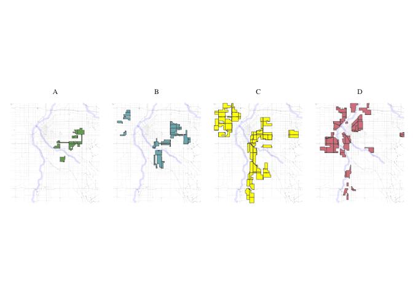
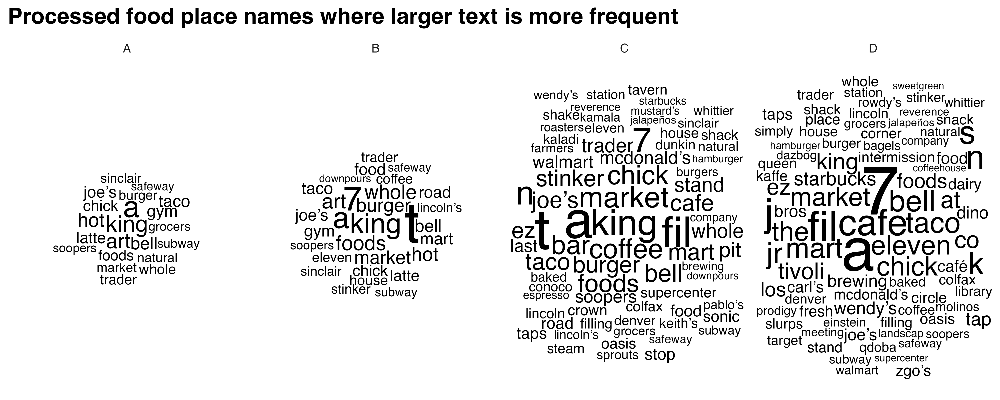
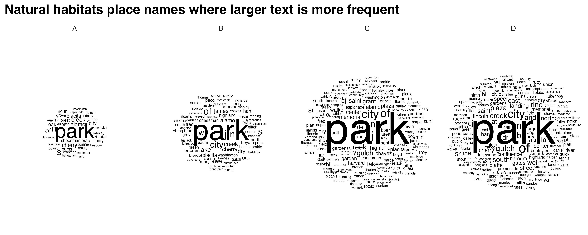

Redlining
================

``` r
if (!requireNamespace("tidytext", quietly = TRUE)) {
  install.packages("tidytext")
}
library(tidytext)
## Warning: package 'tidytext' was built under R version 4.3.2
library(sf)
## Warning: package 'sf' was built under R version 4.3.2
## Linking to GEOS 3.11.0, GDAL 3.5.3, PROJ 9.1.0; sf_use_s2() is TRUE
library(ggplot2)
## Warning: package 'ggplot2' was built under R version 4.3.2
library(ggthemes)
## Warning: package 'ggthemes' was built under R version 4.3.2
library(dplyr)
## 
## Attaching package: 'dplyr'
## The following objects are masked from 'package:stats':
## 
##     filter, lag
## The following objects are masked from 'package:base':
## 
##     intersect, setdiff, setequal, union
library(rstac)
## Warning: package 'rstac' was built under R version 4.3.2
library(gdalcubes)
## Warning: package 'gdalcubes' was built under R version 4.3.2
library(gdalUtils)
## Please note that rgdal will be retired during October 2023,
## plan transition to sf/stars/terra functions using GDAL and PROJ
## at your earliest convenience.
## See https://r-spatial.org/r/2023/05/15/evolution4.html and https://github.com/r-spatial/evolution
## rgdal: version: 1.6-7, (SVN revision 1203)
## Geospatial Data Abstraction Library extensions to R successfully loaded
## Loaded GDAL runtime: GDAL 3.5.3, released 2022/10/21
## Path to GDAL shared files: /Library/Frameworks/R.framework/Versions/4.3-x86_64/Resources/library/rgdal/gdal
##  GDAL does not use iconv for recoding strings.
## GDAL binary built with GEOS: TRUE 
## Loaded PROJ runtime: Rel. 9.1.0, September 1st, 2022, [PJ_VERSION: 910]
## Path to PROJ shared files: /Library/Frameworks/R.framework/Versions/4.3-x86_64/Resources/library/gdalcubes/proj
## PROJ CDN enabled: FALSE
## Linking to sp version:1.6-1
## To mute warnings of possible GDAL/OSR exportToProj4() degradation,
## use options("rgdal_show_exportToProj4_warnings"="none") before loading sp or rgdal.
## 
## Attaching package: 'gdalUtils'
## The following object is masked from 'package:sf':
## 
##     gdal_rasterize
library(gdalcubes)
library(colorspace)
library(terra)
## Warning: package 'terra' was built under R version 4.3.2
## terra 1.7.71
## 
## Attaching package: 'terra'
## The following object is masked from 'package:colorspace':
## 
##     RGB
## The following objects are masked from 'package:gdalcubes':
## 
##     animate, crop, size
library(tidyterra)
## 
## Attaching package: 'tidyterra'
## The following object is masked from 'package:stats':
## 
##     filter
library(basemapR)
library(tidytext)
library(ggwordcloud)
library(osmextract)
## Data (c) OpenStreetMap contributors, ODbL 1.0. https://www.openstreetmap.org/copyright.
## Check the package website, https://docs.ropensci.org/osmextract/, for more details.
library(sf)
library(ggplot2)
library(ggthemes)
```

``` r
# Function to get a list of unique cities and states from the redlining data
get_city_state_list_from_redlining_data <- function() {
  # URL to the GeoJSON data
  url <- "https://raw.githubusercontent.com/americanpanorama/mapping-inequality-census-crosswalk/main/MIv3Areas_2010TractCrosswalk.geojson"
  
  # Read the GeoJSON file into an sf object
  redlining_data <- tryCatch({
    read_sf(url)
  }, error = function(e) {
    stop("Error reading GeoJSON data: ", e$message)
  })

  # Check for the existence of 'city' and 'state' columns
  if (!all(c("city", "state") %in% names(redlining_data))) {
    stop("The required columns 'city' and/or 'state' do not exist in the data.")
  }

  # Extract a unique list of city and state pairs without the geometries
  city_state_df <- redlining_data %>%
    select(city, state) %>%
    st_set_geometry(NULL) %>%  # Drop the geometry to avoid issues with invalid shapes
    distinct(city, state) %>%
    arrange(state, city )  # Arrange the list alphabetically by state, then by city

  # Return the dataframe of unique city-state pairs
  return(city_state_df)
}
```

``` r
#Retrieve the list of cities and states
city_state_list <- get_city_state_list_from_redlining_data()
print(city_state_list)
```

    # A tibble: 314 × 2
       city        state
       <chr>       <chr>
     1 Birmingham  AL   
     2 Mobile      AL   
     3 Montgomery  AL   
     4 Arkadelphia AR   
     5 Batesville  AR   
     6 Camden      AR   
     7 Conway      AR   
     8 El Dorado   AR   
     9 Fort Smith  AR   
    10 Little Rock AR   
    # ℹ 304 more rows

``` r
# Function to load and filter redlining data by city
load_city_redlining_data <- function(city_name) {
  # URL to the GeoJSON data
  url <- "https://raw.githubusercontent.com/americanpanorama/mapping-inequality-census-crosswalk/main/MIv3Areas_2010TractCrosswalk.geojson"
  
  # Read the GeoJSON file into an sf object
  redlining_data <- read_sf(url)
  
  # Filter the data for the specified city and non-empty grades
  
  city_redline <- redlining_data %>%
    filter(city == city_name )
  
  # Return the filtered data
  return(city_redline)
}
```

``` r
# Load redlining data for Denver
denver_redlining <- load_city_redlining_data("Denver")
print(denver_redlining)
```

    Simple feature collection with 316 features and 15 fields
    Geometry type: MULTIPOLYGON
    Dimension:     XY
    Bounding box:  xmin: -105.0622 ymin: 39.62952 xmax: -104.8763 ymax: 39.79111
    Geodetic CRS:  WGS 84
    # A tibble: 316 × 16
       area_id city   state city_survey cat   grade label res   com   ind   fill   
     *   <int> <chr>  <chr> <lgl>       <chr> <chr> <chr> <lgl> <lgl> <lgl> <chr>  
     1    6525 Denver CO    TRUE        Best  A     A1    TRUE  FALSE FALSE #76a865
     2    6525 Denver CO    TRUE        Best  A     A1    TRUE  FALSE FALSE #76a865
     3    6525 Denver CO    TRUE        Best  A     A1    TRUE  FALSE FALSE #76a865
     4    6525 Denver CO    TRUE        Best  A     A1    TRUE  FALSE FALSE #76a865
     5    6529 Denver CO    TRUE        Best  A     A2    TRUE  FALSE FALSE #76a865
     6    6529 Denver CO    TRUE        Best  A     A2    TRUE  FALSE FALSE #76a865
     7    6529 Denver CO    TRUE        Best  A     A2    TRUE  FALSE FALSE #76a865
     8    6537 Denver CO    TRUE        Best  A     A3    TRUE  FALSE FALSE #76a865
     9    6537 Denver CO    TRUE        Best  A     A3    TRUE  FALSE FALSE #76a865
    10    6537 Denver CO    TRUE        Best  A     A3    TRUE  FALSE FALSE #76a865
    # ℹ 306 more rows
    # ℹ 5 more variables: GEOID10 <chr>, GISJOIN <chr>, calc_area <dbl>,
    #   pct_tract <dbl>, geometry <MULTIPOLYGON [°]>

``` r


get_places <- function(polygon_layer, type = "food" ) {
  # Check if the input is an sf object
  if (!inherits(polygon_layer, "sf")) {
    stop("The provided object is not an sf object.")
  }
  
  # Create a bounding box from the input sf object
  bbox_here <- st_bbox(polygon_layer) |>
    st_as_sfc()
  
  if(type == "food"){
    my_layer <- "multipolygons"
    my_query <- "SELECT * FROM multipolygons WHERE (
                 shop IN ('supermarket', 'bodega', 'market', 'other_market', 'farm', 'garden_centre', 'doityourself', 'farm_supply', 'compost', 'mulch', 'fertilizer') OR
                 amenity IN ('social_facility', 'market', 'restaurant', 'coffee') OR
                 leisure = 'garden' OR
                 landuse IN ('farm', 'farmland', 'row_crops', 'orchard_plantation', 'dairy_grazing') OR
                 building IN ('brewery', 'winery', 'distillery') OR
                 shop = 'greengrocer' OR
                 amenity = 'marketplace'
               )"
    title <- "food"
  }
  
  if (type == "processed_food") {
    my_layer <- "multipolygons"
    my_query <- "SELECT * FROM multipolygons WHERE (
                   amenity IN ('fast_food', 'cafe', 'pub') OR
                   shop IN ('convenience', 'supermarket') OR
                   shop = 'kiosk'
                 )"
    title <- "Processed Food Locations"
}
  
  if(type == "natural_habitats"){
    my_layer <- "multipolygons"
    my_query <- "SELECT * FROM multipolygons WHERE (
             boundary = 'protected_area' OR
             natural IN ('tree', 'wood') OR
             landuse = 'forest' OR
             leisure = 'park'
           )"
    title <- "Natural habitats or City owned trees"
  }
  
   if(type == "roads"){
    my_layer <- "lines"
    my_query <- "SELECT * FROM lines WHERE (
             highway IN ('motorway', 'trunk', 'primary', 'secondary', 'tertiary') )"
    title <- "Major roads"
   }
  
  if(type == "rivers"){
    my_layer <- "lines"
    my_query <- "SELECT * FROM lines WHERE (
             waterway IN ('river'))"
    title <- "Major rivers"
  }
  
  if(type == "internet_access") {
    my_layer <- "multipolygons"
    my_query <- "SELECT * FROM multipolygons WHERE (
                 amenity IN ('library', 'cafe', 'community_centre', 'public_building') AND
                 internet_access = 'yes' 
               )"
    title <- "Internet Access Locations"
}

  if(type == "water_bodies") {
    my_layer <- "multipolygons"
    my_query <- "SELECT * FROM multipolygons WHERE (
                 natural IN ('water', 'lake', 'pond') OR
                 water IN ('lake', 'pond') OR
                 landuse = 'reservoir'
               )"
    title <- "Water Bodies"
}

 if(type == "government_buildings") {
    my_layer <- "multipolygons"
    my_query <- "SELECT * FROM multipolygons WHERE (
                 amenity IN ('townhall', 'courthouse', 'embassy', 'police', 'fire_station') OR
                 building IN ('capitol', 'government')
               )"
    title <- "Government Buildings"
}


  # Use the bbox to get data with oe_get(), specifying the desired layer and a custom SQL query for fresh food places
  tryCatch({
    places <- oe_get(
      place = bbox_here,
      layer = my_layer,  # Adjusted layer; change as per actual data availability
      query = my_query,
      quiet = TRUE
    )
    
  places <- st_make_valid(places)
    
    # Crop the data to the bounding box
    cropped_places <- st_crop(places, bbox_here)
    
    # Plotting the cropped fresh food places
    plot <- ggplot(data = cropped_places) +
      geom_sf(fill="cornflowerblue", color="cornflowerblue") +
      ggtitle(title) +
  theme_tufte()+
  theme(legend.position = "none",  # Optionally hide the legend
        axis.text = element_blank(),     # Remove axis text
        axis.title = element_blank(),    # Remove axis titles
        axis.ticks = element_blank(),    # Remove axis ticks
         plot.background = element_rect(fill = "white", color = NA),  # Set the plot background to white
        panel.background = element_rect(fill = "white", color = NA),  # Set the panel background to white
        panel.grid.major = element_blank(),  # Remove major grid lines
        panel.grid.minor = element_blank(),
        ) 
    
    # Save the plot as a PNG file
    png_filename <- paste0(title,"_", Sys.Date(), ".png")
    ggsave(png_filename, plot, width = 10, height = 8, units = "in")
    
    # Return the cropped dataset
    return(cropped_places)
  }, error = function(e) {
    stop("Failed to retrieve or plot data: ", e$message)
  })
}
```

``` r


plot_city_redlining <- function(redlining_data, filename = "redlining_plot.png") {
  # Fetch additional geographic data based on redlining data
  roads <- get_places(redlining_data, type = "roads")
  rivers <- get_places(redlining_data, type = "rivers")
  
  # Filter residential zones with valid grades and where city survey is TRUE
  residential_zones <- redlining_data %>%
    filter(city_survey == TRUE & grade != "") 

  # Colors for the grades
  colors <- c("#76a865", "#7cb5bd", "#ffff00", "#d9838d")

  # Plot the data using ggplot2
  plot <- ggplot() +
    geom_sf(data = roads, lwd = 0.1) +
    geom_sf(data = rivers, color = "blue", alpha = 0.5, lwd = 1.1) +
    geom_sf(data = residential_zones, aes(fill = grade), alpha = 0.5) +
    theme_tufte() +
    scale_fill_manual(values = colors) +
    labs(fill = 'HOLC Categories') +
    theme(
      plot.background = element_rect(fill = "white", color = NA),
      panel.background = element_rect(fill = "white", color = NA),
      panel.grid.major = element_blank(),
      panel.grid.minor = element_blank(),
      legend.position = "right"
    )
  
  # Save the plot as a high-resolution PNG file
  ggsave(filename, plot, width = 10, height = 8, units = "in", dpi = 600)
  
  # Return the plot object if needed for further manipulation or checking
  return(plot)
}
```

``` r
denver_plot <- plot_city_redlining(denver_redlining)
print(denver_plot)
```


``` r
food <- get_places(denver_redlining, type="food")

food_processed <- get_places(denver_redlining, type="processed_food")


natural_habitats <- get_places(denver_redlining, type="natural_habitats")

roads <- get_places(denver_redlining, type="roads")

rivers <- get_places(denver_redlining, type="rivers")

#water_bodies <- get_places(denver_redlining, type="water_bodies")

government_buildings <- get_places(denver_redlining, type="government_buildings")
```

``` r
split_plot <- function(sf_data, roads, rivers) {
  # Filter for grades A, B, C, and D
  sf_data_filtered <- sf_data %>% 
    filter(grade %in% c('A', 'B', 'C', 'D'))

  # Define a color for each grade
  grade_colors <- c("A" = "#76a865", "B" = "#7cb5bd", "C" = "#ffff00", "D" = "#d9838d")

  # Create the plot with panels for each grade
  plot <- ggplot(data = sf_data_filtered) +
    geom_sf(data = roads, alpha = 0.1, lwd = 0.1) +
    geom_sf(data = rivers, color = "blue", alpha = 0.1, lwd = 1.1) +
    geom_sf(aes(fill = grade)) +
    facet_wrap(~ grade, nrow = 1) +  # Free scales for different zoom levels if needed
    scale_fill_manual(values = grade_colors) +
    theme_minimal() +
    labs(fill = 'HOLC Grade') +
    theme_tufte() +
    theme(plot.background = element_rect(fill = "white", color = NA),
          panel.background = element_rect(fill = "white", color = NA),
          legend.position = "none",  # Optionally hide the legend
          axis.text = element_blank(),     # Remove axis text
          axis.title = element_blank(),    # Remove axis titles
          axis.ticks = element_blank(),    # Remove axis ticks
          panel.grid.major = element_blank(),  # Remove major grid lines
          panel.grid.minor = element_blank())  

  return(plot)
}
```

``` r
plot_row <- split_plot(denver_redlining, roads, rivers)
print(plot_row)
```



``` r

process_and_plot_sf_layers <- function(layer1, layer2, output_file = "output_plot.png") {
 # Make geometries valid
layer1 <- st_make_valid(layer1)
layer2 <- st_make_valid(layer2)

# Optionally, simplify geometries to remove duplicate vertices
layer1 <- st_simplify(layer1, preserveTopology = TRUE) |>
  filter(grade != "")

# Prepare a list to store results
results <- list()

# Loop through each grade and perform operations
for (grade in c("A", "B", "C", "D")) {
  # Filter layer1 for current grade
  layer1_grade <- layer1[layer1$grade == grade, ]

  # Buffer the geometries of the current grade
  buffered_layer1_grade <- st_buffer(layer1_grade, dist = 500)

  # Intersect with the second layer
  intersections <- st_intersects(layer2, buffered_layer1_grade, sparse = FALSE)
  selected_polygons <- layer2[rowSums(intersections) > 0, ]

  # Add a new column to store the grade information
  selected_polygons$grade <- grade

  # Store the result
  results[[grade]] <- selected_polygons
}

# Combine all selected polygons from different grades into one sf object
final_selected_polygons <- do.call(rbind, results)

  # Define colors for the grades
  grade_colors <- c("A" = "grey", "B" = "grey", "C" = "grey", "D" = "grey")

  # Create the plot
  plot <- ggplot() +
    geom_sf(data = roads, alpha = 0.05, lwd = 0.1) +
    geom_sf(data = rivers, color = "blue", alpha = 0.1, lwd = 1.1) +
    geom_sf(data = layer1, fill = "grey", color = "grey", size = 0.1) +
    facet_wrap(~ grade, nrow = 1) +
    geom_sf(data = final_selected_polygons,fill = "green", color = "green", size = 0.1) +
    facet_wrap(~ grade, nrow = 1) +
    #scale_fill_manual(values = grade_colors) +
    #scale_color_manual(values = grade_colors) +
    theme_minimal() +
    labs(fill = 'HOLC Grade') +
    theme_tufte() +
    theme(plot.background = element_rect(fill = "white", color = NA),
      panel.background = element_rect(fill = "white", color = NA),
      legend.position = "none",
          axis.text = element_blank(),
          axis.title = element_blank(),
          axis.ticks = element_blank(),
          panel.grid.major = element_blank(),
          panel.grid.minor = element_blank())

  # Save the plot as a high-resolution PNG file
  ggsave(output_file, plot, width = 10, height = 8, units = "in", dpi = 600)
  
  # Return the plot for optional further use
  return(list(plot=plot, sf = final_selected_polygons))
}
```

``` r
create_wordclouds_by_grade <- function(sf_object, output_file = "food_word_cloud_per_grade.png",title = "Healthy food place names word cloud", max_size =25) {
    # Ensure the 'name' and 'grade' columns are present
    if (!("name" %in% names(sf_object)) || !("grade" %in% names(sf_object))) {
        stop("The sf object must contain 'name' and 'grade' columns.")
    }
    
    # Extract relevant data and prepare text data
    text_data <- sf_object %>%
        select(grade, name) %>%
        filter(!is.na(name)) %>%
        unnest_tokens(output = "word", input = name, token = "words") %>%
        count(grade, word, sort = TRUE) %>%
        ungroup() %>%
        filter(n() > 1)  # Filter to remove overly common or single-occurrence words
    
    # Ensure there are no NA values in the 'word' column
    text_data <- text_data %>% filter(!is.na(word))

    # Handle cases where text_data might be empty
    if (nrow(text_data) == 0) {
        stop("No data available for creating word clouds.")
    }
    
    # Create a word cloud using ggplot2 and ggwordcloud
    p <- ggplot( ) +
        geom_text_wordcloud_area(data=text_data, aes(label = word, size = n),rm_outside = TRUE) +
        scale_size_area(max_size = max_size) +
        facet_wrap(~ grade, nrow = 1) +
      scale_color_gradient(low = "darkred", high = "red") +
        theme_minimal() +
        theme(plot.background = element_rect(fill = "white", color = NA),
          panel.background = element_rect(fill = "white", color = NA),
          panel.spacing = unit(0.5, "lines"),
              plot.title = element_text(size = 16, face = "bold"),
              legend.position = "none") +
        labs(title = title)
    
    # Attempt to save the plot and handle any errors
    tryCatch({
        ggsave(output_file, p, width = 10, height = 4, units = "in", dpi = 600)
    }, error = function(e) {
        cat("Error in saving the plot: ", e$message, "\n")
    })
    
    return(p)
}
```

``` r
 layer1 <- denver_redlining
 layer2 <- food
 food_match <- process_and_plot_sf_layers(layer1, layer2, "final_redlining_plot.png")
 print(food_match$plot)
```


``` r
food_word_cloud <- create_wordclouds_by_grade(food_match$sf, output_file = "food_word_cloud_per_grade.png")
```

    Warning in wordcloud_boxes(data_points = points_valid_first, boxes = boxes, :
    Some words could not fit on page. They have been removed.


``` r
 layer1 <- denver_redlining
 layer2 <- food_processed
 processed_food_match <- process_and_plot_sf_layers(layer1, layer2, "final_redlining_plot.png")
 print(processed_food_match$plot)
```


``` r
processed_food_cloud <- create_wordclouds_by_grade(processed_food_match$sf, output_file = "processed_food_word_cloud_per_grade.png",title = "Processed food place names where larger text is more frequent", max_size =17)
```



``` r
 layer1 <- denver_redlining
 layer2 <- natural_habitats
 natural_habitats_match <- process_and_plot_sf_layers(layer1, layer2, "final_redlining_plot.png")
 print(natural_habitats_match$plot)
```


``` r
natural_habitats_cloud <- create_wordclouds_by_grade(natural_habitats_match$sf, output_file = "natural_habitats_word_cloud_per_grade.png",title = "Natural habitats place names where larger text is more frequent", max_size =35)
```



``` r
polygon_layer <- denver_redlining
# Function to process satellite data based on an SF polygon's extent
process_satellite_data <- function(polygon_layer, start_date, end_date, assets, fps = 1, output_file = "anim.gif") {
  # Record start time
  start_time <- Sys.time()
  
  # Calculate the bbox from the polygon layer
  bbox <- st_bbox(polygon_layer)
  
  s = stac("https://earth-search.aws.element84.com/v0")

  
  # Use stacR to search for Sentinel-2 images within the bbox and date range
  items = s |> stac_search(
    collections = "sentinel-s2-l2a-cogs",
    bbox = c(bbox["xmin"], bbox["ymin"], bbox["xmax"], bbox["ymax"]),
    datetime = paste(start_date, end_date, sep = "/"),
    limit = 500
  ) %>% 
  post_request()
  
  # Define mask for Sentinel-2 image quality
  #S2.mask <- image_mask("SCL", values = c(3, 8, 9))
  
  # Create a collection of images filtering by cloud cover
  col <- stac_image_collection(items$features, asset_names = assets, property_filter = function(x) {x[["eo:cloud_cover"]] < 30})
  
  # Define a view for processing the data
  v <- cube_view(srs = "EPSG:4326", 
                 extent = list(t0 = start_date, t1 = end_date,
                               left = bbox["xmin"], right = bbox["xmax"], 
                               top = bbox["ymax"], bottom = bbox["ymin"]),
                 dx = 0.001, dy = 0.001, dt = "P1M", 
                 aggregation = "median", resampling = "bilinear")
  
  # Calculate NDVI and create an animation
  ndvi_col <- function(n) {
    rev(sequential_hcl(n, "Green-Yellow"))
  }
  
  #raster_cube(col, v, mask = S2.mask) %>%
  raster_cube(col, v) %>%
    select_bands(c("B04", "B08")) %>%
    apply_pixel("(B08-B04)/(B08+B04)", "NDVI") %>%
    gdalcubes::animate(col = ndvi_col, zlim = c(-0.2, 1), key.pos = 1, save_as = output_file, fps = fps)
  
  # Calculate processing time
  end_time <- Sys.time()
  processing_time <- difftime(end_time, start_time)
  
  # Return processing time
  return(processing_time)
}
```

``` r
processing_time <- process_satellite_data(denver_redlining, "2022-05-31", "2023-05-31", c("B04", "B08"))
print(processing_time)
```

    Time difference of 9.332093 mins


``` r


yearly_average_ndvi <- function(polygon_layer, output_file = "ndvi.png", dx = 0.01, dy = 0.01) {
  # Record start time
  start_time <- Sys.time()

  # Calculate the bbox from the polygon layer
  bbox <- st_bbox(polygon_layer)
  
  s = stac("https://earth-search.aws.element84.com/v0")

  # Search for Sentinel-2 images within the bbox for June
  items <- s |> stac_search(
    collections = "sentinel-s2-l2a-cogs",
    bbox = c(bbox["xmin"], bbox["ymin"], bbox["xmax"], bbox["ymax"]),
    datetime = "2023-01-01/2023-12-31",
    limit = 500
  ) %>% 
  post_request()
  
  # Create a collection of images filtering by cloud cover
  col <- stac_image_collection(items$features, asset_names = c("B04", "B08"), property_filter = function(x) {x[["eo:cloud_cover"]] < 80})
  
  # Define a view for processing the data specifically for June
  v <- cube_view(srs = "EPSG:4326", 
                 extent = list(t0 = "2023-01-01", t1 = "2023-12-31",
                               left = bbox["xmin"], right = bbox["xmax"], 
                               top = bbox["ymax"], bottom = bbox["ymin"]),
                 dx = dx, dy = dy, dt = "P1Y", 
                 aggregation = "median", resampling = "bilinear")

  # Process NDVI
  ndvi_rast <- raster_cube(col, v) %>%
    select_bands(c("B04", "B08")) %>%
    apply_pixel("(B08-B04)/(B08+B04)", "NDVI") %>%
    write_tif() |>
    terra::rast()
  
 
  # Convert terra Raster to ggplot using tidyterra
ndvi_plot <-   ggplot() +
    geom_spatraster(data = ndvi_rast, aes(fill = NDVI)) +
    scale_fill_viridis_c(option = "viridis", direction = -1, name = "NDVI") +
    labs(title = "NDVI mean for 2023") +
    theme_minimal() +
    coord_sf() +
    theme(plot.background = element_rect(fill = "white", color = NA),
      panel.background = element_rect(fill = "white", color = NA),
      legend.position = "right",
          axis.text = element_blank(),
          axis.title = element_blank(),
          axis.ticks = element_blank(),
          panel.grid.major = element_blank(),
          panel.grid.minor = element_blank()) 

  # Save the plot as a high-resolution PNG file
  ggsave(output_file, ndvi_plot, width = 10, height = 8, dpi = 600)

  # Calculate processing time
  end_time <- Sys.time()
  processing_time <- difftime(end_time, start_time)

  # Return the plot and processing time
  return(list(plot = ndvi_plot, processing_time = processing_time, raster = ndvi_rast))
}
```

``` r
ndvi_background <- yearly_average_ndvi(denver_redlining,dx = 0.0001, dy = 0.0001)
print(ndvi_background$plot)
```


``` r
print(ndvi_background$processing_time)
```

    Time difference of 15.54536 mins

``` r
print(ndvi_background$raster)
```

    class       : SpatRaster 
    dimensions  : 1616, 1860, 1  (nrow, ncol, nlyr)
    resolution  : 1e-04, 1e-04  (x, y)
    extent      : -105.0623, -104.8763, 39.62951, 39.79112  (xmin, xmax, ymin, ymax)
    coord. ref. : lon/lat WGS 84 (EPSG:4326) 
    source      : cube_9522eb956f52023-01-01.tif 
    name        : NDVI 

``` r


create_mask_and_plot <- function(redlining_sf, background_raster = ndvi$raster, roads = NULL, rivers = NULL){
  start_time <- Sys.time()  # Start timing
  
  # Validate and prepare the redlining data
  redlining_sf <- redlining_sf %>%
    filter(grade != "") %>%
    st_make_valid()
  
  
bbox <- st_bbox(redlining_sf)  # Get original bounding box


expanded_bbox <- expand_bbox(bbox, 6000, 1000)  # 

   
expanded_bbox_poly <- st_as_sfc(expanded_bbox, crs = st_crs(redlining_sf)) %>%
    st_make_valid()
  
  # Initialize an empty list to store masks
  masks <- list()
  
  # Iterate over each grade to create masks
  unique_grades <- unique(redlining_sf$grade)
  for (grade in unique_grades) {
    # Filter polygons by grade
    grade_polygons <- redlining_sf[redlining_sf$grade == grade, ]
    
    # Create an "inverted" mask by subtracting these polygons from the background
    mask <- st_difference(expanded_bbox_poly, st_union(grade_polygons))
    
    # Store the mask in the list with the grade as the name
    masks[[grade]] <- st_sf(geometry = mask, grade = grade)
  }
  
  # Combine all masks into a single sf object
  mask_sf <- do.call(rbind, masks)
  
  # Normalize the grades so that C.2 becomes C, but correctly handle other grades
  mask_sf$grade <- ifelse(mask_sf$grade == "C.2", "C", mask_sf$grade)

  # Prepare the plot
  plot <- ggplot() +
    geom_spatraster(data = background_raster, aes(fill = NDVI)) +
  scale_fill_viridis_c(name = "NDVI", option = "viridis", direction = -1) +
   
    geom_sf(data = mask_sf, aes(color = grade), fill = "white", size = 0.1, show.legend = FALSE) +
    scale_color_manual(values = c("A" = "white", "B" = "white", "C" = "white", "D" = "white"), name = "Grade") +
    facet_wrap(~ grade, nrow = 1) +
     geom_sf(data = roads, alpha = 1, lwd = 0.1, color="white") +
    geom_sf(data = rivers, color = "white", alpha = 0.5, lwd = 1.1) +
    labs(title = "NDVI: Normalized Difference Vegetation Index") +
    theme_minimal() +
    coord_sf(xlim = c(bbox["xmin"], bbox["xmax"]), 
           ylim = c(bbox["ymin"], bbox["ymax"]), 
           expand = FALSE) + 
    theme(plot.background = element_rect(fill = "white", color = NA),
          panel.background = element_rect(fill = "white", color = NA),
          legend.position = "bottom",
          axis.text = element_blank(),
          axis.title = element_blank(),
          axis.ticks = element_blank(),
          panel.grid.major = element_blank(),
          panel.grid.minor = element_blank())

  # Save the plot
  ggsave("redlining_mask_ndvi.png", plot, width = 10, height = 4, dpi = 600)

  end_time <- Sys.time()  # End timing
  runtime <- end_time - start_time

  # Return the plot and runtime
  return(list(plot = plot, runtime = runtime, mask_sf = mask_sf))
}
```

``` r
ndvi_background_low <- yearly_average_ndvi(denver_redlining)
print(ndvi_background_low$plot)
```


``` r
print(ndvi_background_low$processing_time)
```

    Time difference of 1.710772 mins

``` r
print(ndvi_background_low$raster)
```

    class       : SpatRaster 
    dimensions  : 17, 19, 1  (nrow, ncol, nlyr)
    resolution  : 0.01, 0.01  (x, y)
    extent      : -105.0643, -104.8743, 39.62532, 39.79532  (xmin, xmax, ymin, ymax)
    coord. ref. : lon/lat WGS 84 (EPSG:4326) 
    source      : cube_95216d405be2023-01-01.tif 
    name        : NDVI 

``` r
ndvi <- create_mask_and_plot(denver_redlining, background_raster = ndvi_background_low$raster, roads = roads, rivers = rivers)
ndvi$mask_sf
```

    Simple feature collection with 4 features and 1 field
    Geometry type: GEOMETRY
    Dimension:     XY
    Bounding box:  xmin: -105.0865 ymin: 39.62053 xmax: -104.8546 ymax: 39.8001
    Geodetic CRS:  WGS 84
      grade                       geometry
    A     A MULTIPOLYGON (((-105.0865 3...
    B     B POLYGON ((-105.0865 39.6205...
    C     C MULTIPOLYGON (((-105.0865 3...
    D     D MULTIPOLYGON (((-105.0865 3...

``` r
ndvi$plot
```


