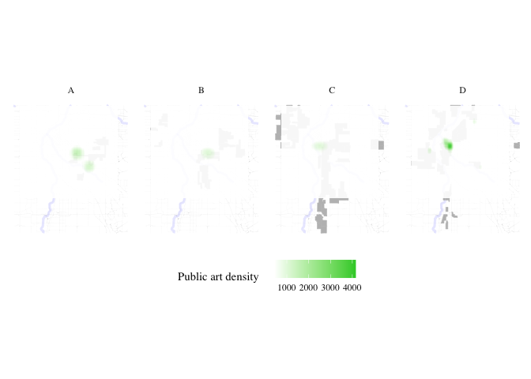
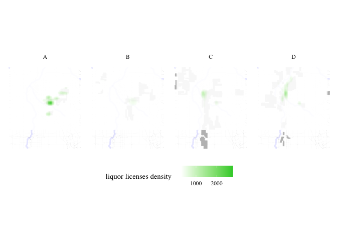

Redlining
================

``` r
if (!requireNamespace("tidytext", quietly = TRUE)) {
  install.packages("tidytext")
}
library(tidytext)
## Warning: package 'tidytext' was built under R version 4.3.2
library(sf)
## Warning: package 'sf' was built under R version 4.3.2
## Linking to GEOS 3.11.0, GDAL 3.5.3, PROJ 9.1.0; sf_use_s2() is TRUE
library(ggplot2)
## Warning: package 'ggplot2' was built under R version 4.3.2
library(ggthemes)
## Warning: package 'ggthemes' was built under R version 4.3.2
library(dplyr)
## 
## Attaching package: 'dplyr'
## The following objects are masked from 'package:stats':
## 
##     filter, lag
## The following objects are masked from 'package:base':
## 
##     intersect, setdiff, setequal, union
library(rstac)
## Warning: package 'rstac' was built under R version 4.3.2
library(gdalcubes)
## Warning: package 'gdalcubes' was built under R version 4.3.2
library(gdalUtils)
## Please note that rgdal will be retired during October 2023,
## plan transition to sf/stars/terra functions using GDAL and PROJ
## at your earliest convenience.
## See https://r-spatial.org/r/2023/05/15/evolution4.html and https://github.com/r-spatial/evolution
## rgdal: version: 1.6-7, (SVN revision 1203)
## Geospatial Data Abstraction Library extensions to R successfully loaded
## Loaded GDAL runtime: GDAL 3.5.3, released 2022/10/21
## Path to GDAL shared files: /Library/Frameworks/R.framework/Versions/4.3-x86_64/Resources/library/rgdal/gdal
##  GDAL does not use iconv for recoding strings.
## GDAL binary built with GEOS: TRUE 
## Loaded PROJ runtime: Rel. 9.1.0, September 1st, 2022, [PJ_VERSION: 910]
## Path to PROJ shared files: /Library/Frameworks/R.framework/Versions/4.3-x86_64/Resources/library/gdalcubes/proj
## PROJ CDN enabled: FALSE
## Linking to sp version:1.6-1
## To mute warnings of possible GDAL/OSR exportToProj4() degradation,
## use options("rgdal_show_exportToProj4_warnings"="none") before loading sp or rgdal.
## 
## Attaching package: 'gdalUtils'
## The following object is masked from 'package:sf':
## 
##     gdal_rasterize
library(gdalcubes)
library(colorspace)
library(terra)
## Warning: package 'terra' was built under R version 4.3.2
## terra 1.7.71
## 
## Attaching package: 'terra'
## The following object is masked from 'package:colorspace':
## 
##     RGB
## The following objects are masked from 'package:gdalcubes':
## 
##     animate, crop, size
library(tidyterra)
## 
## Attaching package: 'tidyterra'
## The following object is masked from 'package:stats':
## 
##     filter
library(basemapR)
library(tidytext)
library(ggwordcloud)
library(osmextract)
## Data (c) OpenStreetMap contributors, ODbL 1.0. https://www.openstreetmap.org/copyright.
## Check the package website, https://docs.ropensci.org/osmextract/, for more details.
library(sf)
library(ggplot2)
library(ggthemes)
library(glue)
## 
## Attaching package: 'glue'
## The following object is masked from 'package:terra':
## 
##     trim

library(purrr)
```

``` r
# Function to get a list of unique cities and states from the redlining data
get_city_state_list_from_redlining_data <- function() {
  # URL to the GeoJSON data
  url <- "https://raw.githubusercontent.com/americanpanorama/mapping-inequality-census-crosswalk/main/MIv3Areas_2010TractCrosswalk.geojson"
  
  # Read the GeoJSON file into an sf object
  redlining_data <- tryCatch({
    read_sf(url)
  }, error = function(e) {
    stop("Error reading GeoJSON data: ", e$message)
  })

  # Check for the existence of 'city' and 'state' columns
  if (!all(c("city", "state") %in% names(redlining_data))) {
    stop("The required columns 'city' and/or 'state' do not exist in the data.")
  }

  # Extract a unique list of city and state pairs without the geometries
  city_state_df <- redlining_data %>%
    select(city, state) %>%
    st_set_geometry(NULL) %>%  # Drop the geometry to avoid issues with invalid shapes
    distinct(city, state) %>%
    arrange(state, city )  # Arrange the list alphabetically by state, then by city

  # Return the dataframe of unique city-state pairs
  return(city_state_df)
}
```

``` r
#Retrieve the list of cities and states
city_state_list <- get_city_state_list_from_redlining_data()
print(city_state_list)
```

    # A tibble: 314 × 2
       city        state
       <chr>       <chr>
     1 Birmingham  AL   
     2 Mobile      AL   
     3 Montgomery  AL   
     4 Arkadelphia AR   
     5 Batesville  AR   
     6 Camden      AR   
     7 Conway      AR   
     8 El Dorado   AR   
     9 Fort Smith  AR   
    10 Little Rock AR   
    # ℹ 304 more rows

``` r
# Function to load and filter redlining data by city
load_city_redlining_data <- function(city_name) {
  # URL to the GeoJSON data
  url <- "https://raw.githubusercontent.com/americanpanorama/mapping-inequality-census-crosswalk/main/MIv3Areas_2010TractCrosswalk.geojson"
  
  # Read the GeoJSON file into an sf object
  redlining_data <- read_sf(url)
  
  # Filter the data for the specified city and non-empty grades
  
  city_redline <- redlining_data %>%
    filter(city == city_name )
  
  # Return the filtered data
  return(city_redline)
}
```

``` r
# Load redlining data for Denver
denver_redlining <- load_city_redlining_data("Denver")
print(denver_redlining)
```

    Simple feature collection with 316 features and 15 fields
    Geometry type: MULTIPOLYGON
    Dimension:     XY
    Bounding box:  xmin: -105.0622 ymin: 39.62952 xmax: -104.8763 ymax: 39.79111
    Geodetic CRS:  WGS 84
    # A tibble: 316 × 16
       area_id city   state city_survey cat   grade label res   com   ind   fill   
     *   <int> <chr>  <chr> <lgl>       <chr> <chr> <chr> <lgl> <lgl> <lgl> <chr>  
     1    6525 Denver CO    TRUE        Best  A     A1    TRUE  FALSE FALSE #76a865
     2    6525 Denver CO    TRUE        Best  A     A1    TRUE  FALSE FALSE #76a865
     3    6525 Denver CO    TRUE        Best  A     A1    TRUE  FALSE FALSE #76a865
     4    6525 Denver CO    TRUE        Best  A     A1    TRUE  FALSE FALSE #76a865
     5    6529 Denver CO    TRUE        Best  A     A2    TRUE  FALSE FALSE #76a865
     6    6529 Denver CO    TRUE        Best  A     A2    TRUE  FALSE FALSE #76a865
     7    6529 Denver CO    TRUE        Best  A     A2    TRUE  FALSE FALSE #76a865
     8    6537 Denver CO    TRUE        Best  A     A3    TRUE  FALSE FALSE #76a865
     9    6537 Denver CO    TRUE        Best  A     A3    TRUE  FALSE FALSE #76a865
    10    6537 Denver CO    TRUE        Best  A     A3    TRUE  FALSE FALSE #76a865
    # ℹ 306 more rows
    # ℹ 5 more variables: GEOID10 <chr>, GISJOIN <chr>, calc_area <dbl>,
    #   pct_tract <dbl>, geometry <MULTIPOLYGON [°]>

``` r


get_places <- function(polygon_layer, type = "food" ) {
  # Check if the input is an sf object
  if (!inherits(polygon_layer, "sf")) {
    stop("The provided object is not an sf object.")
  }
  
  # Create a bounding box from the input sf object
  bbox_here <- st_bbox(polygon_layer) |>
    st_as_sfc()
  
  if(type == "food"){
    my_layer <- "multipolygons"
    my_query <- "SELECT * FROM multipolygons WHERE (
                 shop IN ('supermarket', 'bodega', 'market', 'other_market', 'farm', 'garden_centre', 'doityourself', 'farm_supply', 'compost', 'mulch', 'fertilizer') OR
                 amenity IN ('social_facility', 'market', 'restaurant', 'coffee') OR
                 leisure = 'garden' OR
                 landuse IN ('farm', 'farmland', 'row_crops', 'orchard_plantation', 'dairy_grazing') OR
                 building IN ('brewery', 'winery', 'distillery') OR
                 shop = 'greengrocer' OR
                 amenity = 'marketplace'
               )"
    title <- "food"
  }
  
  if (type == "processed_food") {
    my_layer <- "multipolygons"
    my_query <- "SELECT * FROM multipolygons WHERE (
                   amenity IN ('fast_food', 'cafe', 'pub') OR
                   shop IN ('convenience', 'supermarket') OR
                   shop = 'kiosk'
                 )"
    title <- "Processed Food Locations"
}
  
  if(type == "natural_habitats"){
    my_layer <- "multipolygons"
    my_query <- "SELECT * FROM multipolygons WHERE (
             boundary = 'protected_area' OR
             natural IN ('tree', 'wood') OR
             landuse = 'forest' OR
             leisure = 'park'
           )"
    title <- "Natural habitats or City owned trees"
  }
  
   if(type == "roads"){
    my_layer <- "lines"
    my_query <- "SELECT * FROM lines WHERE (
             highway IN ('motorway', 'trunk', 'primary', 'secondary', 'tertiary') )"
    title <- "Major roads"
   }
  
  if(type == "rivers"){
    my_layer <- "lines"
    my_query <- "SELECT * FROM lines WHERE (
             waterway IN ('river'))"
    title <- "Major rivers"
  }
  
  if(type == "internet_access") {
    my_layer <- "multipolygons"
    my_query <- "SELECT * FROM multipolygons WHERE (
                 amenity IN ('library', 'cafe', 'community_centre', 'public_building') AND
                 internet_access = 'yes' 
               )"
    title <- "Internet Access Locations"
}

  if(type == "water_bodies") {
    my_layer <- "multipolygons"
    my_query <- "SELECT * FROM multipolygons WHERE (
                 natural IN ('water', 'lake', 'pond') OR
                 water IN ('lake', 'pond') OR
                 landuse = 'reservoir'
               )"
    title <- "Water Bodies"
}

 if(type == "government_buildings") {
    my_layer <- "multipolygons"
    my_query <- "SELECT * FROM multipolygons WHERE (
                 amenity IN ('townhall', 'courthouse', 'embassy', 'police', 'fire_station') OR
                 building IN ('capitol', 'government')
               )"
    title <- "Government Buildings"
}


  # Use the bbox to get data with oe_get(), specifying the desired layer and a custom SQL query for fresh food places
  tryCatch({
    places <- oe_get(
      place = bbox_here,
      layer = my_layer,  # Adjusted layer; change as per actual data availability
      query = my_query,
      quiet = TRUE
    )
    
  places <- st_make_valid(places)
    
    # Crop the data to the bounding box
    cropped_places <- st_crop(places, bbox_here)
    
    # Plotting the cropped fresh food places
    plot <- ggplot(data = cropped_places) +
      geom_sf(fill="cornflowerblue", color="cornflowerblue") +
      ggtitle(title) +
  theme_tufte()+
  theme(legend.position = "none",  # Optionally hide the legend
        axis.text = element_blank(),     # Remove axis text
        axis.title = element_blank(),    # Remove axis titles
        axis.ticks = element_blank(),    # Remove axis ticks
         plot.background = element_rect(fill = "white", color = NA),  # Set the plot background to white
        panel.background = element_rect(fill = "white", color = NA),  # Set the panel background to white
        panel.grid.major = element_blank(),  # Remove major grid lines
        panel.grid.minor = element_blank(),
        ) 
    
    # Save the plot as a PNG file
    png_filename <- paste0(title,"_", Sys.Date(), ".png")
    ggsave(png_filename, plot, width = 10, height = 8, units = "in")
    
    # Return the cropped dataset
    return(cropped_places)
  }, error = function(e) {
    stop("Failed to retrieve or plot data: ", e$message)
  })
}
```

``` r


plot_city_redlining <- function(redlining_data, filename = "redlining_plot.png") {
  # Fetch additional geographic data based on redlining data
  roads <- get_places(redlining_data, type = "roads")
  rivers <- get_places(redlining_data, type = "rivers")
  
  # Filter residential zones with valid grades and where city survey is TRUE
  residential_zones <- redlining_data %>%
    filter(city_survey == TRUE & grade != "") 

  # Colors for the grades
  colors <- c("#76a865", "#7cb5bd", "#ffff00", "#d9838d")

  # Plot the data using ggplot2
  plot <- ggplot() +
    geom_sf(data = roads, lwd = 0.1) +
    geom_sf(data = rivers, color = "blue", alpha = 0.5, lwd = 1.1) +
    geom_sf(data = residential_zones, aes(fill = grade), alpha = 0.5) +
    theme_tufte() +
    scale_fill_manual(values = colors) +
    labs(fill = 'HOLC Categories') +
    theme(
      plot.background = element_rect(fill = "white", color = NA),
      panel.background = element_rect(fill = "white", color = NA),
      panel.grid.major = element_blank(),
      panel.grid.minor = element_blank(),
      legend.position = "right"
    )
  
  # Save the plot as a high-resolution PNG file
  ggsave(filename, plot, width = 10, height = 8, units = "in", dpi = 600)
  
  # Return the plot object if needed for further manipulation or checking
  return(plot)
}
```

``` r
denver_plot <- plot_city_redlining(denver_redlining)
print(denver_plot)
```


``` r
food <- get_places(denver_redlining, type="food")

food_processed <- get_places(denver_redlining, type="processed_food")


natural_habitats <- get_places(denver_redlining, type="natural_habitats")

roads <- get_places(denver_redlining, type="roads")

rivers <- get_places(denver_redlining, type="rivers")

#water_bodies <- get_places(denver_redlining, type="water_bodies")

government_buildings <- get_places(denver_redlining, type="government_buildings")
```

``` r
split_plot <- function(sf_data, roads, rivers) {
  # Filter for grades A, B, C, and D
  sf_data_filtered <- sf_data %>% 
    filter(grade %in% c('A', 'B', 'C', 'D'))

  # Define a color for each grade
  grade_colors <- c("A" = "#76a865", "B" = "#7cb5bd", "C" = "#ffff00", "D" = "#d9838d")

  # Create the plot with panels for each grade
  plot <- ggplot(data = sf_data_filtered) +
    geom_sf(data = roads, alpha = 0.1, lwd = 0.1) +
    geom_sf(data = rivers, color = "blue", alpha = 0.1, lwd = 1.1) +
    geom_sf(aes(fill = grade)) +
    facet_wrap(~ grade, nrow = 1) +  # Free scales for different zoom levels if needed
    scale_fill_manual(values = grade_colors) +
    theme_minimal() +
    labs(fill = 'HOLC Grade') +
    theme_tufte() +
    theme(plot.background = element_rect(fill = "white", color = NA),
          panel.background = element_rect(fill = "white", color = NA),
          legend.position = "none",  # Optionally hide the legend
          axis.text = element_blank(),     # Remove axis text
          axis.title = element_blank(),    # Remove axis titles
          axis.ticks = element_blank(),    # Remove axis ticks
          panel.grid.major = element_blank(),  # Remove major grid lines
          panel.grid.minor = element_blank())  

  return(plot)
}
```

``` r
plot_row <- split_plot(denver_redlining, roads, rivers)
print(plot_row)
```


``` r

process_and_plot_sf_layers <- function(layer1, layer2, output_file = "output_plot.png") {
 # Make geometries valid
layer1 <- st_make_valid(layer1)
layer2 <- st_make_valid(layer2)

# Optionally, simplify geometries to remove duplicate vertices
layer1 <- st_simplify(layer1, preserveTopology = TRUE) |>
  filter(grade != "")

# Prepare a list to store results
results <- list()

# Loop through each grade and perform operations
for (grade in c("A", "B", "C", "D")) {
  # Filter layer1 for current grade
  layer1_grade <- layer1[layer1$grade == grade, ]

  # Buffer the geometries of the current grade
  buffered_layer1_grade <- st_buffer(layer1_grade, dist = 500)

  # Intersect with the second layer
  intersections <- st_intersects(layer2, buffered_layer1_grade, sparse = FALSE)
  selected_polygons <- layer2[rowSums(intersections) > 0, ]

  # Add a new column to store the grade information
  selected_polygons$grade <- grade

  # Store the result
  results[[grade]] <- selected_polygons
}

# Combine all selected polygons from different grades into one sf object
final_selected_polygons <- do.call(rbind, results)

  # Define colors for the grades
  grade_colors <- c("A" = "grey", "B" = "grey", "C" = "grey", "D" = "grey")

  # Create the plot
  plot <- ggplot() +
    geom_sf(data = roads, alpha = 0.05, lwd = 0.1) +
    geom_sf(data = rivers, color = "blue", alpha = 0.1, lwd = 1.1) +
    geom_sf(data = layer1, fill = "grey", color = "grey", size = 0.1) +
    facet_wrap(~ grade, nrow = 1) +
    geom_sf(data = final_selected_polygons,fill = "green", color = "green", size = 0.1) +
    facet_wrap(~ grade, nrow = 1) +
    #scale_fill_manual(values = grade_colors) +
    #scale_color_manual(values = grade_colors) +
    theme_minimal() +
    labs(fill = 'HOLC Grade') +
    theme_tufte() +
    theme(plot.background = element_rect(fill = "white", color = NA),
      panel.background = element_rect(fill = "white", color = NA),
      legend.position = "none",
          axis.text = element_blank(),
          axis.title = element_blank(),
          axis.ticks = element_blank(),
          panel.grid.major = element_blank(),
          panel.grid.minor = element_blank())

  # Save the plot as a high-resolution PNG file
  ggsave(output_file, plot, width = 10, height = 8, units = "in", dpi = 600)
  
  # Return the plot for optional further use
  return(list(plot=plot, sf = final_selected_polygons))
}
```

``` r
create_wordclouds_by_grade <- function(sf_object, output_file = "food_word_cloud_per_grade.png",title = "Healthy food place names word cloud", max_size =25, col_select = "name") {
   
    
    # Extract relevant data and prepare text data
    text_data <- sf_object %>%
        select(grade, col_select) %>%
        filter(!is.na(col_select)) %>%
        unnest_tokens(output = "word", input = col_select, token = "words") %>%
        count(grade, word, sort = TRUE) %>%
        ungroup() %>%
        filter(n() > 1)  # Filter to remove overly common or single-occurrence words
    
    # Ensure there are no NA values in the 'word' column
    text_data <- text_data %>% filter(!is.na(word))

    # Handle cases where text_data might be empty
    if (nrow(text_data) == 0) {
        stop("No data available for creating word clouds.")
    }
    
    # Create a word cloud using ggplot2 and ggwordcloud
    p <- ggplot( ) +
        geom_text_wordcloud_area(data=text_data, aes(label = word, size = n),rm_outside = TRUE) +
        scale_size_area(max_size = max_size) +
        facet_wrap(~ grade, nrow = 1) +
      scale_color_gradient(low = "darkred", high = "red") +
        theme_minimal() +
        theme(plot.background = element_rect(fill = "white", color = NA),
          panel.background = element_rect(fill = "white", color = NA),
          panel.spacing = unit(0.5, "lines"),
              plot.title = element_text(size = 16, face = "bold"),
              legend.position = "none") +
        labs(title = title)
    
    # Attempt to save the plot and handle any errors
    tryCatch({
        ggsave(output_file, p, width = 10, height = 4, units = "in", dpi = 600)
    }, error = function(e) {
        cat("Error in saving the plot: ", e$message, "\n")
    })
    
    return(p)
}
```

``` r
 layer1 <- denver_redlining
 layer2 <- food
 food_match <- process_and_plot_sf_layers(layer1, layer2, "final_redlining_plot.png")
 print(food_match$plot)
```


``` r
food_word_cloud <- create_wordclouds_by_grade(food_match$sf, output_file = "food_word_cloud_per_grade.png")
```

    Warning: Using an external vector in selections was deprecated in tidyselect 1.1.0.
    ℹ Please use `all_of()` or `any_of()` instead.
      # Was:
      data %>% select(col_select)

      # Now:
      data %>% select(all_of(col_select))

    See <https://tidyselect.r-lib.org/reference/faq-external-vector.html>.

    Warning in wordcloud_boxes(data_points = points_valid_first, boxes = boxes, :
    Some words could not fit on page. They have been removed.


``` r
 layer1 <- denver_redlining
 layer2 <- food_processed
 processed_food_match <- process_and_plot_sf_layers(layer1, layer2, "final_redlining_plot.png")
 print(processed_food_match$plot)
```


``` r
processed_food_cloud <- create_wordclouds_by_grade(processed_food_match$sf, output_file = "processed_food_word_cloud_per_grade.png",title = "Processed food place names where larger text is more frequent", max_size =17)
```


``` r
 layer1 <- denver_redlining
 layer2 <- natural_habitats
 natural_habitats_match <- process_and_plot_sf_layers(layer1, layer2, "final_redlining_plot.png")
 print(natural_habitats_match$plot)
```


``` r
natural_habitats_cloud <- create_wordclouds_by_grade(natural_habitats_match$sf, output_file = "natural_habitats_word_cloud_per_grade.png",title = "Natural habitats place names where larger text is more frequent", max_size =35)
```


``` r
polygon_layer <- denver_redlining
# Function to process satellite data based on an SF polygon's extent
process_satellite_data <- function(polygon_layer, start_date, end_date, assets, fps = 1, output_file = "anim.gif") {
  # Record start time
  start_time <- Sys.time()
  
  # Calculate the bbox from the polygon layer
  bbox <- st_bbox(polygon_layer)
  
  s = stac("https://earth-search.aws.element84.com/v0")

  
  # Use stacR to search for Sentinel-2 images within the bbox and date range
  items = s |> stac_search(
    collections = "sentinel-s2-l2a-cogs",
    bbox = c(bbox["xmin"], bbox["ymin"], bbox["xmax"], bbox["ymax"]),
    datetime = paste(start_date, end_date, sep = "/"),
    limit = 500
  ) %>% 
  post_request()
  
  # Define mask for Sentinel-2 image quality
  #S2.mask <- image_mask("SCL", values = c(3, 8, 9))
  
  # Create a collection of images filtering by cloud cover
  col <- stac_image_collection(items$features, asset_names = assets, property_filter = function(x) {x[["eo:cloud_cover"]] < 30})
  
  # Define a view for processing the data
  v <- cube_view(srs = "EPSG:4326", 
                 extent = list(t0 = start_date, t1 = end_date,
                               left = bbox["xmin"], right = bbox["xmax"], 
                               top = bbox["ymax"], bottom = bbox["ymin"]),
                 dx = 0.001, dy = 0.001, dt = "P1M", 
                 aggregation = "median", resampling = "bilinear")
  
  # Calculate NDVI and create an animation
  ndvi_col <- function(n) {
    rev(sequential_hcl(n, "Green-Yellow"))
  }
  
  #raster_cube(col, v, mask = S2.mask) %>%
  raster_cube(col, v) %>%
    select_bands(c("B04", "B08")) %>%
    apply_pixel("(B08-B04)/(B08+B04)", "NDVI") %>%
    gdalcubes::animate(col = ndvi_col, zlim = c(-0.2, 1), key.pos = 1, save_as = output_file, fps = fps)
  
  # Calculate processing time
  end_time <- Sys.time()
  processing_time <- difftime(end_time, start_time)
  
  # Return processing time
  return(processing_time)
}
```

``` r
processing_time <- process_satellite_data(denver_redlining, "2022-05-31", "2023-05-31", c("B04", "B08"))
print(processing_time)
```

    Time difference of 9.332093 mins


``` r


yearly_average_ndvi <- function(polygon_layer, output_file = "ndvi.png", dx = 0.01, dy = 0.01) {
  # Record start time
  start_time <- Sys.time()

  # Calculate the bbox from the polygon layer
  bbox <- st_bbox(polygon_layer)
  
  s = stac("https://earth-search.aws.element84.com/v0")

  # Search for Sentinel-2 images within the bbox for June
  items <- s |> stac_search(
    collections = "sentinel-s2-l2a-cogs",
    bbox = c(bbox["xmin"], bbox["ymin"], bbox["xmax"], bbox["ymax"]),
    datetime = "2023-01-01/2023-12-31",
    limit = 500
  ) %>% 
  post_request()
  
  # Create a collection of images filtering by cloud cover
  col <- stac_image_collection(items$features, asset_names = c("B04", "B08"), property_filter = function(x) {x[["eo:cloud_cover"]] < 80})
  
  # Define a view for processing the data specifically for June
  v <- cube_view(srs = "EPSG:4326", 
                 extent = list(t0 = "2023-01-01", t1 = "2023-12-31",
                               left = bbox["xmin"], right = bbox["xmax"], 
                               top = bbox["ymax"], bottom = bbox["ymin"]),
                 dx = dx, dy = dy, dt = "P1Y", 
                 aggregation = "median", resampling = "bilinear")

  # Process NDVI
  ndvi_rast <- raster_cube(col, v) %>%
    select_bands(c("B04", "B08")) %>%
    apply_pixel("(B08-B04)/(B08+B04)", "NDVI") %>%
    write_tif() |>
    terra::rast()
  
 
  # Convert terra Raster to ggplot using tidyterra
ndvi_plot <-   ggplot() +
    geom_spatraster(data = ndvi_rast, aes(fill = NDVI)) +
    scale_fill_viridis_c(option = "viridis", direction = -1, name = "NDVI") +
    labs(title = "NDVI mean for 2023") +
    theme_minimal() +
    coord_sf() +
    theme(plot.background = element_rect(fill = "white", color = NA),
      panel.background = element_rect(fill = "white", color = NA),
      legend.position = "right",
          axis.text = element_blank(),
          axis.title = element_blank(),
          axis.ticks = element_blank(),
          panel.grid.major = element_blank(),
          panel.grid.minor = element_blank()) 

  # Save the plot as a high-resolution PNG file
  ggsave(output_file, ndvi_plot, width = 10, height = 8, dpi = 600)

  # Calculate processing time
  end_time <- Sys.time()
  processing_time <- difftime(end_time, start_time)

  # Return the plot and processing time
  return(list(plot = ndvi_plot, processing_time = processing_time, raster = ndvi_rast))
}
```

``` r
ndvi_background <- yearly_average_ndvi(denver_redlining,dx = 0.0001, dy = 0.0001)
print(ndvi_background$plot)
```


``` r
print(ndvi_background$processing_time)
```

    Time difference of 15.54536 mins

``` r
print(ndvi_background$raster)
```

    class       : SpatRaster 
    dimensions  : 1616, 1860, 1  (nrow, ncol, nlyr)
    resolution  : 1e-04, 1e-04  (x, y)
    extent      : -105.0623, -104.8763, 39.62951, 39.79112  (xmin, xmax, ymin, ymax)
    coord. ref. : lon/lat WGS 84 (EPSG:4326) 
    source      : cube_9522eb956f52023-01-01.tif 
    name        : NDVI 

``` r


create_mask_and_plot <- function(redlining_sf, background_raster = ndvi$raster, roads = NULL, rivers = NULL){
  start_time <- Sys.time()  # Start timing
  
  # Validate and prepare the redlining data
  redlining_sf <- redlining_sf %>%
    filter(grade != "") %>%
    st_make_valid()
  
  
bbox <- st_bbox(redlining_sf)  # Get original bounding box


expanded_bbox <- expand_bbox(bbox, 6000, 1000)  # 

   
expanded_bbox_poly <- st_as_sfc(expanded_bbox, crs = st_crs(redlining_sf)) %>%
    st_make_valid()
  
  # Initialize an empty list to store masks
  masks <- list()
  
  # Iterate over each grade to create masks
  unique_grades <- unique(redlining_sf$grade)
  for (grade in unique_grades) {
    # Filter polygons by grade
    grade_polygons <- redlining_sf[redlining_sf$grade == grade, ]
    
    # Create an "inverted" mask by subtracting these polygons from the background
    mask <- st_difference(expanded_bbox_poly, st_union(grade_polygons))
    
    # Store the mask in the list with the grade as the name
    masks[[grade]] <- st_sf(geometry = mask, grade = grade)
  }
  
  # Combine all masks into a single sf object
  mask_sf <- do.call(rbind, masks)
  
  # Normalize the grades so that C.2 becomes C, but correctly handle other grades
  mask_sf$grade <- ifelse(mask_sf$grade == "C.2", "C", mask_sf$grade)

  # Prepare the plot
  plot <- ggplot() +
    geom_spatraster(data = background_raster, aes(fill = NDVI)) +
  scale_fill_viridis_c(name = "NDVI", option = "viridis", direction = -1) +
   
    geom_sf(data = mask_sf, aes(color = grade), fill = "white", size = 0.1, show.legend = FALSE) +
    scale_color_manual(values = c("A" = "white", "B" = "white", "C" = "white", "D" = "white"), name = "Grade") +
    facet_wrap(~ grade, nrow = 1) +
     geom_sf(data = roads, alpha = 1, lwd = 0.1, color="white") +
    geom_sf(data = rivers, color = "white", alpha = 0.5, lwd = 1.1) +
    labs(title = "NDVI: Normalized Difference Vegetation Index") +
    theme_minimal() +
    coord_sf(xlim = c(bbox["xmin"], bbox["xmax"]), 
           ylim = c(bbox["ymin"], bbox["ymax"]), 
           expand = FALSE) + 
    theme(plot.background = element_rect(fill = "white", color = NA),
          panel.background = element_rect(fill = "white", color = NA),
          legend.position = "bottom",
          axis.text = element_blank(),
          axis.title = element_blank(),
          axis.ticks = element_blank(),
          panel.grid.major = element_blank(),
          panel.grid.minor = element_blank())

  # Save the plot
  ggsave("redlining_mask_ndvi.png", plot, width = 10, height = 4, dpi = 600)

  end_time <- Sys.time()  # End timing
  runtime <- end_time - start_time

  # Return the plot and runtime
  return(list(plot = plot, runtime = runtime, mask_sf = mask_sf))
}
```

``` r
ndvi_background_low <- yearly_average_ndvi(denver_redlining)
print(ndvi_background_low$plot)
```


``` r
print(ndvi_background_low$processing_time)
```

    Time difference of 1.710772 mins

``` r
print(ndvi_background_low$raster)
```

    class       : SpatRaster 
    dimensions  : 17, 19, 1  (nrow, ncol, nlyr)
    resolution  : 0.01, 0.01  (x, y)
    extent      : -105.0643, -104.8743, 39.62532, 39.79532  (xmin, xmax, ymin, ymax)
    coord. ref. : lon/lat WGS 84 (EPSG:4326) 
    source      : cube_95216d405be2023-01-01.tif 
    name        : NDVI 

``` r
ndvi <- create_mask_and_plot(denver_redlining, background_raster = ndvi_background_low$raster, roads = roads, rivers = rivers)
ndvi$mask_sf
```

    Simple feature collection with 4 features and 1 field
    Geometry type: GEOMETRY
    Dimension:     XY
    Bounding box:  xmin: -105.0865 ymin: 39.62053 xmax: -104.8546 ymax: 39.8001
    Geodetic CRS:  WGS 84
      grade                       geometry
    A     A MULTIPOLYGON (((-105.0865 3...
    B     B POLYGON ((-105.0865 39.6205...
    C     C MULTIPOLYGON (((-105.0865 3...
    D     D MULTIPOLYGON (((-105.0865 3...

``` r
ndvi$plot
```


``` r
process_city_inventory_data <- function(address, inner_file, polygon_layer, output_filename,variable_label= 'Tree Density') {
  # Download and read the shapefile
  full_path <- glue("/vsizip/vsicurl/{address}/{inner_file}")
  shape_data <- st_read(full_path, quiet = TRUE) |> st_as_sf()

  # Process the shape data with the provided polygon layer
  processed_data <- process_and_plot_sf_layers(polygon_layer, shape_data, paste0(output_filename, ".png"))

  # Extract trees from the processed data
  trees <- processed_data$sf
  denver_redlining_residential <- polygon_layer |> filter(grade != "")

  # Generate the density plot
  plot <- ggplot() +
    geom_sf(data = roads, alpha = 0.05, lwd = 0.1) +
    geom_sf(data = rivers, color = "blue", alpha = 0.1, lwd = 1.1) +
    geom_sf(data = denver_redlining_residential, fill = "grey", color = "grey", size = 0.1) +
    facet_wrap(~ grade, nrow = 1) +
    stat_density_2d(data = trees, 
                    mapping = aes(x = map_dbl(geometry, ~.[1]),
                                  y = map_dbl(geometry, ~.[2]),
                                  fill = stat(density)),
                    geom = 'tile',
                    contour = FALSE,
                    alpha = 0.9) +
    scale_fill_gradientn(colors = c("transparent", "white", "limegreen"),
                         values = scales::rescale(c(0, 0.1, 1)),  # Adjust these based on your density range
                         guide = "colourbar") +
    theme_minimal() +
    labs(fill = variable_label) +
    theme_tufte() +
    theme(plot.background = element_rect(fill = "white", color = NA),
          panel.background = element_rect(fill = "white", color = NA),
          legend.position = "bottom",
          axis.text = element_blank(),
          axis.title = element_blank(),
          axis.ticks = element_blank(),
          panel.grid.major = element_blank(),
          panel.grid.minor = element_blank())

  # Save the plot
  ggsave(paste0(output_filename, "_density_plot.png"), plot, width = 10, height = 4, units = "in", dpi = 600)

  # Return the plot and the tree layer
  return(list(plot = plot, layer = trees))
}
```

``` r
result <- process_city_inventory_data(
  "https://www.denvergov.org/media/gis/DataCatalog/tree_inventory/shape/tree_inventory.zip",
  "tree_inventory.shp",
  denver_redlining,
  "Denver_tree_inventory_2023"
)
```

    Warning: `stat(density)` was deprecated in ggplot2 3.4.0.
    ℹ Please use `after_stat(density)` instead.

``` r
result
```

    $plot


    $layer
    Simple feature collection with 336999 features and 17 fields
    Geometry type: POINT
    Dimension:     XY
    Bounding box:  xmin: -105.057 ymin: 39.66298 xmax: -104.8801 ymax: 39.7939
    Geodetic CRS:  WGS 84
    First 10 features:
         SITE_ID                    SPECIES_CO                      SPECIES_BO
    A.3    61362                  Oak, Shumard               Quercus shumardii
    A.14  187865                 Maple, Norway                Acer platanoides
    A.20  227501                   Honeylocust           Gleditsia triacanthos
    A.23  185920                    Ash, White              Fraxinus americana
    A.26  163730 Maple, Freeman 'Autumn Blaze' Acer x freemanii 'Autumn Blaze'
    A.33  184376                 Maple, Norway                Acer platanoides
    A.35  182758          Crabapple, Flowering                Malus sylvestris
    A.37    1853                Oak, Chinkapin           Quercus muehlenbergii
    A.43  113549               Pear, Flowering                Pyrus calleryana
    A.53  129798                   Honeylocust           Gleditsia triacanthos
         DIAMETER STEMS               LOCATION_N LOCATION_C
    A.3   6 to 12     1             Mayfair Park        432
    A.14 12 to 18     1          0 Non-park tree       <NA>
    A.20 18 to 24     1          0 Non-park tree       <NA>
    A.23  6 to 12     1          0 Non-park tree       <NA>
    A.26   0 to 6     1          0 Non-park tree       <NA>
    A.33 18 to 24     1          0 Non-park tree       <NA>
    A.35  6 to 12     1          0 Non-park tree       <NA>
    A.37   0 to 6     1 East 17th Avenue Parkway        412
    A.43   0 to 6     8          0 Non-park tree       <NA>
    A.53   0 to 6     1                E 6th Ave        411
                             SITE_DESIG INVENTORY_ ADDRESS             STREET
    A.3                            Park   2/9/2021    1000           N IVY ST
    A.14 Private Maintained Street Tree  11/7/2016    1650       N NEWPORT ST
    A.20 Private Maintained Street Tree  11/8/2016     525      S BELLAIRE ST
    A.23 Private Maintained Street Tree 10/29/2020    1545         N HOLLY ST
    A.26 Private Maintained Street Tree  10/4/2019     600          N VINE ST
    A.33 Private Maintained Street Tree 10/29/2020    1550       N GLENCOE ST
    A.35 Private Maintained Street Tree   4/3/2018    1350        N DAHLIA ST
    A.37                         Median   2/9/2021    5100 E 17TH AVENUE PKWY
    A.43 Private Maintained Street Tree  11/7/2016     894       S GAYLORD ST
    A.53                         Median   2/9/2021    6500  E 6TH AVENUE PKWY
                NEIGHBOR    X_LONG    Y_LAT   WORKGROUP NOTABLE grade
    A.3        Montclair -104.9206 39.73237  Operations     N/A     A
    A.14 South Park Hill -104.9093 39.74253 Inspections     N/A     A
    A.20         Hilltop -104.9372 39.72485 Inspections     N/A     A
    A.23 South Park Hill -104.9224 39.74107 Inspections     N/A     A
    A.26    Country Club -104.9622 39.72567 Inspections     N/A     A
    A.33 South Park Hill -104.9257 39.74126 Inspections     N/A     A
    A.35            Hale -104.9315 39.73746 Inspections     N/A     A
    A.37 South Park Hill -104.9277 39.74368  Operations     N/A     A
    A.43 Washington Park -104.9614 39.70028 Inspections     N/A     A
    A.53         Hilltop -104.9113 39.72560  Operations     N/A     A
                           geometry
    A.3  POINT (-104.9206 39.73237)
    A.14 POINT (-104.9093 39.74253)
    A.20 POINT (-104.9372 39.72485)
    A.23 POINT (-104.9224 39.74107)
    A.26 POINT (-104.9622 39.72567)
    A.33 POINT (-104.9257 39.74126)
    A.35 POINT (-104.9315 39.73746)
    A.37 POINT (-104.9277 39.74368)
    A.43 POINT (-104.9614 39.70028)
    A.53  POINT (-104.9113 39.7256)

``` r
result <- process_city_inventory_data(
  "https://www.denvergov.org/media/gis/DataCatalog/tree_inventory/shape/tree_inventory.zip",
  "tree_inventory.shp",
  denver_redlining,
  "Denver_tree_inventory_2023"
)
result
```

    $plot


    $layer
    Simple feature collection with 336999 features and 17 fields
    Geometry type: POINT
    Dimension:     XY
    Bounding box:  xmin: -105.057 ymin: 39.66298 xmax: -104.8801 ymax: 39.7939
    Geodetic CRS:  WGS 84
    First 10 features:
         SITE_ID                    SPECIES_CO                      SPECIES_BO
    A.3    61362                  Oak, Shumard               Quercus shumardii
    A.14  187865                 Maple, Norway                Acer platanoides
    A.20  227501                   Honeylocust           Gleditsia triacanthos
    A.23  185920                    Ash, White              Fraxinus americana
    A.26  163730 Maple, Freeman 'Autumn Blaze' Acer x freemanii 'Autumn Blaze'
    A.33  184376                 Maple, Norway                Acer platanoides
    A.35  182758          Crabapple, Flowering                Malus sylvestris
    A.37    1853                Oak, Chinkapin           Quercus muehlenbergii
    A.43  113549               Pear, Flowering                Pyrus calleryana
    A.53  129798                   Honeylocust           Gleditsia triacanthos
         DIAMETER STEMS               LOCATION_N LOCATION_C
    A.3   6 to 12     1             Mayfair Park        432
    A.14 12 to 18     1          0 Non-park tree       <NA>
    A.20 18 to 24     1          0 Non-park tree       <NA>
    A.23  6 to 12     1          0 Non-park tree       <NA>
    A.26   0 to 6     1          0 Non-park tree       <NA>
    A.33 18 to 24     1          0 Non-park tree       <NA>
    A.35  6 to 12     1          0 Non-park tree       <NA>
    A.37   0 to 6     1 East 17th Avenue Parkway        412
    A.43   0 to 6     8          0 Non-park tree       <NA>
    A.53   0 to 6     1                E 6th Ave        411
                             SITE_DESIG INVENTORY_ ADDRESS             STREET
    A.3                            Park   2/9/2021    1000           N IVY ST
    A.14 Private Maintained Street Tree  11/7/2016    1650       N NEWPORT ST
    A.20 Private Maintained Street Tree  11/8/2016     525      S BELLAIRE ST
    A.23 Private Maintained Street Tree 10/29/2020    1545         N HOLLY ST
    A.26 Private Maintained Street Tree  10/4/2019     600          N VINE ST
    A.33 Private Maintained Street Tree 10/29/2020    1550       N GLENCOE ST
    A.35 Private Maintained Street Tree   4/3/2018    1350        N DAHLIA ST
    A.37                         Median   2/9/2021    5100 E 17TH AVENUE PKWY
    A.43 Private Maintained Street Tree  11/7/2016     894       S GAYLORD ST
    A.53                         Median   2/9/2021    6500  E 6TH AVENUE PKWY
                NEIGHBOR    X_LONG    Y_LAT   WORKGROUP NOTABLE grade
    A.3        Montclair -104.9206 39.73237  Operations     N/A     A
    A.14 South Park Hill -104.9093 39.74253 Inspections     N/A     A
    A.20         Hilltop -104.9372 39.72485 Inspections     N/A     A
    A.23 South Park Hill -104.9224 39.74107 Inspections     N/A     A
    A.26    Country Club -104.9622 39.72567 Inspections     N/A     A
    A.33 South Park Hill -104.9257 39.74126 Inspections     N/A     A
    A.35            Hale -104.9315 39.73746 Inspections     N/A     A
    A.37 South Park Hill -104.9277 39.74368  Operations     N/A     A
    A.43 Washington Park -104.9614 39.70028 Inspections     N/A     A
    A.53         Hilltop -104.9113 39.72560  Operations     N/A     A
                           geometry
    A.3  POINT (-104.9206 39.73237)
    A.14 POINT (-104.9093 39.74253)
    A.20 POINT (-104.9372 39.72485)
    A.23 POINT (-104.9224 39.74107)
    A.26 POINT (-104.9622 39.72567)
    A.33 POINT (-104.9257 39.74126)
    A.35 POINT (-104.9315 39.73746)
    A.37 POINT (-104.9277 39.74368)
    A.43 POINT (-104.9614 39.70028)
    A.53  POINT (-104.9113 39.7256)

``` r
result <- process_city_inventory_data(
  "https://www.denvergov.org/media/gis/DataCatalog/traffic_accidents/shape/traffic_accidents.zip",
  "traffic_accidents.shp",
  denver_redlining,
  "Denver_traffic_accidents",
  variable_label= 'Traffic accidents density'
)
result
```

    $plot


    $layer
    Simple feature collection with 88031 features and 46 fields
    Geometry type: POINT
    Dimension:     XY
    Bounding box:  xmin: -105.0566 ymin: 39.66305 xmax: -104.8802 ymax: 39.79458
    Geodetic CRS:  WGS 84
    First 10 features:
          OBJECTID_1 INCIDENT_I      OFFENSE_ID OFFENSE_CO OFFENSE__1
    A.39          39 2018643696 201864369654410       5441          0
    A.40          40 2018643698 201864369854410       5441          0
    A.53          53 2018644041 201864404154410       5441          0
    A.54          54 2018644056 201864405654410       5441          0
    A.58          58 2018644159 201864415954410       5441          0
    A.60          60 2018644269 201864426954010       5401          0
    A.70          70 2018644487 201864448754410       5441          0
    A.77          77 2018644554 201864455454410       5441          0
    A.94          94 2018645101 201864510154410       5441          0
    A.102        102 2018645659 201864565954410       5441          0
                           TOP_TRAFFI FIRST_OCCU LAST_OCCUR REPORTED_D
    A.39              TRAF - ACCIDENT 2018-09-19 2018-09-19 2018-09-19
    A.40              TRAF - ACCIDENT 2018-09-19 2018-09-19 2018-09-19
    A.53              TRAF - ACCIDENT 2018-09-19 2018-09-19 2018-09-19
    A.54              TRAF - ACCIDENT 2018-09-19 2018-09-19 2018-09-19
    A.58              TRAF - ACCIDENT 2018-09-19 2018-09-19 2018-09-19
    A.60  TRAF - ACCIDENT - HIT & RUN 2018-09-19 2018-09-19 2018-09-19
    A.70              TRAF - ACCIDENT 2018-09-19 2018-09-19 2018-09-19
    A.77              TRAF - ACCIDENT 2018-09-19 2018-09-19 2018-09-19
    A.94              TRAF - ACCIDENT 2018-09-19 2018-09-19 2018-09-19
    A.102             TRAF - ACCIDENT 2018-09-20 2018-09-20 2018-09-20
                             INCIDENT_A   GEO_X   GEO_Y   GEO_LON  GEO_LAT
    A.39         00 BLK N COLORADO BLVD 3157333 1686820 -104.9407 39.71779
    A.40        N MONACO ST / E 6TH AVE 3165264 1689728 -104.9125 39.72564
    A.53    E SPEER BLVD / N DOWNING ST 3148172 1687097 -104.9733 39.71870
    A.54       N MONACO ST / E 11TH AVE 3165150 1692645 -104.9128 39.73365
    A.58          4600 BLOCK E 18TH AVE 3158980 1696693 -104.9346 39.74487
    A.60        N OLIVE ST / E 24TH AVE 3166747 1699413 -104.9070 39.75220
    A.70                 6001 E 8TH AVE 3163689 1691111 -104.9180 39.72946
    A.77  E MONTVIEW BLVD / N QUINCE ST 3168083 1697686 -104.9022 39.74743
    A.94     E COLFAX AVE / N QUEBEC ST 3167760 1695028 -104.9035 39.74014
    A.102     N HARRISON ST / E 9TH AVE 3156988 1691441 -104.9418 39.73048
          DISTRICT_I PRECINCT_I      NEIGHBORHO BICYCLE_IN PEDESTRIAN
    A.39           3        311    Cherry Creek          0          0
    A.40           2        321         Hilltop          0          0
    A.53           3        311           Speer          0          0
    A.54           2        222       Montclair          0          0
    A.58           2        222 South Park Hill          0          0
    A.60           2        222 North Park Hill          0          0
    A.70           2        222       Montclair          0          0
    A.77           2        223     East Colfax          0          0
    A.94           2        223       Montclair          0          0
    A.102          2        213   Congress Park          0          0
                                                    HARMFUL_EV
    A.39                     REAR TO REAR WITH MV IN TRANSPORT
    A.40                    FRONT TO SIDE WITH MV IN TRANSPORT
    A.53                    FRONT TO SIDE WITH MV IN TRANSPORT
    A.54                    FRONT TO SIDE WITH MV IN TRANSPORT
    A.58                          PARKED MV WITH OTHER VEHICLE
    A.60                    FRONT TO REAR WITH MV IN TRANSPORT
    A.70                                                  TREE
    A.77                    FRONT TO SIDE WITH MV IN TRANSPORT
    A.94                    FRONT TO SIDE WITH MV IN TRANSPORT
    A.102 SIDE TO SIDE OPPOSITE DIRECTION WITH MV IN TRANSPORT
                                                    HARMFUL__1
    A.39                     REAR TO REAR WITH MV IN TRANSPORT
    A.40                                                  <NA>
    A.53                                                  <NA>
    A.54                                    LIGHT/UTILITY POLE
    A.58                          PARKED MV WITH OTHER VEHICLE
    A.60                                                  <NA>
    A.70                                                  <NA>
    A.77                                                  <NA>
    A.94                                                  <NA>
    A.102 SIDE TO SIDE OPPOSITE DIRECTION WITH MV IN TRANSPORT
                                                    HARMFUL__2 ROAD_LOCAT
    A.39                     REAR TO REAR WITH MV IN TRANSPORT ON ROADWAY
    A.40                    FRONT TO SIDE WITH MV IN TRANSPORT ON ROADWAY
    A.53                    FRONT TO SIDE WITH MV IN TRANSPORT ON ROADWAY
    A.54                    FRONT TO SIDE WITH MV IN TRANSPORT ON ROADWAY
    A.58                          PARKED MV WITH OTHER VEHICLE ON ROADWAY
    A.60                    FRONT TO REAR WITH MV IN TRANSPORT ON ROADWAY
    A.70                                                  TREE ON ROADWAY
    A.77                    FRONT TO SIDE WITH MV IN TRANSPORT ON ROADWAY
    A.94                    FRONT TO SIDE WITH MV IN TRANSPORT ON ROADWAY
    A.102 SIDE TO SIDE OPPOSITE DIRECTION WITH MV IN TRANSPORT ON ROADWAY
                       ROAD_DESCR        ROAD_CONTO ROAD_CONDI   LIGHT_COND
    A.39         NON INTERSECTION STRAIGHT ON-LEVEL        DRY    DAY LIGHT
    A.40          AT INTERSECTION    CURVE ON-LEVEL        DRY    DAY LIGHT
    A.53          AT INTERSECTION STRAIGHT ON-LEVEL        DRY    DAY LIGHT
    A.54          AT INTERSECTION STRAIGHT ON-LEVEL        DRY    DAY LIGHT
    A.58         NON INTERSECTION STRAIGHT ON-LEVEL        DRY    DAY LIGHT
    A.60         NON INTERSECTION STRAIGHT ON-LEVEL        DRY    DAY LIGHT
    A.70          AT INTERSECTION STRAIGHT ON-LEVEL        DRY    DAY LIGHT
    A.77  DRIVEWAY ACCESS RELATED STRAIGHT ON-LEVEL        WET    DAY LIGHT
    A.94          AT INTERSECTION STRAIGHT ON-LEVEL        DRY DARK-LIGHTED
    A.102         AT INTERSECTION STRAIGHT ON-LEVEL        DRY DAWN OR DUSK
                      TU1_VEHICL TU1_TRAVEL        TU1_VEHI_1          TU1_DRIVER
    A.39        SUV WITH TRAILER      NORTH    CHANGING LANES    CARELESS DRIVING
    A.40                     SUV      SOUTH  MAKING LEFT TURN FAILED TO YIELD ROW
    A.53                     SUV      NORTH  MAKING LEFT TURN FAILED TO YIELD ROW
    A.54                     SUV       EAST MAKING RIGHT TURN FAILED TO YIELD ROW
    A.58       PASSENGER CAR/VAN       EAST    GOING STRAIGHT    CARELESS DRIVING
    A.60       PASSENGER CAR/VAN      NORTH           BACKING               OTHER
    A.70       PASSENGER CAR/VAN       EAST    GOING STRAIGHT    CARELESS DRIVING
    A.77  VEHICLE OVER 10000 LBS       WEST           PASSING      LANE VIOLATION
    A.94       PASSENGER CAR/VAN       WEST  MAKING LEFT TURN FAILED TO YIELD ROW
    A.102 VEHICLE OVER 10000 LBS  SOUTHEAST  MAKING LEFT TURN      LANE VIOLATION
                  TU1_DRIV_1 TU1_PEDEST                             TU2_VEHICL
    A.39  AGGRESSIVE DRIVING      OTHER                       SUV WITH TRAILER
    A.40  AGGRESSIVE DRIVING      OTHER                      PASSENGER CAR/VAN
    A.53         NO APPARENT      OTHER                                    SUV
    A.54  AGGRESSIVE DRIVING      OTHER                      PASSENGER CAR/VAN
    A.58    DISTRACTED-OTHER      OTHER                                  OTHER
    A.60               OTHER      OTHER                                    SUV
    A.70               OTHER      OTHER                                  OTHER
    A.77  AGGRESSIVE DRIVING      OTHER                      PASSENGER CAR/VAN
    A.94         NO APPARENT      OTHER                      MOTORIZED BICYCLE
    A.102              OTHER      OTHER PICKUP TRUCK/UTILITY VAN WITH TRAILIER
          TU2_TRAVEL         TU2_VEHI_1 TU2_DRIVER  TU2_DRIV_1 TU2_PEDEST
    A.39       NORTH STOPPED IN TRAFFIC  No Action NO APPARENT      OTHER
    A.40       NORTH     GOING STRAIGHT  No Action NO APPARENT      OTHER
    A.53        WEST     GOING STRAIGHT  No Action NO APPARENT      OTHER
    A.54       SOUTH     GOING STRAIGHT  No Action NO APPARENT      OTHER
    A.58       OTHER              OTHER      OTHER       OTHER      OTHER
    A.60       OTHER             PARKED      OTHER       OTHER      OTHER
    A.70       OTHER              OTHER      OTHER       OTHER      OTHER
    A.77        EAST   MAKING LEFT TURN  No Action NO APPARENT      OTHER
    A.94        EAST     GOING STRAIGHT  No Action NO APPARENT      OTHER
    A.102      NORTH             PARKED  No Action NO APPARENT      OTHER
          SERIOUSLY_ FATALITIES FATALITY_M FATALITY_1 SERIOUSLY1 SERIOUSL_1 grade
    A.39           0          0      OTHER      OTHER      OTHER      OTHER     A
    A.40           0          0      OTHER      OTHER      OTHER      OTHER     A
    A.53           0          0      OTHER      OTHER      OTHER      OTHER     A
    A.54           0          0      OTHER      OTHER      OTHER      OTHER     A
    A.58           0          0      OTHER      OTHER      OTHER      OTHER     A
    A.60           0          0      OTHER      OTHER      OTHER      OTHER     A
    A.70           0          0      OTHER      OTHER      OTHER      OTHER     A
    A.77           0          0      OTHER      OTHER      OTHER      OTHER     A
    A.94           0          0      OTHER      OTHER      OTHER      OTHER     A
    A.102          0          0      OTHER      OTHER      OTHER      OTHER     A
                            geometry
    A.39  POINT (-104.9407 39.71779)
    A.40  POINT (-104.9125 39.72564)
    A.53   POINT (-104.9733 39.7187)
    A.54  POINT (-104.9128 39.73365)
    A.58  POINT (-104.9346 39.74487)
    A.60    POINT (-104.907 39.7522)
    A.70   POINT (-104.918 39.72946)
    A.77  POINT (-104.9022 39.74743)
    A.94  POINT (-104.9035 39.74014)
    A.102 POINT (-104.9418 39.73048)

``` r
Crime <- process_city_inventory_data(
  "https://www.denvergov.org/media/gis/DataCatalog/crime/shape/crime.zip",
  "crime.shp",
  denver_redlining,
  "crime",
  variable_label= 'Crime density'
)
Crime$layer
```

    Simple feature collection with 325226 features and 21 fields
    Geometry type: POINT
    Dimension:     XY
    Bounding box:  xmin: -105.0566 ymin: 39.66314 xmax: -104.8827 ymax: 39.79459
    Geodetic CRS:  WGS 84
    First 10 features:
           INCIDENT_I        OFFENSE_ID OFFENSE_CO OFFENSE__1
    A.103  2021367586  2021367586299900       2999          0
    A.105  2022346453  2022346453299900       2999          0
    A.130 20226011890 20226011890299900       2999          0
    A.157  2021263186  2021263186299900       2999          0
    A.250  2021255918  2021255918299900       2999          0
    A.336 20216022999 20216022999299900       2999          0
    A.403 20216008289 20216008289299900       2999          0
    A.467 20226011021 20226011021299900       2999          0
    A.471 20206006868 20206006868299900       2999          0
    A.484 20226007222 20226007222299900       2999          0
                       OFFENSE_TY      OFFENSE_CA FIRST_OCCU LAST_OCCUR REPORTED_D
    A.103 criminal-mischief-other public-disorder 2021-06-26 2021-06-28 2021-06-28
    A.105 criminal-mischief-other public-disorder 2022-07-08       <NA> 2022-07-08
    A.130 criminal-mischief-other public-disorder 2022-06-26 2022-06-26 2022-06-26
    A.157 criminal-mischief-other public-disorder 2021-05-08 2021-05-10 2021-05-10
    A.250 criminal-mischief-other public-disorder 2021-05-04 2021-05-05 2021-05-06
    A.336 criminal-mischief-other public-disorder 2021-11-23 2021-11-23 2021-11-23
    A.403 criminal-mischief-other public-disorder 2021-04-02 2021-04-03 2021-04-03
    A.467 criminal-mischief-other public-disorder 2022-06-13 2022-06-13 2022-06-13
    A.471 criminal-mischief-other public-disorder 2020-06-06 2020-06-06 2020-06-06
    A.484 criminal-mischief-other public-disorder 2022-04-20 2022-04-21 2022-04-21
                   INCIDENT_A GEO_X GEO_Y   GEO_LON  GEO_LAT DISTRICT_I PRECINCT_I
    A.103   221 S GARFIELD ST     0     0 -104.9441 39.71258          3        311
    A.105    1552 N EUDORA ST     0     0 -104.9306 39.74118          2        222
    A.130     612 N MARION ST     0     0 -104.9714 39.72589          3        311
    A.157 888 N COLORADO BLVD     0     0 -104.9404 39.73087          2        222
    A.250 985 N COLORADO BLVD     0     0 -104.9408 39.73184          2        213
    A.336    1522 N QUEBEC ST     0     0 -104.9031 39.74077          2        223
    A.403    2295 N EUDORA ST     0     0 -104.9308 39.75088          2        222
    A.467 100 N COLORADO BLVD     0     0 -104.9403 39.71818          3        321
    A.471    900 N MADISON ST     0     0 -104.9459 39.73067          2        213
    A.484     2909 E OHIO WAY     0     0 -104.9532 39.70308          3        312
               NEIGHBORHO IS_CRIME IS_TRAFFIC VICTIM_COU grade
    A.103    cherry-creek        1          0          1     A
    A.105 south-park-hill        1          0          1     A
    A.130    country-club        1          0          1     A
    A.157            hale        1          0          1     A
    A.250   congress-park        1          0          1     A
    A.336     east-colfax        1          0          1     A
    A.403 south-park-hill        1          0          1     A
    A.467         hilltop        1          0          1     A
    A.471   congress-park        1          0          1     A
    A.484         belcaro        1          0          1     A
                            geometry
    A.103 POINT (-104.9441 39.71258)
    A.105 POINT (-104.9306 39.74118)
    A.130 POINT (-104.9714 39.72589)
    A.157 POINT (-104.9404 39.73087)
    A.250 POINT (-104.9408 39.73184)
    A.336 POINT (-104.9031 39.74077)
    A.403 POINT (-104.9308 39.75088)
    A.467 POINT (-104.9403 39.71818)
    A.471 POINT (-104.9459 39.73067)
    A.484 POINT (-104.9532 39.70308)

``` r
Crime$plot
```


``` r
crime_cloud <- create_wordclouds_by_grade(Crime$layer, output_file = "Crime_word_cloud_per_grade.png",title = "Crime type where larger text is more frequent", max_size =25, col_select = "OFFENSE_TY")
```

    Warning: Using an external vector in selections was deprecated in tidyselect 1.1.0.
    ℹ Please use `all_of()` or `any_of()` instead.
      # Was:
      data %>% select(col_select)

      # Now:
      data %>% select(all_of(col_select))

    See <https://tidyselect.r-lib.org/reference/faq-external-vector.html>.


``` r
instream_sampling_sites <- process_city_inventory_data(
  "https://www.denvergov.org/media/gis/DataCatalog/instream_sampling_sites/shape/instream_sampling_sites.zip",
  "instream_sampling_sites.shp",
  denver_redlining,
  "instream_sampling_sites",
  variable_label= 'Instream sampling sites density'
)
instream_sampling_sites$layer
```

    Simple feature collection with 234 features and 19 fields
    Geometry type: POINT
    Dimension:     XY
    Bounding box:  xmin: -105.0534 ymin: 39.65382 xmax: -104.88 ymax: 39.79136
    Geodetic CRS:  WGS 84
    First 10 features:
              SITE
    A.15       E10
    A.18       E11
    A.19       E12
    A.20       E15
    A.22       E24
    A.23       E31
    A.64        E9
    B.12 CE-62-SMZ
    B.15       E10
    B.18       E11
                                                                                                                                          LOCATION_C
    A.15 Location determined from aerial photographs, state plane coordinates converted to geographic coordinates using Corpscon 6.0.1 (USACE, 2004)
    A.18 Location determined from aerial photographs, state plane coordinates converted to geographic coordinates using Corpscon 6.0.1 (USACE, 2004)
    A.19 Location determined from aerial photographs, state plane coordinates converted to geographic coordinates using Corpscon 6.0.1 (USACE, 2004)
    A.20 Location determined from aerial photographs, state plane coordinates converted to geographic coordinates using Corpscon 6.0.1 (USACE, 2004)
    A.22 Location determined from aerial photographs, state plane coordinates converted to geographic coordinates using Corpscon 6.0.1 (USACE, 2004)
    A.23 Location determined from aerial photographs, state plane coordinates converted to geographic coordinates using Corpscon 6.0.1 (USACE, 2004)
    A.64 Location determined from aerial photographs, state plane coordinates converted to geographic coordinates using Corpscon 6.0.1 (USACE, 2004)
    B.12 Location determined from aerial photographs, state plane coordinates converted to geographic coordinates using Corpscon 6.0.1 (USACE, 2004)
    B.15 Location determined from aerial photographs, state plane coordinates converted to geographic coordinates using Corpscon 6.0.1 (USACE, 2004)
    B.18 Location determined from aerial photographs, state plane coordinates converted to geographic coordinates using Corpscon 6.0.1 (USACE, 2004)
                 SITE_COMME     STREAMID LOCATION_T TREND HIGH_USE BENTHIC
    A.15               <NA> Cherry Creek       <NA>  <NA>     <NA>    <NA>
    A.18               <NA> Cherry Creek       <NA>  <NA>     <NA>    <NA>
    A.19               <NA> Cherry Creek       <NA>  <NA>     <NA>     Yes
    A.20               <NA> Cherry Creek       <NA>  <NA>     <NA>     Yes
    A.22               <NA> Cherry Creek       <NA>  <NA>     <NA>     Yes
    A.23               <NA> Cherry Creek       <NA>  <NA>     <NA>     Yes
    A.64               <NA> Cherry Creek       <NA>  <NA>     <NA>     Yes
    B.12 Mix zone @ CE-62-S Cherry Creek       <NA>  <NA>     <NA>    <NA>
    B.15               <NA> Cherry Creek       <NA>  <NA>     <NA>    <NA>
    B.18               <NA> Cherry Creek       <NA>  <NA>     <NA>    <NA>
         BENTHIC_CO FOCUS_STUD OTHER HOTLINK X_COORDINA Y_COORDINA
    A.15       <NA>       <NA>  <NA>       0    3147489    1687199
    A.18       <NA>       <NA>  <NA>       0    3148010    1687045
    A.19       <NA>       <NA>  <NA>       0    3148222    1686975
    A.20        Yes       <NA>  <NA>       0    3149329    1686366
    A.22       <NA>       <NA>  <NA>       0    3152033    1685993
    A.23        Yes       <NA>  <NA>       0    3153308    1686012
    A.64       <NA>       <NA>  <NA>       0    3147315    1687280
    B.12       <NA>       <NA>  <NA>       0    3146515    1687810
    B.15       <NA>       <NA>  <NA>       0    3147489    1687199
    B.18       <NA>       <NA>  <NA>       0    3148010    1687045
                   DATUM_1 LATITUDE LONGITUDE           DATUM_2 grade
    A.15 State Plane NAD83 39.71899 -104.9757 Geographic, NAD83     A
    A.18 State Plane NAD83 39.71856 -104.9738 Geographic, NAD83     A
    A.19 State Plane NAD83 39.71837 -104.9731 Geographic, NAD83     A
    A.20 State Plane NAD83 39.71668 -104.9692 Geographic, NAD83     A
    A.22 State Plane NAD83 39.71561 -104.9596 Geographic, NAD83     A
    A.23 State Plane NAD83 39.71564 -104.9550 Geographic, NAD83     A
    A.64 State Plane NAD83 39.71922 -104.9763 Geographic, NAD83     A
    B.12 State Plane NAD83 39.72069 -104.9791 Geographic, NAD83     B
    B.15 State Plane NAD83 39.71899 -104.9757 Geographic, NAD83     B
    B.18 State Plane NAD83 39.71856 -104.9738 Geographic, NAD83     B
                           geometry
    A.15   POINT (-104.9757 39.719)
    A.18 POINT (-104.9738 39.71856)
    A.19 POINT (-104.9731 39.71837)
    A.20 POINT (-104.9692 39.71668)
    A.22 POINT (-104.9596 39.71561)
    A.23  POINT (-104.955 39.71564)
    A.64 POINT (-104.9763 39.71922)
    B.12 POINT (-104.9791 39.72069)
    B.15   POINT (-104.9757 39.719)
    B.18 POINT (-104.9738 39.71856)

``` r
instream_sampling_sites$plot
```


``` r
soil_samples <- process_city_inventory_data(
  "https://www.denvergov.org/media/gis/DataCatalog/soil_samples/shape/soil_samples.zip",
  "soil_samples.shp",
  denver_redlining,
  "Soil samples",
  variable_label= 'soil samples density'
)
soil_samples$layer
```

    Simple feature collection with 3580 features and 72 fields
    Geometry type: POINT
    Dimension:     XY
    Bounding box:  xmin: -105.0562 ymin: 39.66378 xmax: -104.88 ymax: 39.79462
    Geodetic CRS:  WGS 84
    First 10 features:
          PROJECT_NU            PROJECT_NA PROJECT_CA TESTHOLE_N DRILL_DATE
    A.16        <NA>                  <NA>       <NA>          1 1965-04-29
    A.118       9332                  <NA>      SEWER          1 1966-05-10
    A.468     71-124  SOIL CLASSIFICATIONS     STREET          3 1971-11-16
    A.469     71-124  SOIL CLASSIFICATIONS     STREET          4 1971-11-16
    A.470     71-124  SOIL CLASSIFICATIONS     STREET          5 1971-11-16
    A.471     71-124  SOIL CLASSIFICATIONS     STREET          6 1971-11-16
    A.472     71-124  SOIL CLASSIFICATIONS     STREET          7 1971-11-16
    A.581       <NA>             SOIL TEST     STREET          1 1971-09-02
    A.779       <NA> SOIL CLASSSIFICATIONS     STREET         11 1971-01-26
    A.840       <NA>   SOIL CLASSIFICATION     STREET          1 1969-06-24
                    APPROX_LOC     ON_STREET    FROM_STREE     TO_STREET
    A.16        4598 E 3rd Ave       3rd Ave   Clermont St     Cherry St
    A.118      5930 E 14th Ave      14th Ave     Jersey St    Jasmine St
    A.468 4750 E Ellsworth Ave Ellsworth Ave     Dexter St     Dahlia St
    A.469 4850 E Ellsworth Ave Ellsworth Ave      Dahia St     Eudora St
    A.470       50 S Dahlia St     Dahlia St    Bayaud Ave Ellsworth Ave
    A.471     50 S Bellaire st   Bellaire St    Bayaud Ave Ellsworth Ave
    A.472       4950 E 3rd Ave       3rd Ave     Eudora St        Elm St
    A.581      4050 E 11th Ave      11th Ave Colorado Blvd     Albion St
    A.779      50 S Emerson St    Emerson St    Bayaud Ave Ellsworth Ave
    A.840     4451 e Hale Pkwy     Hale Pkwy      Birch St   Clermont St
                             LOCATION_D ASPHALT_DE CONCRETE_D BASE_DEPTH
    A.16  4' N OF S FLOWLINE,2'W CHERRY        0.0          0          0
    A.118           100' E OF JERSEY ST        0.0          0          0
    A.468              DEXTER TO DAHLIA        3.0          0          0
    A.469              DAHLIA TO EUDORA        3.5          0          0
    A.470           BAYAUD TO ELLSWORTH        2.5          0          5
    A.471           BAYAUD TO ELLSWORTH        2.0          0          0
    A.472                 EUDORA TO ELM        0.0          0          0
    A.581    COLORADO BLVD TO ALBION ST        2.5          0         10
    A.779           BAYAUD TO ELLSWORTH        4.0          0          0
    A.840             BIRCH TO CLERMONT        0.0          0          0
                                           SPT_COMMEN WATER_COMM L1_DEPTH
    A.16                                         <NA>       <NA>      0-6
    A.118                                        <NA>       <NA>      0-6
    A.468                                        <NA>       <NA>     <NA>
    A.469                                        <NA>       <NA>     <NA>
    A.470                                        <NA>       <NA>     <NA>
    A.471                                        <NA>       <NA>     <NA>
    A.472                    STREET PAVED, CURB IS IN       <NA>     <NA>
    A.581                                        <NA>       <NA>     <NA>
    A.779 ALL TEST HOLES WERE DRILLED 5'-6' FROM CURB       <NA>     <NA>
    A.840                                        <NA>       <NA>     <NA>
          L1_SOILTYP L1_SOILT_1 L1_STIFFNE L1_MOISTUR L1_M200_PC L1_LIQUIDL
    A.16        SAND      SILTY       <NA>       <NA>          0       29.2
    A.118       CLAY       <NA>       <NA>       <NA>          0       37.4
    A.468       <NA>       <NA>       <NA>       <NA>          0        0.0
    A.469       <NA>       <NA>       <NA>       <NA>          0        0.0
    A.470       <NA>       <NA>       <NA>       <NA>          0        0.0
    A.471       <NA>       <NA>       <NA>       <NA>          0        0.0
    A.472       <NA>       <NA>       <NA>       <NA>          0        0.0
    A.581       <NA>       <NA>       <NA>       <NA>          0        0.0
    A.779       <NA>       <NA>       <NA>       <NA>          0        0.0
    A.840       <NA>       <NA>       <NA>       <NA>          0        0.0
          L1_PLASTIC L1_ACLASS L1_GROUPIN L1_NOTES L2_DEPTH L2_SOILTYP L2_SOILT_1
    A.16        11.1      <NA>          0     <NA>      6-8       CLAY       <NA>
    A.118       19.7      <NA>          0     <NA>     <NA>       <NA>       <NA>
    A.468        0.0      6(5)          0     <NA>     <NA>       <NA>       <NA>
    A.469        0.0    1-b(0)          0     <NA>     <NA>       <NA>       <NA>
    A.470        0.0      4(2)          0     <NA>     <NA>       <NA>       <NA>
    A.471        0.0    2-4(0)          0     <NA>     <NA>       <NA>       <NA>
    A.472        0.0      <NA>          0     <NA>     <NA>       <NA>       <NA>
    A.581        0.0     6(10)          0     <NA>     <NA>       <NA>       <NA>
    A.779        0.0    2-4(0)          0     <NA>     <NA>       <NA>       <NA>
    A.840        0.0      6(7)          0     <NA>     <NA>       <NA>       <NA>
          L2_STIFFNE L2_MOISTUR L2_M200_PC L2_LIQUIDL L2_PLASTIC L2_ACLASS
    A.16        <NA>       <NA>          0         50       25.2      <NA>
    A.118       <NA>       <NA>          0          0        0.0      <NA>
    A.468       <NA>       <NA>          0          0        0.0      <NA>
    A.469       <NA>       <NA>          0          0        0.0      <NA>
    A.470       <NA>       <NA>          0          0        0.0      <NA>
    A.471       <NA>       <NA>          0          0        0.0      <NA>
    A.472       <NA>       <NA>          0          0        0.0      <NA>
    A.581       <NA>       <NA>          0          0        0.0      <NA>
    A.779       <NA>       <NA>          0          0        0.0      <NA>
    A.840       <NA>       <NA>          0          0        0.0      <NA>
          L2_GROUPIN L2_NOTES L3_DEPTH L3_SOILTYP L3_SOILT_1 L3_STIFFNE L3_MOISTUR
    A.16           0     <NA>     8-10      SHALE       <NA>       SOFT       <NA>
    A.118          0     <NA>     <NA>       <NA>       <NA>       <NA>       <NA>
    A.468          0     <NA>     <NA>       <NA>       <NA>       <NA>       <NA>
    A.469          0     <NA>     <NA>       <NA>       <NA>       <NA>       <NA>
    A.470          0     <NA>     <NA>       <NA>       <NA>       <NA>       <NA>
    A.471          0     <NA>     <NA>       <NA>       <NA>       <NA>       <NA>
    A.472          0     <NA>     <NA>       <NA>       <NA>       <NA>       <NA>
    A.581          0     <NA>     <NA>       <NA>       <NA>       <NA>       <NA>
    A.779          0     <NA>     <NA>       <NA>       <NA>       <NA>       <NA>
    A.840          0     <NA>     <NA>       <NA>       <NA>       <NA>       <NA>
          L3_M200_PC L3_LIQUIDL L3_PLASTIC L3_ACLASS L3_GROUPIN L3_NOTES L4_DEPTH
    A.16           0         49       18.6      <NA>          0     <NA>     <NA>
    A.118          0          0        0.0      <NA>          0     <NA>     <NA>
    A.468          0          0        0.0      <NA>          0     <NA>     <NA>
    A.469          0          0        0.0      <NA>          0     <NA>     <NA>
    A.470          0          0        0.0      <NA>          0     <NA>     <NA>
    A.471          0          0        0.0      <NA>          0     <NA>     <NA>
    A.472          0          0        0.0      <NA>          0     <NA>     <NA>
    A.581          0          0        0.0      <NA>          0     <NA>     <NA>
    A.779          0          0        0.0      <NA>          0     <NA>     <NA>
    A.840          0          0        0.0      <NA>          0     <NA>     <NA>
          L4_SOILTYP L4_SOILT_1 L4_STIFFNE L4_MOISTUR L4_M200_PC L4_LIQUIDL
    A.16        <NA>       <NA>       <NA>       <NA>          0          0
    A.118       <NA>       <NA>       <NA>       <NA>          0          0
    A.468       <NA>       <NA>       <NA>       <NA>          0          0
    A.469       <NA>       <NA>       <NA>       <NA>          0          0
    A.470       <NA>       <NA>       <NA>       <NA>          0          0
    A.471       <NA>       <NA>       <NA>       <NA>          0          0
    A.472       <NA>       <NA>       <NA>       <NA>          0          0
    A.581       <NA>       <NA>       <NA>       <NA>          0          0
    A.779       <NA>       <NA>       <NA>       <NA>          0          0
    A.840       <NA>       <NA>       <NA>       <NA>          0          0
          L4_PLASTIC L4_ACLASS L4_GROUPIN L4_NOTES L5_DEPTH L5_SOILTYP L5_SOILT_1
    A.16           0      <NA>          0     <NA>     <NA>       <NA>       <NA>
    A.118          0      <NA>          0     <NA>     <NA>       <NA>       <NA>
    A.468          0      <NA>          0     <NA>     <NA>       <NA>       <NA>
    A.469          0      <NA>          0     <NA>     <NA>       <NA>       <NA>
    A.470          0      <NA>          0     <NA>     <NA>       <NA>       <NA>
    A.471          0      <NA>          0     <NA>     <NA>       <NA>       <NA>
    A.472          0      <NA>          0     <NA>     <NA>       <NA>       <NA>
    A.581          0      <NA>          0     <NA>     <NA>       <NA>       <NA>
    A.779          0      <NA>          0     <NA>     <NA>       <NA>       <NA>
    A.840          0      <NA>          0     <NA>     <NA>       <NA>       <NA>
          L5_STIFFNE L5_MOISTUR L5_M200_PC L5_LIQUIDL L5_PLASTIC L5_ACLASS
    A.16        <NA>       <NA>          0          0          0      <NA>
    A.118       <NA>       <NA>          0          0          0      <NA>
    A.468       <NA>       <NA>          0          0          0      <NA>
    A.469       <NA>       <NA>          0          0          0      <NA>
    A.470       <NA>       <NA>          0          0          0      <NA>
    A.471       <NA>       <NA>          0          0          0      <NA>
    A.472       <NA>       <NA>          0          0          0      <NA>
    A.581       <NA>       <NA>          0          0          0      <NA>
    A.779       <NA>       <NA>          0          0          0      <NA>
    A.840       <NA>       <NA>          0          0          0      <NA>
          L5_GROUPIN L5_NOTES      SOURCE_FIL grade                   geometry
    A.16           0     <NA> SOILPOINTS_2013     A POINT (-104.9339 39.72088)
    A.118          0     <NA> SOILPOINTS_2013     A POINT (-104.9191 39.73828)
    A.468          0     <NA> SOILPOINTS_2013     A POINT (-104.9322 39.71619)
    A.469          0     <NA> SOILPOINTS_2013     A POINT (-104.9311 39.71619)
    A.470          0     <NA> SOILPOINTS_2013     A POINT (-104.9316 39.71545)
    A.471          0     <NA> SOILPOINTS_2013     A POINT (-104.9373 39.71548)
    A.472          0     <NA> SOILPOINTS_2013     A POINT (-104.9299 39.72092)
    A.581          0     <NA> SOILPOINTS_2013     A  POINT (-104.9401 39.7328)
    A.779          0     <NA> SOILPOINTS_2013     A POINT (-104.9768 39.71562)
    A.840          0     <NA> SOILPOINTS_2013     A POINT (-104.9355 39.73383)

``` r
soil_samples$plot
```



``` r
public_art <- process_city_inventory_data(
  "https://www.denvergov.org/media/gis/DataCatalog/public_art/shape/public_art.zip",
  "public_art.shp",
  denver_redlining,
  "Public art ",
  variable_label= 'Public art density'
)
public_art$layer
```

    Simple feature collection with 346 features and 11 fields
    Geometry type: POINT
    Dimension:     XY
    Bounding box:  xmin: -105.052 ymin: 39.67439 xmax: -104.894 ymax: 39.78956
    Geodetic CRS:  WGS 84
    First 10 features:
          ACCESSION_ YEAR_INSTA                                       TITLE
    A.45   1991.14.1       1991                                     At Play
    A.55    1920.6.1       1920                         The Ancient Mariner
    A.84    1966.1.1       1966 Antique Chinese Type Sundial or The Sundial
    A.88   1991.14.2       1991                               Water Friends
    A.146   1990.1.1       1990                            Sandstone Median
    A.150   1983.2.1       1983                                 Reflections
    A.151   1971.3.1       1971                            Feature Fountain
    A.153   1898.1.1       1898                          The Boy and a Frog
    A.154   1925.2.1    1925-26                 The Story of a Pikes Peaker
    A.160   2010.8.1       2010                                      Albedo
                     ARTIST                           MATERIAL
    A.45   Julie Burrington                              Mural
    A.55    Robert Garrison                       Carved Stone
    A.84      Milt Erickson                              Stone
    A.88   Julie Burrington                              Mural
    A.146    Trine Bumiller                          Sandstone
    A.150     Frank Swanson                              Stone
    A.151           Unknown                              Stone
    A.153 Elsie Ward Hering                             Bronze
    A.154   Robert Garrison                       Frieze Stone
    A.160        Osman Akan Stainless Steel and Dichroic Glass
                                         LOCATION
    A.45                       Congress Park Pool
    A.55                 Park Hill Branch Library
    A.84  1st and Bellaire St, off Colorado Blvd.
    A.88                       Congress Park Pool
    A.146                           Colorado Blvd
    A.150                  Denver Botanic Gardens
    A.151                  Denver Botanic Gardens
    A.153                  Denver Botanic Gardens
    A.154                  Denver Botanic Gardens
    A.160                  Denver Botanic Gardens
                                                       DETAILED_L NOTES POINT_X
    A.45                                                     <NA>  <NA> 3153046
    A.55                                  Main Building East Wall  <NA> 3159561
    A.84                                                     <NA>  <NA> 3159021
    A.88                                                     <NA>  <NA> 3153046
    A.146 On medians down Colorado Blvd. between 44th and Alameda  <NA> 3157337
    A.150                                                    <NA>  <NA> 3151742
    A.151                                                    <NA>  <NA> 3151468
    A.153                                                    <NA>  <NA> 3151543
    A.154                                                    <NA>  <NA> 3151158
    A.160                                                    <NA>  <NA> 3151977
          POINT_Y grade                   geometry
    A.45  1691240     A    POINT (-104.9559 39.73)
    A.55  1697781     A POINT (-104.9326 39.74784)
    A.84  1687341     A  POINT (-104.9347 39.7192)
    A.88  1691240     A    POINT (-104.9559 39.73)
    A.146 1685672     A POINT (-104.9407 39.71464)
    A.150 1692108     A  POINT (-104.9605 39.7324)
    A.151 1691736     A POINT (-104.9615 39.73139)
    A.153 1691648     A POINT (-104.9612 39.73114)
    A.154 1691849     A  POINT (-104.9626 39.7317)
    A.160 1692096     A POINT (-104.9596 39.73237)

``` r
public_art$plot
```



``` r
liquor_licenses <- process_city_inventory_data(
  "https://www.denvergov.org/media/gis/DataCatalog/liquor_licenses/shape/liquor_licenses.zip",
  "liquor_licenses.shp",
  denver_redlining,
  "liquor licenses ",
  variable_label= 'liquor licenses density'
)
liquor_licenses$layer
```

    Simple feature collection with 8922 features and 25 fields
    Geometry type: POINT
    Dimension:     XY
    Bounding box:  xmin: -105.0574 ymin: 39.66682 xmax: -104.8831 ymax: 39.79217
    Geodetic CRS:  WGS 84
    First 10 features:
                        BFN                           BUS_PROF_N
    A.2046 2013-BFN-1064822            FOODUCOPIA'S CORNER STORE
    A.2058 2019-BFN-0003501                     SOUTH GAYLORD ST
    A.2070 2018-BFN-0004903                 SWIZZLE BEVERAGE CO.
    A.2076 2016-BFN-0007297       BROADSTONE GARDENS SOCIAL CLUB
    A.2108 2012-BFN-1059699              GRILLIN' WINGS & THINGS
    A.2131 2019-BFN-0005463                  SWIZZLE BEVERAGE CO
    A.2172 2014-BFN-1074097                   BONNIE BRAE LIQUOR
    A.2178 2020-BFN-0001441 KIRK OF BONNIE BRAE (CONGREGATIONAL)
    A.2186 2016-BFN-0006305            SOUTH GAYLORD ASSOCIATION
    A.2191   2002-BFN-61610               COST PLUS WORLD MARKET
                      FULL_ADDRE                      LICENSES
    A.2046   1939 E KENTUCKY AVE LIQUOR - HOTEL AND RESTAURANT
    A.2058     1000 S GAYLORD ST       LIQUOR - SPECIAL EVENTS
    A.2070     1080 S GAYLORD ST             LIQUOR - TASTINGS
    A.2076     225 S HARRISON ST          LIQUOR - BEER & WINE
    A.2108 723 S UNIVERSITY BLVD LIQUOR - HOTEL AND RESTAURANT
    A.2131     1080 S GAYLORD ST             LIQUOR - TASTINGS
    A.2172 785 S UNIVERSITY BLVD                LIQUOR - STORE
    A.2178      1201 S STEELE ST       LIQUOR - SPECIAL EVENTS
    A.2186     1000 S GAYLORD ST       LIQUOR - SPECIAL EVENTS
    A.2191 2500 E 1ST AVE #C-100                LIQUOR - STORE
                        LIC_STATUS ISSUE_DATE   END_DATE ADDRESS_ID
    A.2046        CLOSED - EXPIRED 2022-12-16 2022-09-16     389218
    A.2058        CLOSED - EXPIRED 2019-09-04 2020-05-14      89547
    A.2070        CLOSED - EXPIRED 2019-10-10 2019-07-10      89554
    A.2076      CLOSED - WITHDRAWN 2016-12-01 2016-10-27     188052
    A.2108        CLOSED - EXPIRED 2021-12-05 2021-09-05     238896
    A.2131        CLOSED - EXPIRED 2020-09-30 2020-07-01      89554
    A.2172 LICENSE ISSUED - ACTIVE 2023-10-17 2024-09-25      88878
    A.2178      CLOSED - WITHDRAWN 2020-08-19 2020-03-05     108422
    A.2186        CLOSED - EXPIRED 2018-07-05 2017-10-31      89547
    A.2191        CLOSED - EXPIRED 2018-07-19 2013-08-07     261586
                               ADDRESS_LI ADDRESS__1   CITY STATE   ZIP COUNCIL_DI
    A.2046            1939 E Kentucky Ave       <NA> Denver    CO     0          6
    A.2058              1000 S Gaylord St       <NA> Denver    CO     0          6
    A.2070              1080 S Gaylord St       <NA> Denver    CO     0          6
    A.2076              225 S Harrison St       <NA> Denver    CO     0          5
    A.2108          723 S University Blvd       <NA> Denver    CO 80209          6
    A.2131              1080 S Gaylord St       <NA> Denver    CO     0          6
    A.2172          785 S University Blvd       <NA> Denver    CO     0          6
    A.2178               1201 S Steele St       <NA> Denver    CO     0          6
    A.2186              1000 S Gaylord St       <NA> Denver    CO     0          6
    A.2191 2500 E 1st Ave Bldg C Unit 100       <NA> Denver    CO     0          5
           POLICE_DIS CENSUS_TRA      NEIGHBORHO ZONE_DISTR X_COORD Y_COORD
    A.2046          3      03402 Washington Park    U-MX-2X 3150758 1680416
    A.2058          3      03402 Washington Park     U-MS-2 3151497 1679684
    A.2070          3      03402 Washington Park     U-MS-2 3151505 1679176
    A.2076          3      03800    Cherry Creek     C-RX-8 3157122 1685007
    A.2108          3      03402 Washington Park     U-MS-3 3152062 1681488
    A.2131          3      03402 Washington Park     U-MS-2 3151505 1679176
    A.2172          3      03402 Washington Park     U-MS-3 3152070 1681161
    A.2178          3      03902  Cory - Merrill    E-SU-DX 3154668 1678261
    A.2186          3      03402 Washington Park     U-MS-2 3151497 1679684
    A.2191          3      03800    Cherry Creek        B-3 3152698 1686446
           HEARING_DA HEARING_TI HEARING_ST HEARING__1 grade
    A.2046       <NA>       <NA>       <NA>       <NA>     A
    A.2058       <NA>       <NA>       <NA>       <NA>     A
    A.2070       <NA>       <NA>       <NA>       <NA>     A
    A.2076 12/02/2016      09:00    Pending 2016-12-02     A
    A.2108       <NA>       <NA>       <NA>       <NA>     A
    A.2131       <NA>       <NA>       <NA>       <NA>     A
    A.2172       <NA>       <NA>       <NA>       <NA>     A
    A.2178       <NA>       <NA>       <NA>       <NA>     A
    A.2186       <NA>       <NA>       <NA>       <NA>     A
    A.2191       <NA>       <NA>       <NA>       <NA>     A
                             geometry
    A.2046 POINT (-104.9642 39.70032)
    A.2058  POINT (-104.9616 39.6983)
    A.2070 POINT (-104.9616 39.69691)
    A.2076 POINT (-104.9415 39.71282)
    A.2108 POINT (-104.9596 39.70324)
    A.2131 POINT (-104.9616 39.69691)
    A.2172 POINT (-104.9595 39.70235)
    A.2178 POINT (-104.9504 39.69434)
    A.2186  POINT (-104.9616 39.6983)
    A.2191 POINT (-104.9572 39.71684)

``` r
liquor_licenses$plot
```


``` r
Denver_police_shootings <- process_city_inventory_data(
  "https://www.denvergov.org/media/gis/DataCatalog/denver_police_officer_involved_shootings/shape/denver_police_officer_involved_shootings.zip",
  "denver_police_officer_involved_shootings.shp",
  denver_redlining,
  "Police shootings",
  variable_label= 'Police shootings density'
)
Denver_police_shootings$layer
```

    Simple feature collection with 204 features and 40 fields
    Geometry type: POINT
    Dimension:     XY
    Bounding box:  xmin: -105.0498 ymin: 39.67174 xmax: -104.8849 ymax: 39.79096
    Geodetic CRS:  WGS 84
    First 10 features:
         INCIDENT_I INCIDENT_D YEAR        TIME TIME_RANGE          HOURS       DAY
    A.2   201549266 2015-01-26 2015  7:02:00 PM    Morning 6:00am-11:59am    Monday
    A.3   201549266 2015-01-26 2015  7:02:00 PM    Morning 6:00am-11:59am    Monday
    A.15 2015726322 2015-12-14 2015  3:25:00 PM  Afternoon 12:00pm-5:59pm    Monday
    A.50 2018276764 2018-04-25 2018  4:47:00 PM  Afternoon 12:00pm-5:59pm Wednesday
    A.51 2018276764 2018-04-25 2018  4:47:00 PM  Afternoon 12:00pm-5:59pm Wednesday
    A.52 2018276764 2018-04-25 2018  4:47:00 PM  Afternoon 12:00pm-5:59pm Wednesday
    A.67 2019222960 2019-04-10 2019 12:55:00 AM      Night 12:00am-5:59am Wednesday
    A.96 2020749889 2020-12-28 2020 11:22:00 AM    Morning 6:00am-11:59am    Monday
    A.97 2020749889 2020-12-28 2020 11:22:00 AM    Morning 6:00am-11:59am    Monday
    A.98 2020749889 2020-12-28 2020 11:22:00 AM    Morning 6:00am-11:59am    Monday
         POLICE_DIS        CONTACT_TY            CONTACT_BA
    A.2  District 2 Citizen-Initiated    Suspicious Vehicle
    A.3  District 2 Citizen-Initiated    Suspicious Vehicle
    A.15 District 2 Citizen-Initiated Burglary - In Progess
    A.50 District 2 Officer-Initiated  Bank Robbery Suspect
    A.51 District 2 Officer-Initiated  Bank Robbery Suspect
    A.52 District 2 Officer-Initiated  Bank Robbery Suspect
    A.67 District 2 Officer-Initiated Robbery - Car Jacking
    A.96 District 2 Citizen-Initiated   Residential Robbery
    A.97 District 2 Citizen-Initiated   Residential Robbery
    A.98 District 2 Citizen-Initiated   Residential Robbery
                                             STREET       CITY      NEIGHBORHO
    A.2  2500 blk N Newport St / N Niagara St Alley Denver, CO North Park Hill
    A.3  2500 blk N Newport St / N Niagara St Alley Denver, CO North Park Hill
    A.15                         1101 N Bellaire St Denver, CO            Hale
    A.50                 E Colfax Ave / N Quebec St Denver, CO     East Colfax
    A.51                 E Colfax Ave / N Quebec St Denver, CO     East Colfax
    A.52                 E Colfax Ave / N Quebec St Denver, CO     East Colfax
    A.67                   N Quebec St / E 16th Ave Denver, CO       Park Hill
    A.96                         1000 N Monaco Pkwy Denver, CO       Montclair
    A.97                         1000 N Monaco Pkwy Denver, CO       Montclair
    A.98                         1000 N Monaco Pkwy Denver, CO       Montclair
                  BOUNDARY      LAT       LON       OFFFICER_N    ROLE     RANK
    A.2  Inside City Limit 39.75376 -104.9091   Greene, Daniel Officer  Officer
    A.3  Inside City Limit 39.75376 -104.9091  Jordan, Gabriel Officer  Officer
    A.15 Inside City Limit 39.73326 -104.9377  Richter, Curtis Officer  Officer
    A.50 Inside City Limit 39.74176 -104.9033    Bishop, Blake Officer  Officer
    A.51 Inside City Limit 39.74176 -104.9033  Nielsen, Andrew Officer  Officer
    A.52 Inside City Limit 39.74176 -104.9033 Valentine, Keith Officer  Officer
    A.67 Inside City Limit 39.74162 -104.9035  Nielsen, Andrew Officer  Officer
    A.96 Inside City Limit 39.73199 -104.9121   Crystal Thomas Officer  Officer
    A.97 Inside City Limit 39.73199 -104.9121      John Repjar Officer  Officer
    A.98 Inside City Limit 39.73199 -104.9121  Jeffrey Jenkins Officer Corporal
         BADGE_NO AGENCY OFFICER_TE  TENURE_RAN        DUTY_STATU        UNIFORM
    A.2    P98016 Denver         24 21-30 Years On-Duty City Paid Police Uniform
    A.3    P05076 Denver         17 11-20 Years On-Duty City Paid Police Uniform
    A.15   P99034 Denver         23 21-30 Years On-Duty City Paid Police Uniform
    A.50   P14067 Denver          8  5-10 Years On-Duty City Paid Police Uniform
    A.51   P14076    N/A          8  5-10 Years On-Duty City Paid Police Uniform
    A.52   P15060 Denver          7  5-10 Years On-Duty City Paid Police Uniform
    A.67   P14076 Denver          8  5-10 Years On-Duty City Paid Police Uniform
    A.96   P14087 Denver          8  5-10 Years On-Duty City Paid Police Uniform
    A.97   P00094 Denver         22 21-30 Years On-Duty City Paid Police Uniform
    A.98   P00040 Denver         22 21-30 Years On-Duty City Paid Police Uniform
         GENDER AGE AGE_RANGE  RACE     ETHNICTY SUB_ARMED SUB_WEAPON WEAPON_FIR
    A.2    Male  46     35-49 White Non-Hispanic       Yes    Firearm         No
    A.3    Male  37     35-49 White Non-Hispanic       Yes    Firearm         No
    A.15   Male  53     50-64 White Non-Hispanic       N/A    Firearm        Yes
    A.50   Male  27     25-34 White Non-Hispanic       Yes    Firearm        Yes
    A.51   Male  30     25-34 White Non-Hispanic       N/A    Firearm        Yes
    A.52   Male  30     25-34 White Non-Hispanic       N/A    Firearm        Yes
    A.67   Male  31     25-34 White Non-Hispanic       N/A    Firearm        Yes
    A.96 Female  39     35-49 Black Non-Hispanic       Yes    Firearm        Yes
    A.97   Male  47     35-49 White     Hispanic       Yes    Firearm        Yes
    A.98   Male  48     35-49 White Non-Hispanic       N/A    Firearm        Yes
                                       SHOOT_REAS      SHOOT_ACTI      INJURY
    A.2       Subject struck officer with vehicle      Auto Theft Not Injured
    A.3   Subject threatened officer with vehicle      Auto Theft     Injured
    A.15         Subject simulated use of firearm        Burglary Not Injured
    A.50 Subject pointed firearm at officer/other  Arrest Warrant Not Injured
    A.51 Subject pointed firearm at officer/other  Arrest Warrant Not Injured
    A.52 Subject pointed firearm at officer/other  Arrest Warrant Not Injured
    A.67    Subject fired weapon at officer/other Vehicle Pursuit Not Injured
    A.96    Subject fired weapon at officer/other         Robbery Not Injured
    A.97    Subject fired weapon at officer/other         Robbery Not Injured
    A.98    Subject fired weapon at officer/other         Robbery Not Injured
                                                                                                                                                               LETTER
    A.2                                                                https://www.denverda.org/wp-content/uploads/decision-letter/2015/2015letterJordanandGreene.pdf
    A.3                                                                https://www.denverda.org/wp-content/uploads/decision-letter/2015/2015letterJordanandGreene.pdf
    A.15                                                                                                                                               None available
    A.50 https://www.denverda.org/wp-content/uploads/decision-letter/2018/Decision-Letter-for-Officer-Involved-Shooting-Death-of-Charles-Boeh-Death-April-25-2018.pdf
    A.51 https://www.denverda.org/wp-content/uploads/decision-letter/2018/Decision-Letter-for-Officer-Involved-Shooting-Death-of-Charles-Boeh-Death-April-25-2018.pdf
    A.52 https://www.denverda.org/wp-content/uploads/decision-letter/2018/Decision-Letter-for-Officer-Involved-Shooting-Death-of-Charles-Boeh-Death-April-25-2018.pdf
    A.67   https://www.denverda.org/wp-content/uploads/decision-letter/2019/Decision-Letter-for-Officer-Involved-Shooting-of-Anthony-Solano-Vasquez-April-10-2019.pdf
    A.96              https://www.denverda.org/wp-content/uploads/decision-letter/2021/051921-Decsion-Letter-for-Officer-Involved-Shooting-Larry-Hamm-Dec-28-2020.pdf
    A.97              https://www.denverda.org/wp-content/uploads/decision-letter/2021/051921-Decsion-Letter-for-Officer-Involved-Shooting-Larry-Hamm-Dec-28-2020.pdf
    A.98              https://www.denverda.org/wp-content/uploads/decision-letter/2021/051921-Decsion-Letter-for-Officer-Involved-Shooting-Larry-Hamm-Dec-28-2020.pdf
               X       Y grade                   geometry
    A.2  3165976 1700000     A POINT (-104.9091 39.75376)
    A.3  3165976 1700000     A POINT (-104.9091 39.75376)
    A.15 3158168 1692420     A POINT (-104.9377 39.73326)
    A.50 3167761 1695030     A POINT (-104.9033 39.74176)
    A.51 3167761 1695030     A POINT (-104.9033 39.74176)
    A.52 3167761 1695030     A POINT (-104.9033 39.74176)
    A.67 3167756 1695514     A POINT (-104.9035 39.74162)
    A.96       0       0     A POINT (-104.9121 39.73199)
    A.97       0       0     A POINT (-104.9121 39.73199)
    A.98       0       0     A POINT (-104.9121 39.73199)


``` r
Denver_police_shootings_cloud <- create_wordclouds_by_grade(Denver_police_shootings$layer, output_file = "police_shootings_word_cloud_per_grade.png",title = "police involved shooting per crime type where larger text is more frequent", max_size =35, col_select = "SHOOT_ACTI")
```


